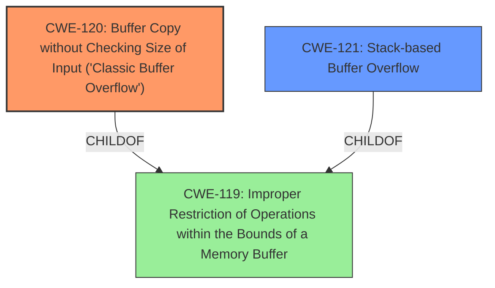

# Analysis for CVE-2025-3678

# Summary
| CWE ID | CWE Name | Confidence | CWE Abstraction Level | CWE Vulnerability Mapping Label | CWE-Vulnerability Mapping Notes |
|---|---|---|---|---|---|
| CWE-120 | Buffer Copy without Checking Size of Input ('Classic Buffer Overflow') | 1.0 | Base | Allowed-with-Review | Primary CWE. The vulnerability is caused by copying data to a buffer without proper size validation, which leads to a buffer overflow. |
| CWE-121 | Stack-based Buffer Overflow | 0.7 | Variant | Allowed | Secondary CWE. This is a more specific type of buffer overflow that occurs on the stack, which is consistent with the provided exploit details. |
| CWE-119 | Improper Restriction of Operations within the Bounds of a Memory Buffer | 0.6 | Class | Discouraged | Secondary CWE. A more general category that includes buffer overflows, but CWE-120 and CWE-121 are more specific and better describe the vulnerability. |

## Evidence and Confidence

*   **Confidence Score:** 0.8
*   **Evidence Strength:** HIGH

## Relationship Analysis
The primary relationship impacting the CWE selection is the parent-child relationship. CWE-120 is a base CWE that describes a buffer copy without checking size, a common cause of buffer overflows. CWE-121, Stack-based Buffer Overflow, is a variant of CWE-119 (Improper Restriction of Operations within the Bounds of a Memory Buffer) and is more specific than CWE-120, implying it occurs on the stack. The exploit details provided in the CVE reference confirm a stack-based overflow, thus supporting the inclusion of CWE-121 as a secondary classification.

## Vulnerability Chain
The vulnerability chain starts with the **lack of input validation** on the HELP command's input. This **weakness** allows an attacker to send an overly long string to the server. Since there's no check on the input size, the `Buffer Copy without Checking Size of Input` (CWE-120) leads directly to a `Stack-based Buffer Overflow` (CWE-121). Successful exploitation allows for arbitrary code execution, completing the chain.

## Summary of Analysis
The initial assessment identified a buffer overflow vulnerability. The CVE reference confirms this, stating that the `HELP` command handling in PCMan FTP Server 2.0.7 does not properly validate input length, leading to a buffer overflow. The exploit provided overwrites the EIP, indicating a stack-based overflow.

The selection of CWE-120 as the primary CWE is based on the fact that the root cause is the unchecked buffer copy. The inclusion of CWE-121 is based on the stack-based nature of the overflow, as demonstrated by the EIP overwrite in the exploit. The evidence explicitly supports these classifications.

The CWEs are at the optimal level of specificity, with CWE-120 describing the general buffer overflow issue and CWE-121 detailing the stack-based nature of the vulnerability. This provides a comprehensive view of the vulnerability's root cause and manifestation.

Relevant CWE Information:

# Enhanced Context (25 CWEs)
The following CWEs were identified as potentially relevant to this vulnerability:

## CWE-134: Use of Externally-Controlled Format String
**Abstraction Level**: Base
**Similarity Score**: 0.73
**Source**: dense

**Description**:
The product uses a function that accepts a format string as an argument, but the format string originates from an external source.

**Mapping Guidance**:
- Usage: Allowed
- Rationale: This CWE entry is at the Base level of abstraction, which is a preferred level of abstraction for mapping to the root causes of vulnerabilities.

*Not Selected*: This CWE is related to format string vulnerabilities, but the provided information indicates a buffer overflow, not a format string issue.

## CWE-434: Unrestricted Upload of File with Dangerous Type
**Abstraction Level**: Base
**Similarity Score**: 0.73
**Source**: dense

**Description**:
The product allows the upload or transfer of dangerous file types that are automatically processed within its environment.

**Mapping Guidance**:
- Usage: Allowed
- Rationale: This CWE entry is at the Base level of abstraction, which is a preferred level of abstraction for mapping to the root causes of vulnerabilities.

*Not Selected*: This CWE relates to file uploads, which are not part of this vulnerability.

## CWE-193: Off-by-one Error
**Abstraction Level**: Base
**Similarity Score**: 0.72
**Source**: dense

**Description**:
A product calculates or uses an incorrect maximum or minimum value that is 1 more, or 1 less, than the correct value.

**Mapping Guidance**:
- Usage: Allowed
- Rationale: This CWE entry is at the Base level of abstraction, which is a preferred level of abstraction for mapping to the root causes of vulnerabilities.

*Not Selected*: This CWE is specific to off-by-one errors, which are not indicated in the vulnerability description.

## CWE-131: Incorrect Calculation of Buffer Size
**Abstraction Level**: Base
**Similarity Score**: 0.72
**Source**: dense

**Description**:
The product does not correctly calculate the size to be used when allocating a buffer, which could lead to a buffer overflow.

**Mapping Guidance**:
- Usage: Allowed
- Rationale: This CWE entry is at the Base level of abstraction, which is a preferred level of abstraction for mapping to the root causes of vulnerabilities.

*Not Selected*: While an incorrect buffer size calculation *could* be present, the more direct cause is the lack of checking the input size before copying to the buffer. CWE-120 is more appropriate.

## CWE-425: Direct Request ('Forced Browsing')
**Abstraction Level**: Base
**Similarity Score**: 0.72
**Source**: dense

**Description**:
The web application does not adequately enforce appropriate authorization on all restricted URLs, scripts, or files.

**Mapping Guidance**:
- Usage: Allowed
- Rationale: This CWE entry is at the Base level of abstraction, which is a preferred level of abstraction for mapping to the root causes of vulnerabilities.

*Not Selected*: This CWE is about authorization issues, which are not part of this vulnerability.

## CWE-41: Improper Resolution of Path Equivalence
**Abstraction Level**: Base
**Similarity Score**: 0.71
**Source**: dense

**Description**:
The product is vulnerable to file system contents disclosure through path equivalence. Path equivalence involves the use of special characters in file and directory names. The associated manipulations are intended to generate multiple names for the same object.

**Mapping Guidance**:
- Usage: Allowed
- Rationale: This CWE entry is at the Base level of abstraction, which is a preferred level of abstraction for mapping to the root causes of vulnerabilities.

*Not Selected*: This CWE is related to path equivalence issues, which are not part of this vulnerability.

## CWE-74: Improper Neutralization of Special Elements in Output Used by a Downstream Component ('Injection')
**Abstraction Level**: Class
**Similarity Score**: 0.71
**Source**: dense

**Description**:
The product constructs all or part of a command, data structure, or record using externally-influenced input from an upstream component, but it does not neutralize or incorrectly neutralizes special elements that could modify how it is parsed or interpreted when it is sent to a downstream component.

**Mapping Guidance**:
- Usage: Discouraged
- Rationale: CWE-74 is high-level and often misused when lower-level weaknesses are more appropriate.

*Not Selected*: This CWE is about injection vulnerabilities, which are not part of this vulnerability. The root cause is the buffer overflow.

## CWE-755: Improper Handling of Exceptional Conditions
**Abstraction Level**: Class
**Similarity Score**: 0.71
**Source**: dense

**Description**:
The product does not handle or incorrectly handles an exceptional condition.

**Mapping Guidance**:
- Usage: Discouraged
- Rationale: This CWE entry is a level-1 Class (i.e., a child of a Pillar). It might have lower-level children that would be more appropriate

*Not Selected*: This CWE is too general and doesn't fit the specific buffer overflow issue.

## CWE-918: Server-Side Request Forgery (SSRF)
**Abstraction Level**: Base
**Similarity Score**: 0.71
**Source**: dense

**Description**:
The web server receives a URL or similar request