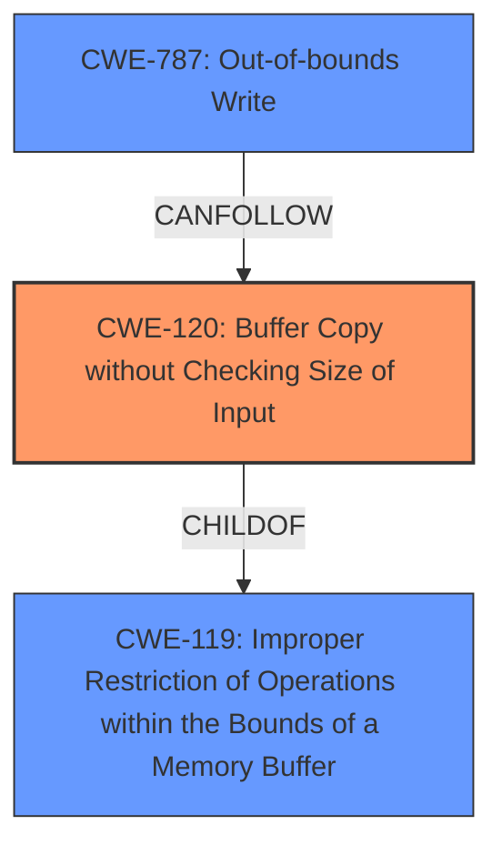

# Analysis for CVE-2025-3683

# Summary
| CWE ID | CWE Name | Confidence | CWE Abstraction Level | CWE Vulnerability Mapping Label | CWE-Vulnerability Mapping Notes |
|---|---|---|---|---|---|
| CWE-120 | Buffer Copy without Checking Size of Input ('Classic Buffer Overflow') | 0.85 | Base | Allowed-with-Review | Primary CWE.  The vulnerability involves a buffer overflow due to unchecked input size during a copy operation. |
| CWE-787 | Out-of-bounds Write | 0.75 | Base | Allowed | Secondary candidate.  Buffer overflows often lead to out-of-bounds writes. |
| CWE-119 | Improper Restriction of Operations within the Bounds of a Memory Buffer | 0.60 | Class | Discouraged | Secondary candidate. A more general description of memory buffer issues. |

## Evidence and Confidence

*   **Confidence Score:** 0.80
*   **Evidence Strength:** MEDIUM

## Relationship Analysis
The primary CWE is CWE-120, which describes a buffer copy without checking the input size. This can lead to CWE-787, an out-of-bounds write. CWE-119 is a more general class that encompasses both. We choose CWE-120 as the root cause, with CWE-787 as a potential consequence.

## Vulnerability Chain
The vulnerability chain starts with the **buffer overflow** (**CWE-120**), leading to an out-of-bounds write (**CWE-787**), which can then lead to remote code execution.

## Summary of Analysis
The vulnerability description clearly states a **buffer overflow** in the SIZE Command Handler of PCMan FTP Server 2.0.7. The CVE Reference Links Content Summary confirms this, indicating the overflow is triggered via the SIZE command. The retriever results list CWE-120, CWE-119, and CWE-787 as the most relevant.

*   CWE-120 (Buffer Copy without Checking Size of Input) is chosen as the primary CWE because the description describes a buffer overflow with missing input validation. This aligns with the "Buffer Copy" operations, in which where there is no "Checking [the] Size of Input", and (by implication of the copy) writing past the end of the buffer.
*   CWE-787 (Out-of-bounds Write) is included because buffer overflows often lead to out-of-bounds writes. This is a consequence of the primary weakness.
*   CWE-119 (Improper Restriction of Operations within the Bounds of a Memory Buffer) is a more general description, but still applicable as the root cause. It is not selected as primary because CWE-120 provides a more specific explanation of the vulnerability.

Other CWEs considered but not used:

*   CWE-190 (Integer Overflow or Wraparound): While integer overflows can lead to buffer overflows, there's no direct evidence of this in the description.
*   CWE-89 (SQL Injection), CWE-79 (Cross-site Scripting), CWE-78 (OS Command Injection): These are unrelated to buffer overflows.
*   CWE-434 (Unrestricted Upload of File with Dangerous Type): This is unrelated to buffer overflows.
*   CWE-125 (Out-of-bounds Read): The description specifies a buffer overflow, implying a write, not a read.
*   CWE-121 (Stack-based Buffer Overflow): This is a subtype of buffer overflow, but the location (stack vs heap) is not specified in the vulnerability description.
*   CWE-128 (Wrap-around Error): This is a subtype of integer overflow, and there's no direct evidence of an integer overflow.

I am confident in this assessment as the description explicitly mentions "buffer overflow" and the summary supports this.