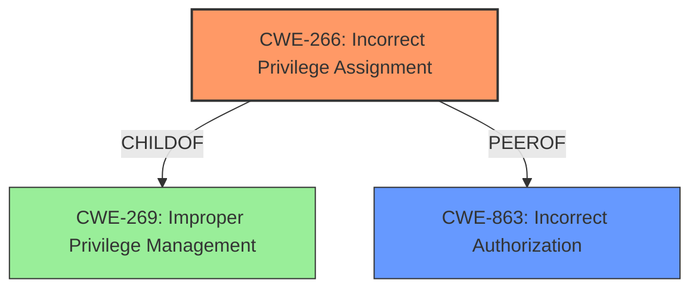

# Analysis for CVE-2025-3761

# Summary
| CWE ID    | CWE Name                       | Confidence | CWE Abstraction Level | CWE Vulnerability Mapping Label | CWE-Vulnerability Mapping Notes |
| :-------- | :----------------------------- | :--------- | :-------------------- | :------------------------------ | :------------------------------ |
| CWE-266   | Incorrect Privilege Assignment | 0.9        | Base                  | Allowed                       | Primary CWE                     |
| CWE-863   | Incorrect Authorization      | 0.7        | Class                 | Allowed-with-Review           | Secondary Candidate             |

## Evidence and Confidence

*   **Confidence Score:** 0.9
*   **Evidence Strength:** HIGH

## Relationship Analysis
The primary relationship influencing the decision is that CWE-266 (Incorrect Privilege Assignment) is a more specific Base CWE, while CWE-863 (Incorrect Authorization) is a broader Class CWE. The vulnerability description indicates that the **incorrect assignment** of privileges is the root cause, making CWE-266 a better fit. There's a hierarchical relationship between CWE-266 and CWE-269 (Improper Privilege Management), with CWE-266 being a child of CWE-269. However, CWE-269 is discouraged, and CWE-266 is more specific.

## Vulnerability Chain
The vulnerability chain starts with **incorrectly restricting access to unauthorized users to update roles** using the `mt_save_profile()` function, leading to the ability for authenticated users to escalate their privileges to administrator.

Vulnerability Chain:
1.  **Incorrect Privilege Assignment (CWE-266)**: The `mt_save_profile()` function **does not appropriately restrict access to unauthorized users to update roles**.
2.  Privilege Escalation (Impact): Authenticated attackers with Subscriber-level access can update their role to that of an administrator.

## Summary of Analysis
The initial assessment considered multiple CWEs, particularly those related to authorization and privilege management. However, the key phrase "**not appropriately restricting access to unauthorized users to update roles**" strongly suggests that the root cause is an **incorrect assignment of privileges**, making CWE-266 the most appropriate choice. The CVE reference links content summary provided further evidence, indicating that the security update includes a check for the `manage_options` capability before updating capabilities, which directly addresses the **incorrect privilege assignment**.

The graph relationships confirm that CWE-266 is a more specific Base CWE compared to the broader Class CWEs like CWE-285 and CWE-863. The selection of CWE-266 is at the optimal level of specificity because it directly reflects the **root cause** of the vulnerability, which is the **incorrect assignment of privileges**, not just a general authorization failure.

Relevant CWE Information:

# Enhanced Context (25 CWEs)
The following CWEs were identified as potentially relevant to this vulnerability:

## CWE-266: Incorrect Privilege Assignment
**Abstraction Level**: Base
**Similarity Score**: 0.80
**Source**: dense

**Description**:
A product incorrectly assigns a privilege to a particular actor, creating an unintended sphere of control for that actor.

**Mapping Guidance**:
- Usage: Allowed
- Rationale: This CWE entry is at the Base level of abstraction, which is a preferred level of abstraction for mapping to the root causes of vulnerabilities.

### Justification for CWE-266
The vulnerability description states that the `mt_save_profile()` function **does not appropriately restrict access to unauthorized users to update roles**. This directly aligns with the description of CWE-266, which states that a product incorrectly assigns a privilege to a particular actor, creating an unintended sphere of control for that actor. In this case, the privilege is the ability to update user roles, and it is incorrectly assigned to unauthorized users (e.g., subscribers). The security implication is that attackers can escalate their privileges to administrator, gaining full control of the WordPress site.
**Confidence Score:** 0.9

### Justification for CWE-863
CWE-863 (Incorrect Authorization) was considered as a secondary candidate because the vulnerability involves a failure in authorization. The vulnerability description mentions that the `mt_save_profile()` function **does not appropriately restrict access**, which can be interpreted as an authorization failure. However, CWE-863 is a more general Class-level CWE, while CWE-266 is a more specific Base-level CWE that directly addresses the **root cause** of the vulnerability (i.e., **incorrect privilege assignment**).
**Confidence Score:** 0.7

Other CWEs Considered but Not Used:
*   CWE-269 (Improper Privilege Management): This CWE was considered but not used because it is a high-level Class CWE and is discouraged. The vulnerability description provides enough information to identify the more specific root cause of **incorrect privilege assignment (CWE-266)**.
*   CWE-285 (Improper Authorization): This CWE was considered but not used because it is a Class CWE and lower-level CWEs can frequently be used instead. The vulnerability description provides enough information to identify the more specific root cause of **incorrect privilege assignment (CWE-266)**.
*   CWE-862 (Missing Authorization): This CWE was not chosen because the function `mt_save_profile()` exists, which means there is an attempt to restrict access. But this function **does not appropriately restrict access**, which means the authorization is incorrect, not missing.