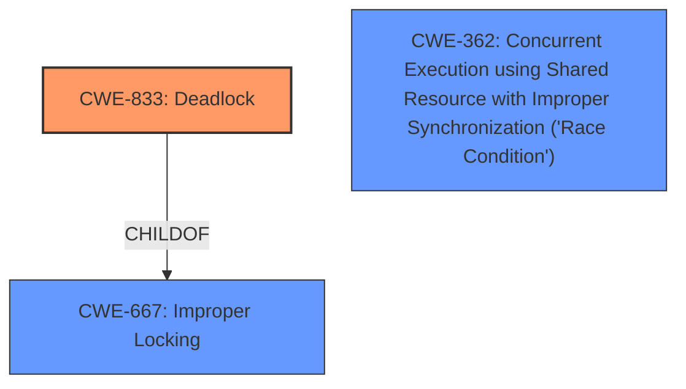

# Analysis for CVE-2025-37745

# Summary
| CWE ID | CWE Name | Confidence | CWE Abstraction Level | CWE Vulnerability Mapping Label | CWE-Vulnerability Mapping Notes |
|---|---|---|---|---|---|
| CWE-833 | Deadlock | 1.0 | Base |  Primary | Allowed |
| CWE-667 | Improper Locking | 0.8 | Class | Secondary Candidate | Allowed-with-Review |
| CWE-362 | Concurrent Execution using Shared Resource with Improper Synchronization ('Race Condition') | 0.7 | Class | Secondary Candidate | Allowed-with-Review |

## Evidence and Confidence

*   **Confidence Score:** 0.9
*   **Evidence Strength:** HIGH

## Relationship Analysis
The primary weakness is CWE-833 Deadlock (Base). CWE-833 is a child of CWE-667 Improper Locking (Class). CWE-362 Concurrent Execution using Shared Resource with Improper Synchronization ('Race Condition') (Class) is related as concurrency is involved. The selection of CWE-833 is favored due to its Base level of abstraction, providing a more specific description of the **deadlock** condition.

## Vulnerability Chain
The vulnerability chain starts with a **write operation to /sys/module/hibernate/parameters/compressor conflicts with the registration of ieee80211 device**, leading to **improper locking**, which results in a **deadlock**.
  - Root Cause: **write operation to /sys/module/hibernate/parameters/compressor conflicts with the registration of ieee80211 device**
  - Weakness: **Improper Locking**
  - Impact: **Deadlock**

## Summary of Analysis
The analysis indicates a deadlock situation in the Linux kernel due to conflicting operations on shared resources. The **write operation to /sys/module/hibernate/parameters/compressor conflicts with the registration of ieee80211 device**, triggering a **deadlock** when attempting to acquire system_transition_mutex under param_lock. The provided evidence strongly supports the selection of CWE-833 Deadlock as the primary CWE. The vulnerability description clearly states that the issue results in a deadlock. The retriever results also list CWE-833 as a top candidate. The relationship graph shows that CWE-833 is a child of CWE-667, but CWE-833 provides a more specific description of the vulnerability, justifying its selection as the primary CWE.

CWEs Considered but Not Used:

*   CWE-667 Improper Locking: Considered but not selected as the primary CWE because CWE-833 Deadlock is a more specific child that better describes the vulnerability.
*   CWE-362 Concurrent Execution using Shared Resource with Improper Synchronization ('Race Condition'): Considered, but the description highlights the deadlock condition.
*   CWE-367 Time-of-check Time-of-use (TOCTOU) Race Condition: Not applicable as the issue isn't related to TOCTOU.
*   CWE-392 Missing Report of Error Condition: Not applicable.
*   CWE-401 Missing Release of Memory after Effective Lifetime: Not applicable.
*   CWE-909 Missing Initialization of Resource: Not applicable.
*   CWE-415 Double Free: Not applicable.
*   CWE-413 Improper Resource Locking: Considered as a potential contributing factor but is not as descriptive as CWE-833.
*   CWE-609 Double-Checked Locking: Not applicable.

Relevant CWE Information:

# Enhanced Context (25 CWEs)
The following CWEs were identified as potentially relevant to this vulnerability:

## CWE-667: Improper Locking
**Abstraction Level**: Class
**Similarity Score**: 0.80
**Source**: dense

**Description**:
The product does not properly acquire or release a lock on a resource, leading to unexpected resource state changes and behaviors.

**Mapping Guidance**:
- Usage: Allowed-with-Review
- Rationale: This CWE entry is a Class and might have Base-level children that would be more appropriate

## CWE-833: Deadlock
**Abstraction Level**: Base
**Similarity Score**: 0.79
**Source**: dense

**Description**:
The product contains multiple threads or executable segments that are waiting for each other to release a necessary lock, resulting in deadlock.

**Mapping Guidance**:
- Usage: Allowed
- Rationale: This CWE entry is at the Base level of abstraction, which is a preferred level of abstraction for mapping to the root causes of vulnerabilities.

## CWE-362: Concurrent Execution using Shared Resource with Improper Synchronization ('Race Condition')
**Abstraction Level**: Class
**Similarity Score**: 0.74
**Source**: dense

**Description**:
The product contains a concurrent code sequence that requires temporary, exclusive access to a shared resource, but a timing window exists in which the shared resource can be modified by another code sequence operating concurrently.

**Mapping Guidance**:
- Usage: Allowed-with-Review
- Rationale: This CWE entry is a Class and might have Base-level children that would be more appropriate

## CWE-413: Improper Resource Locking
**Abstraction Level**: Base
**Similarity Score**: 0.74
**Source**: dense

**Description**:
The product does not lock or does not correctly lock a resource when the product must have exclusive access to the resource.

**Mapping Guidance**:
- Usage: Allowed
- Rationale: This CWE entry is at the Base level of abstraction, which is a preferred level of abstraction for mapping to the root causes of vulnerabilities.

## CWE-755: Improper Handling of Exceptional Conditions
**Abstraction Level**: Class
**Similarity Score**: 0.74
**Source**: dense

**Description**:
The product does not handle or incorrectly handles an exceptional condition.

**Mapping Guidance**:
- Usage: Discouraged
- Rationale: This CWE entry is a level-1 Class (i.e., a child of a Pillar). It might have lower-level children that would be more appropriate

## CWE-404: Improper Resource Shutdown or Release
**Abstraction Level**: Class
**Similarity Score**: 0.74
**Source**: dense

**Description**:
The product does not release or incorrectly releases a resource before it is made available for re-use.

**Mapping Guidance**:
- Usage: Allowed-with-Review
- Rationale: This CWE entry is a Class and might have Base-level children that would be more appropriate

## CWE-703: Improper Check or Handling of Exceptional Conditions
**Abstraction Level**: Pillar
**Similarity Score**: 0.74
**Source**: dense

**Description**:
The product does not properly anticipate or handle exceptional conditions that rarely occur during normal operation of the product.

**Mapping Guidance**:
- Usage: Discouraged
- Rationale: This CWE entry is extremely high-level, a Pillar.

## CWE-367: Time-of-check Time-of-use (TOCTOU) Race Condition
**Abstraction Level**: Base
**Similarity Score**: 0.73
**Source**: dense

**Description**:
The product checks the state of a resource before using that resource, but the resource's state can change between the check and the use in a way that invalidates the results of the check. This can cause the product to perform invalid actions when the resource is in an unexpected state.

**Mapping Guidance**:
- Usage: Allowed
- Rationale: This CWE entry is at the Base level of abstraction, which is a preferred level of abstraction for mapping to the root causes of vulnerabilities.

## CWE-754: Improper Check for Unusual or Exceptional Conditions
**Abstraction Level**: Class
**Similarity Score**: 0.73
**Source**: dense

**Description**:
The product does not check or incorrectly checks for unusual or exceptional conditions that are not expected to occur frequently during day to day operation of the product.

**Mapping Guidance**:
- Usage: Allowed-with-Review
- Rationale: This CWE entry is a Class and might have Base-level children that would be more appropriate

## CWE-909: Missing Initialization of Resource
**Abstraction Level**: Class
**Similarity Score**: 0.72
**Source**: dense

**Description**:
The product does not initialize a critical resource.

**Mapping Guidance**:
- Usage: Allowed-with-Review
- Rationale: This CWE entry is a Class and might have Base-level children that would be more appropriate

## CWE-667: Improper Locking
**Abstraction Level**: Class
**Similarity Score**: 902.20
**Source**: sparse

**Description**:
The