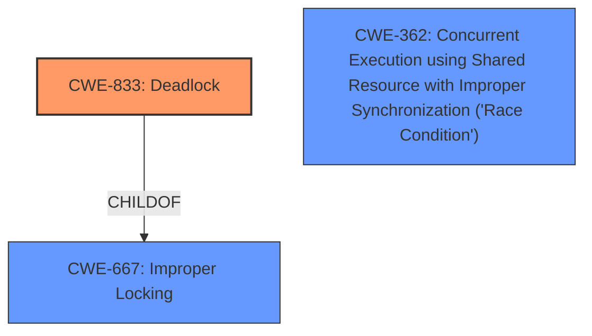

# Analysis Report for CVE-2025-37745

# Vulnerability Analysis Report: CVE-2025-37745

## Description

In the Linux kernel, the following vulnerability has been resolved PM hibernate Avoid deadlock in hibernate_compressor_param_set() syzbot reported a deadlock in lock_system_sleep() (see below). The **write operation to /sys/module/hibernate/parameters/compressor conflicts with the registration of ieee80211 device**, resulting in a deadlock when attempting to acquire system_transition_mutex under param_lock. To avoid this deadlock, change hibernate_compressor_param_set() to use mutex_trylock() for attempting to acquire system_transition_mutex and return -EBUSY when it fails. Task flags need not be saved or adjusted before calling mutex_trylock(&system_transition_mutex) because the caller is not going to end up waiting for this mutex and if it runs concurrently with system suspend in progress, it will be frozen properly when it returns to user space. syzbot report syz-executor895/5833 is trying to acquire lock ffffffff8e0828c8 (system_transition_mutex){+.+.}-{44}, at lock_system_sleep+0x87/0xa0 kernel/power/main.c56 but task is already holding lock ffffffff8e07dc68 (param_lock){+.+.}-{44}, at kernel_param_lock kernel/params.c607 [inline] ffffffff8e07dc68 (param_lock){+.+.}-{44}, at param_attr_store+0xe6/0x300 kernel/params.c586 which lock already depends on the new lock. the existing dependency chain (in reverse order) is -> #3 (param_lock){+.+.}-{44} __mutex_lock_common kernel/locking/mutex.c585 [inline] __mutex_lock+0x19b/0xb10 kernel/locking/mutex.c730 ieee80211_rate_control_ops_get net/mac80211/rate.c220 [inline] rate_control_alloc net/mac80211/rate.c266 [inline] ieee80211_init_rate_ctrl_alg+0x18d/0x6b0 net/mac80211/rate.c1015 ieee80211_register_hw+0x20cd/0x4060 net/mac80211/main.c1531 mac80211_hwsim_new_radio+0x304e/0x54e0 drivers/net/wireless/virtual/mac80211_hwsim.c5558 init_mac80211_hwsim+0x432/0x8c0 drivers/net/wireless/virtual/mac80211_hwsim.c6910 do_one_initcall+0x128/0x700 init/main.c1257 do_initcall_level init/main.c1319 [inline] do_initcalls init/main.c1335 [inline] do_basic_setup init/main.c1354 [inline] kernel_init_freeable+0x5c7/0x900 init/main.c1568 kernel_init+0x1c/0x2b0 init/main.c1457 ret_from_fork+0x45/0x80 arch/x86/kernel/process.c148 ret_from_fork_asm+0x1a/0x30 arch/x86/entry/entry_64.S244 -> #2 (rtnl_mutex){+.+.}-{44} __mutex_lock_common kernel/locking/mutex.c585 [inline] __mutex_lock+0x19b/0xb10 kernel/locking/mutex.c730 wg_pm_notification drivers/net/wireguard/device.c80 [inline] wg_pm_notification+0x49/0x180 drivers/net/wireguard/device.c64 notifier_call_chain+0xb7/0x410 kernel/notifier.c85 notifier_call_chain_robust kernel/notifier.c120 [inline] blocking_notifier_call_chain_robust kernel/notifier.c345 [inline] blocking_notifier_call_chain_robust+0xc9/0x170 kernel/notifier.c333 pm_notifier_call_chain_robust+0x27/0x60 kernel/power/main.c102 snapshot_open+0x189/0x2b0 kernel/power/user.c77 misc_open+0x35a/0x420 drivers/char/misc.c179 chrdev_open+0x237/0x6a0 fs/char_dev.c414 do_dentry_open+0x735/0x1c40 fs/open.c956 vfs_open+0x82/0x3f0 fs/open.c1086 do_open fs/namei.c3830 [inline] path_openat+0x1e88/0x2d80 fs/namei.c3989 do_filp_open+0x20c/0x470 fs/namei.c4016 do_sys_openat2+0x17a/0x1e0 fs/open.c1428 do_sys_open fs/open.c1443 [inline] __do_sys_openat fs/open.c1459 [inline] __se_sys_openat fs/open.c1454 [inline] __x64_sys_openat+0x175/0x210 fs/open.c1454 do_syscall_x64 arch/x86/entry/common.c52 [inline] do_syscall_64+0xcd/0x250 arch/x86/entry/common.c83 entry_SYSCALL_64_after_hwframe+0x77/0x7f -> #1 ((pm_chain_head).rwsem){++++}-{44} down_read+0x9a/0x330 kernel/locking/rwsem.c1524 blocking_notifier_call_chain_robust kerne ---truncated---

## Vulnerability Description Key Phrases

- **Rootcause:** write operation to /sys/module/hibernate/parameters/compressor conflicts with the registration of ieee80211 device
- **Impact:** deadlock
- **Product:** Linux kernel
- **Component:** kernel/power/main.c

## Analysis (with Relationship Data)

# Summary
| CWE ID | CWE Name | Confidence | CWE Abstraction Level | CWE Vulnerability Mapping Label | CWE-Vulnerability Mapping Notes |
|---|---|---|---|---|---|
| CWE-833 | Deadlock | 1.0 | Base |  Primary | Allowed |
| CWE-667 | Improper Locking | 0.8 | Class | Secondary Candidate | Allowed-with-Review |
| CWE-362 | Concurrent Execution using Shared Resource with Improper Synchronization ('Race Condition') | 0.7 | Class | Secondary Candidate | Allowed-with-Review |

## Evidence and Confidence

*   **Confidence Score:** 0.9
*   **Evidence Strength:** HIGH

## Relationship Analysis
The primary weakness is CWE-833 Deadlock (Base). CWE-833 is a child of CWE-667 Improper Locking (Class). CWE-362 Concurrent Execution using Shared Resource with Improper Synchronization ('Race Condition') (Class) is related as concurrency is involved. The selection of CWE-833 is favored due to its Base level of abstraction, providing a more specific description of the **deadlock** condition.



## Vulnerability Chain
The vulnerability chain starts with a **write operation to /sys/module/hibernate/parameters/compressor conflicts with the registration of ieee80211 device**, leading to **improper locking**, which results in a **deadlock**.
  - Root Cause: **write operation to /sys/module/hibernate/parameters/compressor conflicts with the registration of ieee80211 device**
  - Weakness: **Improper Locking**
  - Impact: **Deadlock**

## Summary of Analysis
The analysis indicates a deadlock situation in the Linux kernel due to conflicting operations on shared resources. The **write operation to /sys/module/hibernate/parameters/compressor conflicts with the registration of ieee80211 device**, triggering a **deadlock** when attempting to acquire system_transition_mutex under param_lock. The provided evidence strongly supports the selection of CWE-833 Deadlock as the primary CWE. The vulnerability description clearly states that the issue results in a deadlock. The retriever results also list CWE-833 as a top candidate. The relationship graph shows that CWE-833 is a child of CWE-667, but CWE-833 provides a more specific description of the vulnerability, justifying its selection as the primary CWE.

CWEs Considered but Not Used:

*   CWE-667 Improper Locking: Considered but not selected as the primary CWE because CWE-833 Deadlock is a more specific child that better describes the vulnerability.
*   CWE-362 Concurrent Execution using Shared Resource with Improper Synchronization ('Race Condition'): Considered, but the description highlights the deadlock condition.
*   CWE-367 Time-of-check Time-of-use (TOCTOU) Race Condition: Not applicable as the issue isn't related to TOCTOU.
*   CWE-392 Missing Report of Error Condition: Not applicable.
*   CWE-401 Missing Release of Memory after Effective Lifetime: Not applicable.
*   CWE-909 Missing Initialization of Resource: Not applicable.
*   CWE-415 Double Free: Not applicable.
*   CWE-413 Improper Resource Locking: Considered as a potential contributing factor but is not as descriptive as CWE-833.
*   CWE-609 Double-Checked Locking: Not applicable.

Relevant CWE Information:

# Enhanced Context (25 CWEs)
The following CWEs were identified as potentially relevant to this vulnerability:

## CWE-667: Improper Locking
**Abstraction Level**: Class
**Similarity Score**: 0.80
**Source**: dense

**Description**:
The product does not properly acquire or release a lock on a resource, leading to unexpected resource state changes and behaviors.

**Mapping Guidance**:
- Usage: Allowed-with-Review
- Rationale: This CWE entry is a Class and might have Base-level children that would be more appropriate


## CWE-833: Deadlock
**Abstraction Level**: Base
**Similarity Score**: 0.79
**Source**: dense

**Description**:
The product contains multiple threads or executable segments that are waiting for each other to release a necessary lock, resulting in deadlock.

**Mapping Guidance**:
- Usage: Allowed
- Rationale: This CWE entry is at the Base level of abstraction, which is a preferred level of abstraction for mapping to the root causes of vulnerabilities.


## CWE-362: Concurrent Execution using Shared Resource with Improper Synchronization ('Race Condition')
**Abstraction Level**: Class
**Similarity Score**: 0.74
**Source**: dense

**Description**:
The product contains a concurrent code sequence that requires temporary, exclusive access to a shared resource, but a timing window exists in which the shared resource can be modified by another code sequence operating concurrently.

**Mapping Guidance**:
- Usage: Allowed-with-Review
- Rationale: This CWE entry is a Class and might have Base-level children that would be more appropriate


## CWE-413: Improper Resource Locking
**Abstraction Level**: Base
**Similarity Score**: 0.74
**Source**: dense

**Description**:
The product does not lock or does not correctly lock a resource when the product must have exclusive access to the resource.

**Mapping Guidance**:
- Usage: Allowed
- Rationale: This CWE entry is at the Base level of abstraction, which is a preferred level of abstraction for mapping to the root causes of vulnerabilities.


## CWE-755: Improper Handling of Exceptional Conditions
**Abstraction Level**: Class
**Similarity Score**: 0.74
**Source**: dense

**Description**:
The product does not handle or incorrectly handles an exceptional condition.

**Mapping Guidance**:
- Usage: Discouraged
- Rationale: This CWE entry is a level-1 Class (i.e., a child of a Pillar). It might have lower-level children that would be more appropriate


## CWE-404: Improper Resource Shutdown or Release
**Abstraction Level**: Class
**Similarity Score**: 0.74
**Source**: dense

**Description**:
The product does not release or incorrectly releases a resource before it is made available for re-use.

**Mapping Guidance**:
- Usage: Allowed-with-Review
- Rationale: This CWE entry is a Class and might have Base-level children that would be more appropriate


## CWE-703: Improper Check or Handling of Exceptional Conditions
**Abstraction Level**: Pillar
**Similarity Score**: 0.74
**Source**: dense

**Description**:
The product does not properly anticipate or handle exceptional conditions that rarely occur during normal operation of the product.

**Mapping Guidance**:
- Usage: Discouraged
- Rationale: This CWE entry is extremely high-level, a Pillar.


## CWE-367: Time-of-check Time-of-use (TOCTOU) Race Condition
**Abstraction Level**: Base
**Similarity Score**: 0.73
**Source**: dense

**Description**:
The product checks the state of a resource before using that resource, but the resource's state can change between the check and the use in a way that invalidates the results of the check. This can cause the product to perform invalid actions when the resource is in an unexpected state.

**Mapping Guidance**:
- Usage: Allowed
- Rationale: This CWE entry is at the Base level of abstraction, which is a preferred level of abstraction for mapping to the root causes of vulnerabilities.


## CWE-754: Improper Check for Unusual or Exceptional Conditions
**Abstraction Level**: Class
**Similarity Score**: 0.73
**Source**: dense

**Description**:
The product does not check or incorrectly checks for unusual or exceptional conditions that are not expected to occur frequently during day to day operation of the product.

**Mapping Guidance**:
- Usage: Allowed-with-Review
- Rationale: This CWE entry is a Class and might have Base-level children that would be more appropriate


## CWE-909: Missing Initialization of Resource
**Abstraction Level**: Class
**Similarity Score**: 0.72
**Source**: dense

**Description**:
The product does not initialize a critical resource.

**Mapping Guidance**:
- Usage: Allowed-with-Review
- Rationale: This CWE entry is a Class and might have Base-level children that would be more appropriate


## CWE-667: Improper Locking
**Abstraction Level**: Class
**Similarity Score**: 902.20
**Source**: sparse

**Description**:
The


## CWE Relationship Analysis

Current CWEs represent these abstraction levels: .


### Vulnerability Chain Analysis

**Chain starting from CWE-392:**
- 392 (Missing Report of Error Condition) - ROOT


**Chain starting from CWE-404:**
- 404 (Improper Resource Shutdown or Release) - ROOT


### CWE Relationship Diagram

```mermaid
graph TD
    classDef primary fill:#f96,stroke:#333,stroke-width:2px
    classDef secondary fill:#69f,stroke:#333
    classDef tertiary fill:#9e9,stroke:#333
```


*Report generated on 2025-07-14 21:15:27*
