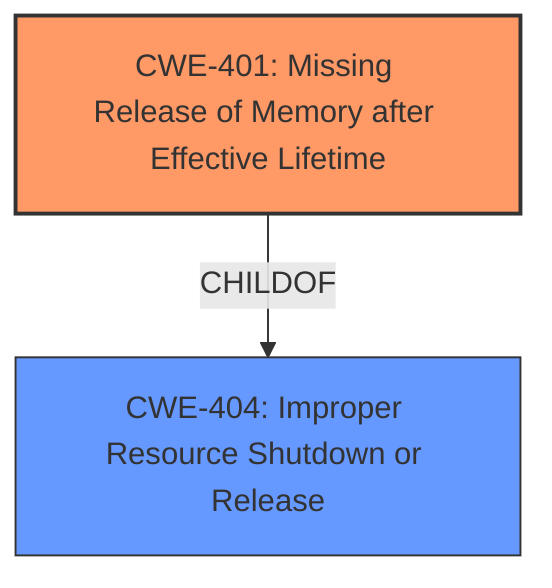

# Analysis Report for CVE-2025-37764

# Vulnerability Analysis Report: CVE-2025-37764

## Description

In the Linux kernel, the following vulnerability has been resolved drm/imagination fix firmware **memory leaks** Free the memory used to hold the results of firmware image processing when the module is unloaded. Fix the related issue of the same memory being leaked if processing of the firmware image fails during module load. Ensure all firmware GEM objects are destroyed if firmware image processing fails. Fixes **memory leaks** on powervr module unload detected by Kmemleak unreferenced object 0xffff000042e20000 (size 94208) comm modprobe, pid 470, jiffies 4295277154 hex dump (first 32 bytes) 02 ae 7f ed bf 45 84 00 3c 5b 1f ed 9f 45 45 05 .....E..<[...EE. d5 4f 5d 14 6c 00 3d 23 30 d0 3a 4a 66 0e 48 c8 .O].l.=#0.Jf.H. backtrace (crc dd329dec) kmemleak_alloc+0x30/0x40 ___kmalloc_large_node+0x140/0x188 __kmalloc_large_node_noprof+0x2c/0x13c __kmalloc_noprof+0x48/0x4c0 pvr_fw_init+0xaa4/0x1f50 [powervr] unreferenced object 0xffff000042d20000 (size 20480) comm modprobe, pid 470, jiffies 4295277154 hex dump (first 32 bytes) 00 00 00 00 00 00 00 00 09 00 00 00 0b 00 00 00 ................ 00 00 00 00 00 00 00 00 07 00 00 00 08 00 00 00 ................ backtrace (crc 395b02e3) kmemleak_alloc+0x30/0x40 ___kmalloc_large_node+0x140/0x188 __kmalloc_large_node_noprof+0x2c/0x13c __kmalloc_noprof+0x48/0x4c0 pvr_fw_init+0xb0c/0x1f50 [powervr]

## Vulnerability Description Key Phrases

- **Weakness:** memory leaks
- **Product:** Linux kernel
- **Component:** drm/imagination fix firmware

## Analysis (with Relationship Data)

# Summary

| CWE ID | CWE Name | Confidence | CWE Abstraction Level | CWE Vulnerability Mapping Label | CWE-Vulnerability Mapping Notes |
|---|---|---|---|---|---|
| CWE-401 | Missing Release of Memory after Effective Lifetime | 1.0 | Variant | Allowed | Primary CWE |

## Evidence and Confidence

*   **Confidence Score:** 1.0
*   **Evidence Strength:** HIGH

## Relationship Analysis

The primary CWE is CWE-401 (Missing Release of Memory after Effective Lifetime), which is a variant of CWE-404 (Improper Resource Shutdown or Release). This hierarchical relationship indicates that CWE-401 is a more specific case of a broader resource management issue. No other relationships influenced my decision significantly.



## Vulnerability Chain

The vulnerability chain consists of a **memory leak** due to the **missing release of memory** after it is no longer needed, specifically when the powervr module is unloaded or when firmware image processing fails. This leads to the resource not being freed, and thus a memory leak.

## Summary of Analysis

The analysis is based on the vulnerability description, which clearly states that the issue is a **memory leak** in the Linux kernel's drm/imagination fix firmware. The description mentions the need to free memory used to hold the results of firmware image processing when the module is unloaded, and also when processing of the firmware image fails during module load.

The evidence from the vulnerability description includes:

*   "Fix firmware **memory leaks**"
*   "Free the memory used to hold the results of firmware image processing when the module is unloaded."
*   "Fix the related issue of the same memory being leaked if processing of the firmware image fails during module load."
*   "Fixes **memory leaks** on powervr module unload"

Based on this, the most appropriate CWE is CWE-401, Missing Release of Memory after Effective Lifetime. This CWE accurately reflects the vulnerability where memory is allocated but not released when it is no longer required, leading to a **memory leak**. It is a variant, so it is more specific.

I considered CWE-908 (Use of Uninitialized Resource) and CWE-909 (Missing Initialization of Resource) but they do not fit the vulnerability description. The issue is not related to uninitialized resources, but rather resources that are allocated but not properly freed.

Relevant CWE Information:

# Enhanced Context (25 CWEs)

## CWE-909: Missing Initialization of Resource
**Abstraction Level**: Class
**Similarity Score**: 0.77
**Source**: dense

**Description**:
The product does not initialize a critical resource.

**Mapping Guidance**:
- Usage: Allowed-with-Review
- Rationale: This CWE entry is a Class and might have Base-level children that would be more appropriate

## CWE-908: Use of Uninitialized Resource
**Abstraction Level**: Base
**Similarity Score**: 0.75
**Source**: dense

**Description**:
The product uses or accesses a resource that has not been initialized.

**Mapping Guidance**:
- Usage: Allowed
- Rationale: This CWE entry is at the Base level of abstraction, which is a preferred level of abstraction for mapping to the root causes of vulnerabilities.


## CWE Relationship Analysis

Current CWEs represent these abstraction levels: .


### Vulnerability Chain Analysis

**Chain starting from CWE-401:**
- 401 (Missing Release of Memory after Effective Lifetime) - ROOT


**Chain starting from CWE-908:**
- 908 (Use of Uninitialized Resource) - ROOT


### CWE Relationship Diagram

```mermaid
graph TD
    classDef primary fill:#f96,stroke:#333,stroke-width:2px
    classDef secondary fill:#69f,stroke:#333
    classDef tertiary fill:#9e9,stroke:#333
```


*Report generated on 2025-07-14 21:18:26*
