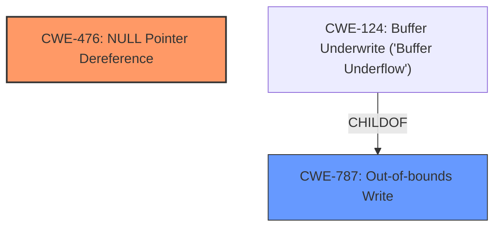

# Analysis Report for CVE-2025-37774

# Vulnerability Analysis Report: CVE-2025-37774

## Description

In the Linux kernel, the following vulnerability has been resolved slab ensure slab->obj_exts is clear in a newly allocated slab page ktest recently reported crashes while running several buffered io tests with __alloc_tagging_slab_alloc_hook() at the top of the crash call stack. The signature indicates an **invalid address dereference** with low bits of slab->obj_exts being set. The bits were outside of the range used by page_memcg_data_flags and objext_flags and hence were not masked out by slab_obj_exts() when obtaining the pointer stored in slab->obj_exts. The typical crash log looks like this 00510 Unable to handle kernel NULL pointer dereference at virtual address 0000000000000010 00510 Mem abort info 00510 ESR = 0x0000000096000045 00510 EC = 0x25 DABT (current EL), IL = 32 bits 00510 SET = 0, FnV = 0 00510 EA = 0, S1PTW = 0 00510 FSC = 0x05 level 1 translation fault 00510 Data abort info 00510 ISV = 0, ISS = 0x00000045, ISS2 = 0x00000000 00510 CM = 0, WnR = 1, TnD = 0, TagAccess = 0 00510 GCS = 0, Overlay = 0, DirtyBit = 0, Xs = 0 00510 user pgtable 4k pages, 39-bit VAs, pgdp=0000000104175000 00510 [0000000000000010] pgd=0000000000000000, p4d=0000000000000000, pud=0000000000000000 00510 Internal error Oops 0000000096000045

## Vulnerability Description Key Phrases

- **Weakness:** invalid address dereference
- **Impact:** ['kernel NULL pointer dereference', 'Oops']
- **Product:** Linux kernel

## Analysis (with Relationship Data)

# Summary
| CWE ID | CWE Name | Confidence | CWE Abstraction Level | CWE Vulnerability Mapping Label | CWE-Vulnerability Mapping Notes |
|---|---|---|---|---|---|
| CWE-476 | NULL Pointer Dereference | 0.9 | Base | Primary | Allowed |
| CWE-787 | Out-of-bounds Write | 0.6 | Base | Secondary | Allowed |

## Evidence and Confidence

*   **Confidence Score:** 0.8
*   **Evidence Strength:** MEDIUM

## Relationship Analysis
The primary weakness appears to be a NULL Pointer Dereference (CWE-476), which is a base-level CWE. While Out-of-Bounds Write (CWE-787) is also considered due to the description mentioning invalid address dereference, the core issue seems to be the dereference of a NULL pointer, making CWE-476 the primary concern. CWE-787 is a parent of CWE-124, indicating a potential for buffer underflow, but there isn't strong evidence to support this.



## Vulnerability Chain
The vulnerability chain starts with a potential memory corruption issue, leading to an **invalid address dereference**. This **invalid address dereference** results in the kernel attempting to access a NULL pointer (CWE-476), ultimately causing a kernel panic (Oops). A potential secondary weakness could be an out-of-bounds write (CWE-787) leading to memory corruption.

## Summary of Analysis
The analysis is based on the provided vulnerability description, which highlights an **invalid address dereference** leading to a kernel NULL pointer dereference. The primary CWE is identified as CWE-476 (NULL Pointer Dereference) due to the crash log explicitly mentioning a NULL pointer dereference.

The retriever results also support this, with CWE-476 having the highest score.

While other CWEs like CWE-787 (Out-of-bounds Write) are considered, the direct evidence points towards a NULL pointer dereference as the root cause. The description mentions "slab->obj_exts being set" with "low bits" outside the range, suggesting a potential memory corruption leading to an invalid pointer value. However, the ultimate result is dereferencing a NULL pointer.

Therefore, CWE-476 is chosen as the primary CWE because it directly describes the observed crash.

Relevant CWE Information:

# Enhanced Context (25 CWEs)
The following CWEs were identified as potentially relevant to this vulnerability:

## CWE-476: NULL Pointer Dereference
**Abstraction Level**: Base
**Similarity Score**: 0.78
**Source**: dense

**Description**:
The product dereferences a pointer that it expects to be valid but is NULL.

**Mapping Guidance**:
- Usage: Allowed
- Rationale: This CWE entry is at the Base level of abstraction, which is a preferred level of abstraction for mapping to the root causes of vulnerabilities.


## CWE-824: Access of Uninitialized Pointer
**Abstraction Level**: Base
**Similarity Score**: 0.78
**Source**: dense

**Description**:
The product accesses or uses a pointer that has not been initialized.

**Mapping Guidance**:
- Usage: Allowed
- Rationale: This CWE entry is at the Base level of abstraction, which is a preferred level of abstraction for mapping to the root causes of vulnerabilities.


## CWE-822: Untrusted Pointer Dereference
**Abstraction Level**: Base
**Similarity Score**: 0.78
**Source**: dense

**Description**:
The product obtains a value from an untrusted source, converts this value to a pointer, and dereferences the resulting pointer.

**Mapping Guidance**:
- Usage: Allowed
- Rationale: This CWE entry is at the Base level of abstraction, which is a preferred level of abstraction for mapping to the root causes of vulnerabilities.


## CWE-667: Improper Locking
**Abstraction Level**: Class
**Similarity Score**: 0.76
**Source**: dense

**Description**:
The product does not properly acquire or release a lock on a resource, leading to unexpected resource state changes and behaviors.

**Mapping Guidance**:
- Usage: Allowed-with-Review
- Rationale: This CWE entry is a Class and might have Base-level children that would be more appropriate


## CWE-909: Missing Initialization of Resource
**Abstraction Level**: Class
**Similarity Score**: 0.76
**Source**: dense

**Description**:
The product does not initialize a critical resource.

**Mapping Guidance**:
- Usage: Allowed-with-Review
- Rationale: This CWE entry is a Class and might have Base-level children that would be more appropriate


## CWE-252: Unchecked Return Value
**Abstraction Level**: Base
**Similarity Score**: 0.75
**Source**: dense

**Description**:
The product does not check the return value from a method or function, which can prevent it from detecting unexpected states and conditions.

**Mapping Guidance**:
- Usage: Allowed
- Rationale: This CWE entry is at the Base level of abstraction, which is a preferred level of abstraction for mapping to the root causes of vulnerabilities.


## CWE-131: Incorrect Calculation of Buffer Size
**Abstraction Level**: Base
**Similarity Score**: 0.75
**Source**: dense

**Description**:
The product does not correctly calculate the size to be used when allocating a buffer, which could lead to a buffer overflow.

**Mapping Guidance**:
- Usage: Allowed
- Rationale: This CWE entry is at the Base level of abstraction, which is a preferred level of abstraction for mapping to the root causes of vulnerabilities.


## CWE-665: Improper Initialization
**Abstraction Level**: Class
**Similarity Score**: 0.75
**Source**: dense

**Description**:
The product does not initialize or incorrectly initializes a resource, which might leave the resource in an unexpected state when it is accessed or used.

**Mapping Guidance**:
- Usage: Discouraged
- Rationale: This CWE entry is a level-1 Class (i.e., a child of a Pillar). It might have lower-level children that would be more appropriate


## CWE-193: Off-by-one Error
**Abstraction Level**: Base
**Similarity Score**: 0.74
**Source**: dense

**Description**:
A product calculates or uses an incorrect maximum or minimum value that is 1 more, or 1 less, than the correct value.

**Mapping Guidance**:
- Usage: Allowed
- Rationale: This CWE entry is at the Base level of abstraction, which is a preferred level of abstraction for mapping to the root causes of vulnerabilities.


## CWE-823: Use of Out-of-range Pointer Offset
**Abstraction Level**: Base
**Similarity Score**: 0.74
**Source**: dense

**Description**:
The product performs pointer arithmetic on a valid pointer, but it uses an offset that can point outside of the intended range of valid memory locations for the resulting pointer.

**Mapping Guidance**:
- Usage: Allowed
- Rationale: This CWE entry is at the Base level of abstraction, which is a preferred level of abstraction for mapping to the root causes of vulnerabilities.


## CWE-476: NULL Pointer Dereference
**Abstraction Level**: Base
**Similarity Score**: 628.51
**Source**: sparse

**Description**:
The product dereferences a pointer that it expects to be valid but is NULL.

**Mapping Guidance**:
- Usage: Allowed
- Rationale: This CWE entry is at the Base level of abstraction, which is a preferred level of abstraction for mapping to the root causes of vulnerabilities.


## CWE-823: Use of Out-of-range Pointer Offset
**Abstraction Level**: Base
**Similarity Score**: 569.42
**Source**: sparse

**Description**:
The product performs pointer arithmetic on a valid pointer, but it uses an offset that can point outside of the intended range of valid memory locations for the resulting pointer.

**Mapping Guidance**:
- Usage: Allowed
- Rationale: This CWE entry is at the Base level of abstraction, which is a preferred level of abstraction for mapping to the root causes of vulnerabilities.


## CWE-665: Improper Initialization
**Abstraction Level**: Class
**Similarity Score**: 556.18
**Source**: sparse

**Description**:
The product does not initialize or incorrectly initializes a resource, which might leave the resource in an unexpected state when it is accessed or used.

**Mapping Guidance**:
- Usage: Discouraged
- Rationale: This CWE entry is a level-1 Class (i.e., a child of a Pillar). It might have


## CWE Relationship Analysis

Current CWEs represent these abstraction levels: .


### Vulnerability Chain Analysis

**Chain starting from CWE-476:**
- 476 (NULL Pointer Dereference) - ROOT


**Chain starting from CWE-823:**
- 823 (Use of Out-of-range Pointer Offset) - ROOT


### CWE Relationship Diagram

```mermaid
graph TD
    classDef primary fill:#f96,stroke:#333,stroke-width:2px
    classDef secondary fill:#69f,stroke:#333
    classDef tertiary fill:#9e9,stroke:#333
```


*Report generated on 2025-07-14 21:22:00*
