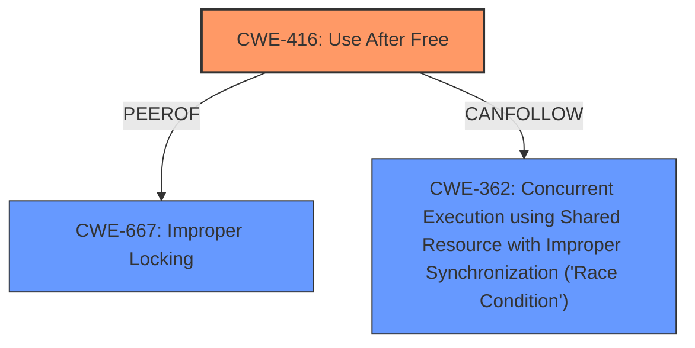

# Analysis for CVE-2025-37777

# Summary
| CWE ID | CWE Name | Confidence | CWE Abstraction Level | CWE Vulnerability Mapping Label | CWE-Vulnerability Mapping Notes |
|---|---|---|---|---|---|
| CWE-416 | Use After Free | 1.0 | Variant | Allowed | Primary CWE |
| CWE-667 | Improper Locking | 0.5 | Class | Allowed-with-Review | Secondary Candidate |
| CWE-362 | Concurrent Execution using Shared Resource with Improper Synchronization ('Race Condition') | 0.5 | Class | Allowed-with-Review | Secondary Candidate |

## Evidence and Confidence

*   **Confidence Score:** 0.9
*   **Evidence Strength:** HIGH

## Relationship Analysis
The primary relationship is that CWE-416 is a variant that can be related to concurrency issues like CWE-362 and locking issues like CWE-667. The selection of CWE-416 is based on the explicit mention of "**use-after-free**" in the vulnerability description.

## Vulnerability Chain
The vulnerability chain starts with a potential concurrency issue (possibly due to **improper locking** or **race condition**) that leads to a **use-after-free** condition when the ksmbd connection is disconnected and the `ksmbd_transport` is freed prematurely. This results in the `__smb2_lease_break_noti` function attempting to access the freed memory, causing a **use-after-free**.

## Summary of Analysis
The initial analysis strongly points towards CWE-416 (**Use After Free**) as the primary weakness, given its direct mention in the vulnerability description: "ksmbd fix **use-after-free** in __smb2_lease_break_noti()." The **use-after-free** occurs because "conn->ksmbd_transport is already freed" when `__smb2_lease_break_noti` calls `ksmbd_conn_write`. This aligns perfectly with the description of CWE-416. The retriever results also list CWE-416 as the top match. While concurrency issues like **improper locking** (CWE-667) or **race conditions** (CWE-362) could potentially contribute to or exacerbate the vulnerability, the core issue is the **use-after-free**. Therefore, CWE-416 is the most specific and relevant CWE. I considered the possibility of a race condition or locking issue as a contributing factor, but the primary weakness is the dereference of already freed memory.

Relevant CWE Information:

# Enhanced Context (25 CWEs)
The following CWEs were identified as potentially relevant to this vulnerability:

## CWE-362: Concurrent Execution using Shared Resource with Improper Synchronization ('Race Condition')
**Abstraction Level**: Class
**Similarity Score**: 0.72
**Source**: dense

**Description**:
The product contains a concurrent code sequence that requires temporary, exclusive access to a shared resource, but a timing window exists in which the shared resource can be modified by another code sequence operating concurrently.

**Mapping Guidance**:
- Usage: Allowed-with-Review
- Rationale: This CWE entry is a Class and might have Base-level children that would be more appropriate

## CWE-667: Improper Locking
**Abstraction Level**: Class
**Similarity Score**: 0.70
**Source**: dense

**Description**:
The product does not properly acquire or release a lock on a resource, leading to unexpected resource state changes and behaviors.

**Mapping Guidance**:
- Usage: Allowed-with-Review
- Rationale: This CWE entry is a Class and might have Base-level children that would be more appropriate

## CWE-416: Use After Free
**Abstraction Level**: Variant
**Similarity Score**: 0.68
**Source**: graph

**Description**:
The product reuses or references memory after it has been freed. At some point afterward, the memory may be allocated again and saved in another pointer, while the original pointer references a location somewhere within the new allocation. Any operations using the original pointer are no longer valid because the memory "belongs" to the code that operates on the new pointer.

**Mapping Guidance**:
- Usage: Allowed
- Rationale: This CWE entry is at the Variant level of abstraction, which is a preferred level of abstraction for mapping to the root causes of vulnerabilities.