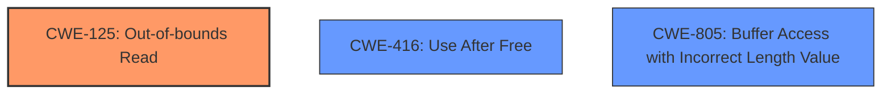

# Raw Analyzer Response for CVE-2025-37785

# Summary
| CWE ID | CWE Name | Confidence | CWE Abstraction Level | CWE Vulnerability Mapping Label | CWE-Vulnerability Mapping Notes |
|---|---|---|---|---|---|
| CWE-125 | Out-of-bounds Read | 0.9 | Base | Primary | Allowed |
| CWE-416 | Use After Free | 0.7 | Variant | Secondary Candidate | Allowed |
| CWE-805 | Buffer Access with Incorrect Length Value | 0.6 | Base | Secondary Candidate | Allowed |

## Evidence and Confidence

*   **Confidence Score:** 0.8
*   **Evidence Strength:** MEDIUM

## Relationship Analysis
The primary relationship that influenced the CWE selection was the hierarchical relationship. CWE-125, Out-of-bounds Read, is the direct result of dereferencing a pointer that points past the allocated memory, caused by a faulty length check on the '.' directory entry. While a **use-after-free** condition is reported, the root cause is the **out-of-bounds read**.

## Vulnerability Chain
The vulnerability chain starts with the incorrect calculation of the directory entry length, leading to the pointer arithmetic placing the pointer out of bounds. This out-of-bounds pointer is then dereferenced, causing an **out-of-bounds read**. In some cases, the memory past the boundary might have been recently freed leading to the KASAN report of **use-after-free**, however, the root cause remains the **out-of-bounds read**.

## Summary of Analysis
The initial assessment focused on the reported **use-after-free** condition. However, further analysis of the vulnerability description and the call trace clearly indicates that the root cause is an **out-of-bounds read** due to an incorrect directory entry length check. The "**use-after-free**" is a consequence of reading from memory that may have been recently freed, but the primary issue is accessing memory outside the allocated buffer.

The vulnerability description states: "Mounting a corrupted filesystem with directory which contains . dir entry with rec_len == block size results in **out-of-bounds read** (later on, when the corrupted directory is removed)." and "Note This is reported by KASAN as **use-after-free** in case another structure was recently freed from the slot past the bound, but it is really an **OOB read**." This evidence strongly supports the selection of CWE-125 as the primary weakness.

CWE-125 is the most specific and accurate representation of the vulnerability based on the provided evidence.

Relevant CWE Information:

# Enhanced Context (25 CWEs)
The following CWEs were identified as potentially relevant to this vulnerability:

## CWE-125: Out-of-bounds Read
**Abstraction Level**: Base
**Similarity Score**: 0.77
**Source**: dense

**Description**:
The product reads data past the end, or before the beginning, of the intended buffer.

**Mapping Guidance**:
- Usage: Allowed
- Rationale: This CWE entry is at the Base level of abstraction, which is a preferred level of abstraction for mapping to the root causes of vulnerabilities.

## CWE-416: Use After Free
**Abstraction Level**: Variant
**Similarity Score**: 1.00
**Source**: Retriever Results

**Description**: The product accesses memory location after it has been freed

**Mapping Guidance**:
- Usage: Allowed

## CWE-805: Buffer Access with Incorrect Length Value
**Abstraction Level**: Base
**Similarity Score**: 775.57
**Source**: sparse

**Description**:
The product uses a sequential operation to read or write a buffer, but it uses an incorrect length value that causes it to access memory that is outside of the bounds of the buffer.

**Mapping Guidance**:
- Usage: Allowed
- Rationale: This CWE entry is at the Base level of abstraction, which is a preferred level of abstraction for mapping to the root causes of vulnerabilities.