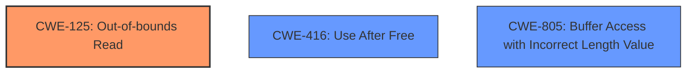

# Analysis Report for CVE-2025-37785

# Vulnerability Analysis Report: CVE-2025-37785

## Description

In the Linux kernel, the following vulnerability has been resolved ext4 fix OOB read when checking dotdot dir Mounting a corrupted filesystem with directory which contains . dir entry with rec_len == block size results in out-of-bounds read (later on, when the corrupted directory is removed). ext4_empty_dir() assumes every ext4 directory contains at least . and .. as directory entries in the first data block. It first loads the . dir entry, performs sanity checks by calling ext4_check_dir_entry() and then uses its rec_len member to compute the location of .. dir entry (in ext4_next_entry). It assumes the .. dir entry fits into the same data block. If the rec_len of . is precisely one block (4KB), it slips through the sanity checks (it is considered the last directory entry in the data block) and leaves struct ext4_dir_entry_2 *de point exactly past the memory slot allocated to the data block. The following call to ext4_check_dir_entry() on new value of de then dereferences this pointer which results in out-of-bounds mem access. Fix this by extending __ext4_check_dir_entry() to check for . dir entries that reach the end of data block. Make sure to ignore the phony dir entries for checksum (by checking name_len for non-zero). Note This is reported by KASAN as **use-after-free** in case another structure was recently freed from the slot past the bound, but it is really an OOB read. This issue was found by syzkaller tool. Call Trace [ 38.594108] BUG KASAN slab-**use-after-free** in __ext4_check_dir_entry+0x67e/0x710 [ 38.594649] Read of size 2 at addr ffff88802b41a004 by task syz-executor/5375 [ 38.595158] [ 38.595288] CPU 0 UID 0 PID 5375 Comm syz-executor Not tainted 6.14.0-rc7 #1 [ 38.595298] Hardware name QEMU Standard PC (i440FX + PIIX, 1996), BIOS rel-1.16.3-0-ga6ed6b701f0a-prebuilt.qemu.org 04/01/2014 [ 38.595304] Call Trace [ 38.595308] [ 38.595311] dump_stack_lvl+0xa7/0xd0 [ 38.595325] print_address_description.constprop.0+0x2c/0x3f0 [ 38.595339] ? __ext4_check_dir_entry+0x67e/0x710 [ 38.595349] print_report+0xaa/0x250 [ 38.595359] ? __ext4_check_dir_entry+0x67e/0x710 [ 38.595368] ? kasan_addr_to_slab+0x9/0x90 [ 38.595378] kasan_report+0xab/0xe0 [ 38.595389] ? __ext4_check_dir_entry+0x67e/0x710 [ 38.595400] __ext4_check_dir_entry+0x67e/0x710 [ 38.595410] ext4_empty_dir+0x465/0x990 [ 38.595421] ? __pfx_ext4_empty_dir+0x10/0x10 [ 38.595432] ext4_rmdir.part.0+0x29a/0xd10 [ 38.595441] ? __dquot_initialize+0x2a7/0xbf0 [ 38.595455] ? __pfx_ext4_rmdir.part.0+0x10/0x10 [ 38.595464] ? __pfx___dquot_initialize+0x10/0x10 [ 38.595478] ? down_write+0xdb/0x140 [ 38.595487] ? __pfx_down_write+0x10/0x10 [ 38.595497] ext4_rmdir+0xee/0x140 [ 38.595506] vfs_rmdir+0x209/0x670 [ 38.595517] ? lookup_one_qstr_excl+0x3b/0x190 [ 38.595529] do_rmdir+0x363/0x3c0 [ 38.595537] ? __pfx_do_rmdir+0x10/0x10 [ 38.595544] ? strncpy_from_user+0x1ff/0x2e0 [ 38.595561] __x64_sys_unlinkat+0xf0/0x130 [ 38.595570] do_syscall_64+0x5b/0x180 [ 38.595583] entry_SYSCALL_64_after_hwframe+0x76/0x7e

## Vulnerability Description Key Phrases

- **Weakness:** use-after-free
- **Impact:** out-of-bounds read
- **Product:** Linux kernel
- **Component:** ext4

## Analysis (with Relationship Data)

# Summary
| CWE ID | CWE Name | Confidence | CWE Abstraction Level | CWE Vulnerability Mapping Label | CWE-Vulnerability Mapping Notes |
|---|---|---|---|---|---|
| CWE-125 | Out-of-bounds Read | 0.9 | Base | Primary | Allowed |
| CWE-416 | Use After Free | 0.7 | Variant | Secondary Candidate | Allowed |
| CWE-805 | Buffer Access with Incorrect Length Value | 0.6 | Base | Secondary Candidate | Allowed |

## Evidence and Confidence

*   **Confidence Score:** 0.8
*   **Evidence Strength:** MEDIUM

## Relationship Analysis
The primary relationship that influenced the CWE selection was the hierarchical relationship. CWE-125, Out-of-bounds Read, is the direct result of dereferencing a pointer that points past the allocated memory, caused by a faulty length check on the '.' directory entry. While a **use-after-free** condition is reported, the root cause is the **out-of-bounds read**.



## Vulnerability Chain
The vulnerability chain starts with the incorrect calculation of the directory entry length, leading to the pointer arithmetic placing the pointer out of bounds. This out-of-bounds pointer is then dereferenced, causing an **out-of-bounds read**. In some cases, the memory past the boundary might have been recently freed leading to the KASAN report of **use-after-free**, however, the root cause remains the **out-of-bounds read**.

## Summary of Analysis
The initial assessment focused on the reported **use-after-free** condition. However, further analysis of the vulnerability description and the call trace clearly indicates that the root cause is an **out-of-bounds read** due to an incorrect directory entry length check. The "**use-after-free**" is a consequence of reading from memory that may have been recently freed, but the primary issue is accessing memory outside the allocated buffer.

The vulnerability description states: "Mounting a corrupted filesystem with directory which contains . dir entry with rec_len == block size results in **out-of-bounds read** (later on, when the corrupted directory is removed)." and "Note This is reported by KASAN as **use-after-free** in case another structure was recently freed from the slot past the bound, but it is really an **OOB read**." This evidence strongly supports the selection of CWE-125 as the primary weakness.

CWE-125 is the most specific and accurate representation of the vulnerability based on the provided evidence.

Relevant CWE Information:

# Enhanced Context (25 CWEs)
The following CWEs were identified as potentially relevant to this vulnerability:

## CWE-125: Out-of-bounds Read
**Abstraction Level**: Base
**Similarity Score**: 0.77
**Source**: dense

**Description**:
The product reads data past the end, or before the beginning, of the intended buffer.

**Mapping Guidance**:
- Usage: Allowed
- Rationale: This CWE entry is at the Base level of abstraction, which is a preferred level of abstraction for mapping to the root causes of vulnerabilities.

## CWE-416: Use After Free
**Abstraction Level**: Variant
**Similarity Score**: 1.00
**Source**: Retriever Results

**Description**: The product accesses memory location after it has been freed

**Mapping Guidance**:
- Usage: Allowed

## CWE-805: Buffer Access with Incorrect Length Value
**Abstraction Level**: Base
**Similarity Score**: 775.57
**Source**: sparse

**Description**:
The product uses a sequential operation to read or write a buffer, but it uses an incorrect length value that causes it to access memory that is outside of the bounds of the buffer.

**Mapping Guidance**:
- Usage: Allowed
- Rationale: This CWE entry is at the Base level of abstraction, which is a preferred level of abstraction for mapping to the root causes of vulnerabilities.


## CWE Relationship Analysis

Current CWEs represent these abstraction levels: .


### Vulnerability Chain Analysis

**Chain starting from CWE-416:**
- 416 (Use After Free) - ROOT


**Chain starting from CWE-805:**
- 805 (Buffer Access with Incorrect Length Value) - ROOT


### CWE Relationship Diagram

```mermaid
graph TD
    classDef primary fill:#f96,stroke:#333,stroke-width:2px
    classDef secondary fill:#69f,stroke:#333
    classDef tertiary fill:#9e9,stroke:#333
```


*Report generated on 2025-07-14 21:24:54*
