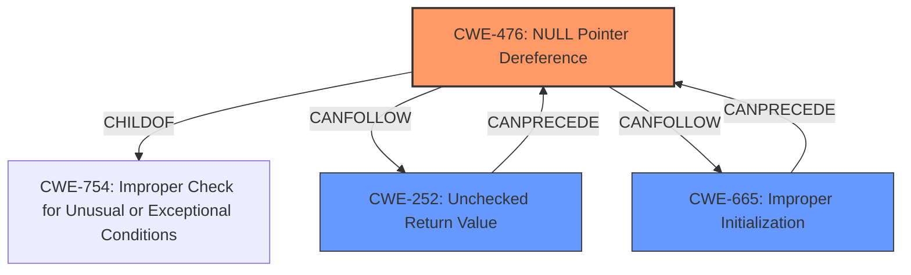

# Raw Analyzer Response for CVE-2025-37792

# Summary
| CWE ID  | CWE Name                                          | Confidence | CWE Abstraction Level | CWE Vulnerability Mapping Label | CWE-Vulnerability Mapping Notes |
| :-------- | :------------------------------------------------ | :---------- | :-------------------- | :------------------------------ | :------------------------------ |
| CWE-476   | NULL Pointer Dereference                          | 1          | Base                 | Primary                          | Allowed                       |
| CWE-665   | Improper Initialization                           | 0.8        | Class                 | Secondary                       | Discouraged                   |
| CWE-252   | Unchecked Return Value                            | 0.7        | Base                 | Secondary                       | Allowed                       |

## Evidence and Confidence

*   **Confidence Score:** 0.9
*   **Evidence Strength:** HIGH

## Relationship Analysis
The primary relationship that influenced the decision was the ChildOf relationship, which helped determine that CWE-476 is a specific type of **Improper Check for Unusual or Exceptional Conditions (CWE-754)**. The relationship between CWE-252 and CWE-476, where **Unchecked Return Value (CWE-252)** can precede **NULL Pointer Dereference (CWE-476)**, also played a role. While CWE-665 is a more general class, its relevance stems from the vulnerability description indicating a potential initialization issue that could lead to the **NULL pointer dereference**. The abstraction levels were considered to ensure that the most specific and relevant CWEs were selected.

## Vulnerability Chain
The vulnerability chain starts with an **error pointer vs NULL bug**, potentially stemming from **Improper Initialization (CWE-665)** or an **Unchecked Return Value (CWE-252)**, leading to a **NULL pointer dereference (CWE-476)**.

1.  **Improper Initialization (CWE-665)** / **Unchecked Return Value (CWE-252)**: Resource is not correctly initialized or the return value is not checked after a call, which may lead to an unexpected state.
2.  **NULL Pointer Dereference (CWE-476)**: The pointer, now unexpectedly NULL, is dereferenced, causing a crash or other undefined behavior.

## Summary of Analysis
The initial assessment was heavily influenced by the vulnerability description emphasizing a **NULL pointer dereference**. The key phrases, "error pointer vs NULL bug" and "**NULL dereference**", pointed directly to **CWE-476 (NULL Pointer Dereference)** as the primary weakness. The retriever results and CWE specifications supported this assessment. Further analysis considered related weaknesses like **Improper Initialization (CWE-665)** and **Unchecked Return Value (CWE-252)**, as the **NULL pointer dereference** could be a consequence of these underlying issues. The graph relationships showed how these CWEs could be interconnected, with **CWE-252** potentially preceding **CWE-476**. Ultimately, **CWE-476** was chosen as the primary CWE due to the explicit mention of a **NULL pointer dereference** in the vulnerability description. The secondary CWEs, **CWE-665** and **CWE-252**, were included because they represent potential contributing factors to the primary weakness.

Relevant Evidence:
*   "Bluetooth btrtl Prevent potential **NULL dereference**"
*   "It results in an **error pointer vs NULL bug**, followed by a **NULL pointer dereference**."

The selected CWEs are at the optimal level of specificity, with **CWE-476** being a Base-level CWE that directly describes the vulnerability. **CWE-665** and **CWE-252** are included to capture the potential contributing factors to the **NULL pointer dereference**.

Other CWEs Considered but Not Used:

*   **CWE-824 (Access of Uninitialized Pointer)**: While related, the description specifically mentions a **NULL pointer**, not just any uninitialized pointer.
*   **CWE-822 (Untrusted Pointer Dereference)**: There's no indication that the pointer's value comes from an untrusted source.
*   **CWE-833 (Deadlock)**: This is unrelated to the provided vulnerability description.
*   **CWE-789 (Memory Allocation with Excessive Size Value)**: There is no mention of memory allocation issues related to excessive size.
*   **CWE-772 (Missing Release of Resource after Effective Lifetime)**: There is no mention of resource leakage.