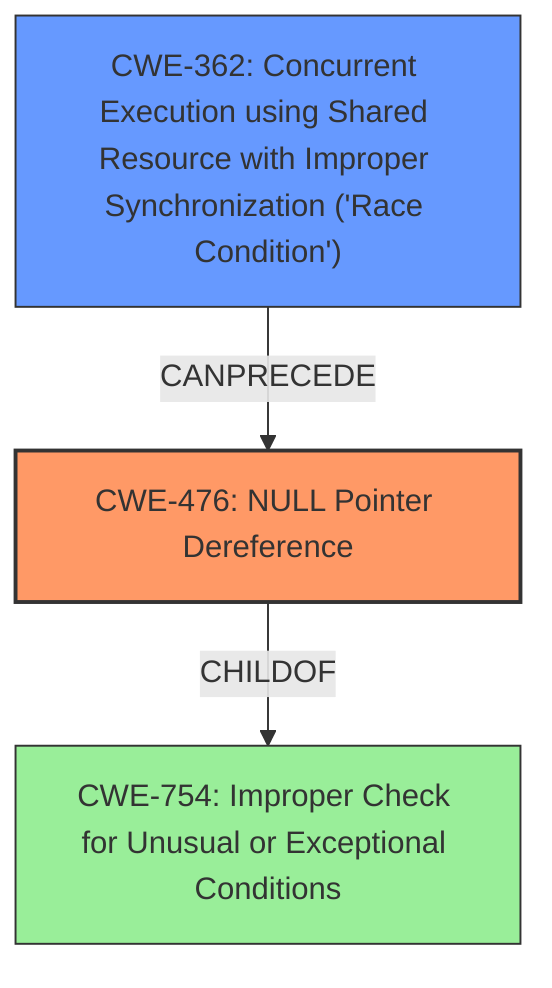

# Analysis Report for CVE-2025-37794

# Vulnerability Analysis Report: CVE-2025-37794

## Description

In the Linux kernel, the following vulnerability has been resolved wifi mac80211 Purge vif txq in ieee80211_do_stop() After ieee80211_do_stop() SKB from vifs txq could still be processed. Indeed another concurrent vif schedule_and_wake_txq call could cause those packets to be dequeued (see ieee80211_handle_wake_tx_queue()) without checking the sdata current state. Because vif.drv_priv is now cleared in this function, this could lead to driver crash. For example in ath12k, ahvif is store in vif.drv_priv. Thus if ath12k_mac_op_tx() is called after ieee80211_do_stop(), ahvif->ah can be NULL, leading the ath12k_warn(ahvif->ah,...) call in this function to trigger the NULL deref below. Unable to handle kernel paging request at virtual address dfffffc000000001 KASAN **null-ptr-deref** in range [0x0000000000000008-0x000000000000000f] batman_adv bat0 Interface deactivated brbh1337 Mem abort info ESR = 0x0000000096000004 EC = 0x25 DABT (current EL), IL = 32 bits SET = 0, FnV = 0 EA = 0, S1PTW = 0 FSC = 0x04 level 0 translation fault Data abort info ISV = 0, ISS = 0x00000004, ISS2 = 0x00000000 CM = 0, WnR = 0, TnD = 0, TagAccess = 0 GCS = 0, Overlay = 0, DirtyBit = 0, Xs = 0 [dfffffc000000001] address between user and kernel address ranges Internal error Oops 0000000096000004

## Vulnerability Description Key Phrases

- **Weakness:** ['NULL dereference', 'null-ptr-deref']
- **Impact:** ['driver crash', 'Oops']
- **Product:** Linux kernel
- **Component:** wifi mac80211

## Analysis (with Relationship Data)

# Summary
| CWE ID    | CWE Name                                                                        | Confidence | CWE Abstraction Level | CWE Vulnerability Mapping Label | CWE-Vulnerability Mapping Notes |
| --------- | ------------------------------------------------------------------------------- | ---------- | --------------------- | ------------------------------- | ------------------------------- |
| CWE-476   | NULL Pointer Dereference                                                        | 1          | Base                  | Primary CWE                   | Allowed                       |
| CWE-362   | Concurrent Execution using Shared Resource with Improper Synchronization ('Race Condition') | 0.6          | Class                 | Secondary Candidate                    | Allowed-with-Review                       |

## Evidence and Confidence

*   **Confidence Score:** 0.8
*   **Evidence Strength:** HIGH

## Relationship Analysis
The primary weakness is a **NULL pointer dereference** (CWE-476). The vulnerability occurs due to a race condition (CWE-362) where the `vif.drv_priv` is cleared in `ieee80211_do_stop()` while another concurrent `vif schedule_and_wake_txq` call could cause packets to be dequeued without checking the `sdata` current state. The race condition allows the execution flow to continue even after the `vif.drv_priv` is cleared, eventually leading to the **NULL pointer dereference** when `ath12k_mac_op_tx()` is called. CWE-476 is a child of CWE-754 (Improper Check for Unusual or Exceptional Conditions) and is related to CWE-824 (Access of Uninitialized Pointer). CWE-362 is a class-level CWE, while CWE-476 is a base-level CWE, indicating a more specific characterization of the vulnerability.mermaid



## Vulnerability Chain
The vulnerability chain starts with a race condition (CWE-362) where a shared resource is accessed concurrently without proper synchronization. This leads to a state where a necessary pointer (`vif.drv_priv`) is cleared prematurely. Consequently, a **NULL pointer dereference** (CWE-476) occurs when the cleared pointer is accessed later in the execution, resulting in a driver crash.

CWE-362 (Race Condition) -> **NULL pointer dereference** (CWE-476) -> Driver Crash

## Summary of Analysis
The vulnerability description clearly indicates a **NULL pointer dereference** occurring in the Linux kernel's wifi mac80211 component. The root cause is the concurrent access to a shared resource without proper synchronization, leading to the premature clearing of a pointer. The subsequent dereference of this **NULL pointer** causes a driver crash.

The primary CWE is CWE-476 (NULL Pointer Dereference), as it directly describes the error leading to the crash. CWE-362 (Concurrent Execution using Shared Resource with Improper Synchronization ('Race Condition')) is considered as a secondary CWE because it describes the condition that enables the NULL pointer dereference.

The selection of CWE-476 is at the optimal level of specificity, as it is a base-level CWE that precisely captures the nature of the error. Other CWEs like CWE-754 (Improper Check for Unusual or Exceptional Conditions) are more general and do not accurately represent the specific vulnerability.

Relevant CWE Information:

# Enhanced Context (25 CWEs)
The following CWEs were identified as potentially relevant to this vulnerability:

## CWE-824: Access of Uninitialized Pointer
**Abstraction Level**: Base
**Similarity Score**: 0.76
**Source**: dense

**Description**:
The product accesses or uses a pointer that has not been initialized.

**Mapping Guidance**:
- Usage: Allowed
- Rationale: This CWE entry is at the Base level of abstraction, which is a preferred level of abstraction for mapping to the root causes of vulnerabilities.

## CWE-667: Improper Locking
**Abstraction Level**: Class
**Similarity Score**: 0.75
**Source**: dense

**Description**:
The product does not properly acquire or release a lock on a resource, leading to unexpected resource state changes and behaviors.

**Mapping Guidance**:
- Usage: Allowed-with-Review
- Rationale: This CWE entry is a Class and might have Base-level children that would be more appropriate

## CWE-476: NULL Pointer Dereference
**Abstraction Level**: Base
**Similarity Score**: 0.75
**Source**: dense

**Description**:
The product dereferences a pointer that it expects to be valid but is NULL.

**Mapping Guidance**:
- Usage: Allowed
- Rationale: This CWE entry is at the Base level of abstraction, which is a preferred level of abstraction for mapping to the root causes of vulnerabilities.

## CWE-822: Untrusted Pointer Dereference
**Abstraction Level**: Base
**Similarity Score**: 0.74
**Source**: dense

**Description**:
The product obtains a value from an untrusted source, converts this value to a pointer, and dereferences the resulting pointer.

**Mapping Guidance**:
- Usage: Allowed
- Rationale: This CWE entry is at the Base level of abstraction, which is a preferred level of abstraction for mapping to the root causes of vulnerabilities.

## CWE-833: Deadlock
**Abstraction Level**: Base
**Similarity Score**: 0.73
**Source**: dense

**Description**:
The product contains multiple threads or executable segments that are waiting for each other to release a necessary lock, resulting in deadlock.

**Mapping Guidance**:
- Usage: Allowed
- Rationale: This CWE entry is at the Base level of abstraction, which is a preferred level of abstraction for mapping to the root causes of vulnerabilities.

## CWE-755: Improper Handling of Exceptional Conditions
**Abstraction Level**: Class
**Similarity Score**: 0.73
**Source**: dense

**Description**:
The product does not handle or incorrectly handles an exceptional condition.

**Mapping Guidance**:
- Usage: Discouraged
- Rationale: This CWE entry is a level-1 Class (i.e., a child of a Pillar). It might have lower-level children that would be more appropriate

## CWE-665: Improper Initialization
**Abstraction Level**: Class
**Similarity Score**: 0.73
**Source**: dense

**Description**:
The product does not initialize or incorrectly initializes a resource, which might leave the resource in an unexpected state when it is accessed or used.

**Mapping Guidance**:
- Usage: Discouraged
- Rationale: This CWE entry is a level-1 Class (i.e., a child of a Pillar). It might have lower-level children that would be more appropriate

## CWE-252: Unchecked Return Value
**Abstraction Level**: Base
**Similarity Score**: 0.73
**Source**: dense

**Description**:
The product does not check the return value from a method or function, which can prevent it from detecting unexpected states and conditions.

**Mapping Guidance**:
- Usage: Allowed
- Rationale: This CWE entry is at the Base level of abstraction, which is a preferred level of abstraction for mapping to the root causes of vulnerabilities.

## CWE-703: Improper Check or Handling of Exceptional Conditions
**Abstraction Level**: Pillar
**Similarity Score**: 0.73
**Source**: dense

**Description**:
The product does not properly anticipate or handle exceptional conditions that rarely occur during normal operation of the product.

**Mapping Guidance**:
- Usage: Discouraged
- Rationale: This CWE entry is extremely high-level, a Pillar.

## CWE-1285: Improper Validation of Specified Index, Position, or Offset in Input
**Abstraction Level**: Base
**Similarity Score**: 0.72
**Source**: dense

**Description**:
The product receives input that is expected to specify an index, position, or offset into an indexable resource such as a buffer or file, but it does not validate or incorrectly validates that the specified index/position/offset has the required properties.

**Mapping Guidance**:
- Usage: Allowed
- Rationale: This CWE entry is at the Base level of abstraction, which is a preferred level of abstraction for mapping to the root causes of vulnerabilities.

## CWE-476: NULL Pointer Dereference
**Abstraction Level**: Base
**Similarity Score**: 2085.32
**Source**: sparse

**Description**:
The product dereferences a pointer that it expects to be valid but is NULL.

**Mapping Guidance**:
- Usage: Allowed
- Rationale: This CWE entry is at the


## CWE Relationship Analysis

Current CWEs represent these abstraction levels: .


### Vulnerability Chain Analysis

**Chain starting from CWE-665:**
- 665 (Improper Initialization) - ROOT


**Chain starting from CWE-476:**
- 476 (NULL Pointer Dereference) - ROOT


### CWE Relationship Diagram

```mermaid
graph TD
    classDef primary fill:#f96,stroke:#333,stroke-width:2px
    classDef secondary fill:#69f,stroke:#333
    classDef tertiary fill:#9e9,stroke:#333
```


*Report generated on 2025-07-14 21:26:46*
