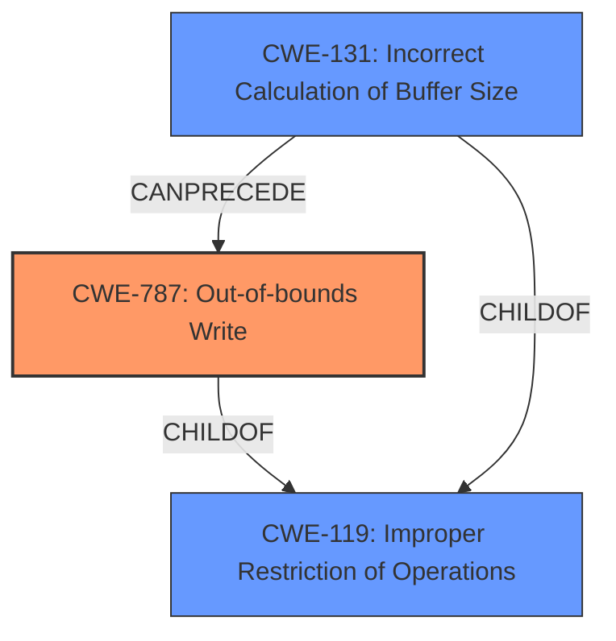

# Analysis Report for CVE-2025-37816

# Vulnerability Analysis Report: CVE-2025-37816

## Description

In the Linux kernel, the following vulnerability has been resolved mei vsc Fix fortify-panic caused by **invalid counted_by() use** gcc 15 honors the __counted_by(len) attribute on vsc_tp_packet.buf[] and the vsc-tp.c code is using this in a wrong way. len does not contain the available size in the buffer, it contains the actual packet length *without* the crc. So as soon as vsc_tp_xfer() tries to add the crc to buf[] the fortify-panic handler gets triggered [ 80.842193] memcpy detected **buffer overflow** 4 byte write of buffer size 0 [ 80.842243] WARNING CPU 4 PID 272 at lib/string_helpers.c1032 __fortify_report+0x45/0x50 ... [ 80.843175] __fortify_panic+0x9/0xb [ 80.843186] vsc_tp_xfer.cold+0x67/0x67 [mei_vsc_hw] [ 80.843210] ? seqcount_lockdep_reader_access.constprop.0+0x82/0x90 [ 80.843229] ? lockdep_hardirqs_on+0x7c/0x110 [ 80.843250] mei_vsc_hw_start+0x98/0x120 [mei_vsc] [ 80.843270] mei_reset+0x11d/0x420 [mei] The easiest fix would be to just drop the counted-by but with the exception of the ack buffer in vsc_tp_xfer_helper() which only contains enough room for the packet-header, all other uses of vsc_tp_packet always use a buffer of VSC_TP_MAX_XFER_SIZE bytes for the packet. Instead of just dropping the counted-by, split the vsc_tp_packet struct definition into a header and a full-packet definition and use a fixed size buf[] in the packet definition, this way fortify-source buffer overrun checking still works when enabled.

## Vulnerability Description Key Phrases

- **Rootcause:** invalid counted_by() use
- **Weakness:** buffer overflow
- **Impact:** fortify-panic
- **Product:** Linux kernel
- **Component:** mei vsc

## Analysis (with Relationship Data)

# Summary

| CWE ID  | CWE Name                                                               | Confidence | CWE Abstraction Level | CWE Vulnerability Mapping Label | CWE-Vulnerability Mapping Notes |
| ------- | ---------------------------------------------------------------------- | ---------- | --------------------- | ------------------------------- | ------------------------------- |
| CWE-787 | Out-of-bounds Write                                                     | 0.9        | Base                  | Primary                         | Allowed                         |
| CWE-131 | Incorrect Calculation of Buffer Size                                   | 0.7        | Base                  | Secondary                       | Allowed                         |

## Evidence and Confidence

*   **Confidence Score:** 0.8
*   **Evidence Strength:** MEDIUM

## Relationship Analysis

The primary CWE is CWE-787 (Out-of-bounds Write). CWE-131 (Incorrect Calculation of Buffer Size) can precede CWE-787, as an incorrect size calculation can lead to an out-of-bounds write. CWE-119 (Improper Restriction of Operations within the Bounds of a Memory Buffer) is a parent of CWE-787 and CWE-131. The selection of CWE-787 is more specific than CWE-119.



## Vulnerability Chain

The vulnerability chain starts with an **invalid counted_by() use**, leading to an **incorrect calculation of the buffer size**, which results in an **out-of-bounds write**, manifesting as a **buffer overflow** and ultimately triggering a fortify-panic.

## Summary of Analysis

The analysis is based on the provided evidence, which indicates an **invalid counted_by() use** leading to a **buffer overflow**.

The relationship graph shows how an incorrect buffer size calculation (CWE-131) can lead to an out-of-bounds write (CWE-787), both being specific instances of improper memory buffer operation (CWE-119).

CWE-787 is selected as the primary CWE because the memcpy operation results in writing past the end of the buffer. The vulnerability description explicitly states: "memcpy detected **buffer overflow** 4 byte write of buffer size 0". This is a direct out-of-bounds write.

CWE-131 is selected as a secondary CWE because the root cause "mei vsc Fix fortify-panic caused by **invalid counted_by() use**" indicates an incorrect calculation of the buffer size using the counted_by() attribute.

The selected CWEs are at the optimal level of specificity, as they directly address the root cause and the resulting vulnerability.

Relevant CWE Information:

# Enhanced Context (25 CWEs)

## CWE-131: Incorrect Calculation of Buffer Size
**Abstraction Level**: Base
**Similarity Score**: 0.76
**Source**: dense

**Description**:
The product does not correctly calculate the size to be used when allocating a buffer, which could lead to a buffer overflow.

**Mapping Guidance**:
- Usage: Allowed
- Rationale: This CWE entry is at the Base level of abstraction, which is a preferred level of abstraction for mapping to the root causes of vulnerabilities.

*Justification:* The **invalid counted_by() use** indicates an error in calculating the buffer size. The description aligns with CWE-131.

## CWE-787: Out-of-bounds Write
**Abstraction Level**: Base
**Similarity Score**: N/A (not in retriever results, but directly relevant)
**Source**: Vulnerability Description

**Description**: The product writes data past the end, or before the beginning, of the intended buffer.

**Mapping Guidance**:
- Usage: Allowed
- Rationale: This CWE entry is at the Base level of abstraction, which is a preferred level of abstraction for mapping to the root causes of vulnerabilities.

*Justification:* The vulnerability description explicitly mentions a **buffer overflow** due to writing 4 bytes past the end of a buffer size 0.

## CWE-119: Improper Restriction of Operations within the Bounds of a Memory Buffer
**Abstraction Level**: Class
**Similarity Score**: 0.72086 (Retriever Result)
**Source**: sparse

**Description**: The product performs operations on a memory buffer, but it reads from or writes to a memory location outside the buffer's intended boundary.

**Mapping Guidance**:
- Usage: Discouraged
- Rationale: CWE-119 is commonly misused in low-information vulnerability reports when lower-level CWEs could be used instead, or when more details about the vulnerability are available.

*Justification:* While this is a more general description of the issue, CWE-787 provides a more specific classification of the vulnerability as an out-of-bounds write. Therefore, CWE-119 is not selected as the primary CWE.

## CWE-120: Buffer Copy without Checking Size of Input ('Classic Buffer Overflow')
**Abstraction Level**: Base
**Similarity Score**: 0.700 (Retriever Result)
**Source**: alternate_terms

**Description**: The product copies an input buffer to an output buffer without checking the size of the input buffer, potentially leading to a buffer overflow.

**Mapping Guidance**:
- Usage: Allowed-with-Review
- Rationale: There are some indications that this CWE ID might be misused and selected simply because it mentions "buffer overflow" - an increasingly vague term. This CWE entry is only appropriate for "Buffer Copy" operations (not buffer reads), in which where there is no "Checking [the] Size of Input", and (by implication of the copy) writing past the end of the buffer.

*Justification:* While the vulnerability results in a **buffer overflow**, the root cause is not necessarily due to missing size checks during a buffer copy operation. The issue is with an **incorrect calculation of the buffer size** due to the **invalid counted_by() use** and ultimately results in out of bounds write (CWE-787).

## CWE-190: Integer Overflow or Wraparound
**Abstraction Level**: Base
**Similarity Score**: 0.800 (Retriever Result)
**Source**: alternate_terms

**Description**: The product performs a calculation that can produce an integer overflow or wraparound when the logic assumes that the resulting value will always be larger than the original value.

*Justification:* While an integer overflow could theoretically be involved in the size calculation, there is no explicit evidence provided. Therefore, CWE-190 is not selected.

## CWE-125: Out-of-bounds Read
**Abstraction Level**: Base
**Similarity Score**: 0.942 (Retriever Result)
**Source**: sparse

**Description**: The product reads data past the end, or before the beginning, of the intended buffer.

*Justification:* The vulnerability description focuses on writing beyond buffer limits rather than reading. Therefore, CWE-125 is not selected.


## CWE Relationship Analysis

Current CWEs represent these abstraction levels: .


### Vulnerability Chain Analysis

**Chain starting from CWE-125:**
- 125 (Out-of-bounds Read) - ROOT


**Chain starting from CWE-131:**
- 131 (Incorrect Calculation of Buffer Size) - ROOT


### CWE Relationship Diagram

```mermaid
graph TD
    classDef primary fill:#f96,stroke:#333,stroke-width:2px
    classDef secondary fill:#69f,stroke:#333
    classDef tertiary fill:#9e9,stroke:#333
```


*Report generated on 2025-07-14 21:29:28*
