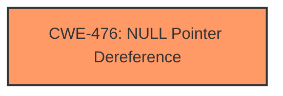

# Enhanced Analysis for CVE-2025-37827

# Summary
| CWE ID | CWE Name | Confidence | CWE Abstraction Level | CWE Vulnerability Mapping Label | CWE-Vulnerability Mapping Notes |
|---|---|---|---|---|---|
| CWE-476 | NULL Pointer Dereference | 1.0 | Base | Allowed | Primary CWE |

## Evidence and Confidence

*   **Confidence Score:** 1.0
*   **Evidence Strength:** HIGH

## Relationship Analysis
The primary relationship that influenced the decision was the direct identification of "**NULL pointer dereference**" in the vulnerability description key phrases. While other CWEs were considered, the explicit mention of this issue strongly supports CWE-476 as the most appropriate mapping.



## Vulnerability Chain
The vulnerability chain is straightforward:
1.  **Root Cause:** A **NULL pointer dereference** occurs in `__btrfs_add_free_space_zoned()`.
2.  **Impact:** System crash due to the program attempting to access memory at address 0.

## Summary of Analysis
The analysis is primarily based on the vulnerability description, which explicitly mentions a "**NULL pointer dereference**." This aligns perfectly with CWE-476.

The vulnerability description key phrases clearly indicate the root cause: "**rootcause:** **NULL pointer dereference**". This direct statement makes CWE-476 the most appropriate and specific classification.

The retriever results also support this decision, with CWE-476 being the top-ranked CWE ID.

Relevant CWE Information:

# Enhanced Context (25 CWEs)
The following CWEs were identified as potentially relevant to this vulnerability:

## CWE-476: NULL Pointer Dereference
**Abstraction Level**: Base
**Similarity Score**: 0.70
**Source**: dense

**Description**:
The product dereferences a pointer that it expects to be valid but is NULL.

**Mapping Guidance**:
- Usage: Allowed
- Rationale: This CWE entry is at the Base level of abstraction, which is a preferred level of abstraction for mapping to the root causes of vulnerabilities.

## CWE-476: NULL Pointer Dereference
**Abstraction Level**: Base
**Similarity Score**: 2.88
**Source**: graph

**Description**:
The product dereferences a pointer that it expects to be valid but is NULL.

**Mapping Guidance**:
- Usage: Allowed
- Rationale: This CWE entry is at the Base level of abstraction, which is a preferred level of abstraction for mapping to the root causes of vulnerabilities.

**Relationships**:
- CANFOLLOW -> CWE-789
- CANFOLLOW -> CWE-362
- CANFOLLOW -> CWE-252
- CANFOLLOW -> CWE-1325
- CHILDOF -> CWE-754

## CWE-476: NULL Pointer Dereference
**Abstraction Level**: Base
**Similarity Score**: 472.92
**Source**: sparse

**Description**:
The product dereferences a pointer that it expects to be valid but is NULL.

**Mapping Guidance**:
- Usage: Allowed
- Rationale: This CWE entry is at the Base level of abstraction, which is a preferred level of abstraction for mapping to the root causes of vulnerabilities.

### Top Combined Results

| Rank | CWE ID | Name | Abstraction | Usage  | Retrievers | Individual Scores |
|------|--------|------|-------------|-------|------------|-------------------|
| 1 | 476 | NULL Pointer Dereference | Base | Allowed | sparse | 0.403 |

**CWE-476: NULL Pointer Dereference**
The vulnerability description explicitly states a **NULL pointer dereference** as the root cause. This aligns perfectly with CWE-476, which describes a scenario where the product dereferences a pointer that it expects to be valid but is NULL. This is a direct match and requires no further interpretation. The security implication is a potential crash or denial of service.

CWE-252: Unchecked Return Value, CWE-824: Access of Uninitialized Pointer, CWE-457: Use of Uninitialized Variable were considered. These were not selected because the vulnerability description explicitly stated the vulnerability was a **NULL pointer dereference**.


## CWE Relationship Analysis

Current CWEs represent these abstraction levels: .


### Vulnerability Chain Analysis

**Chain starting from CWE-476:**
- 476 (NULL Pointer Dereference) - ROOT


**Chain starting from CWE-457:**
- 457 (Use of Uninitialized Variable) - ROOT


### CWE Relationship Diagram

```mermaid
graph TD
    classDef primary fill:#f96,stroke:#333,stroke-width:2px
    classDef secondary fill:#69f,stroke:#333
    classDef tertiary fill:#9e9,stroke:#333
```