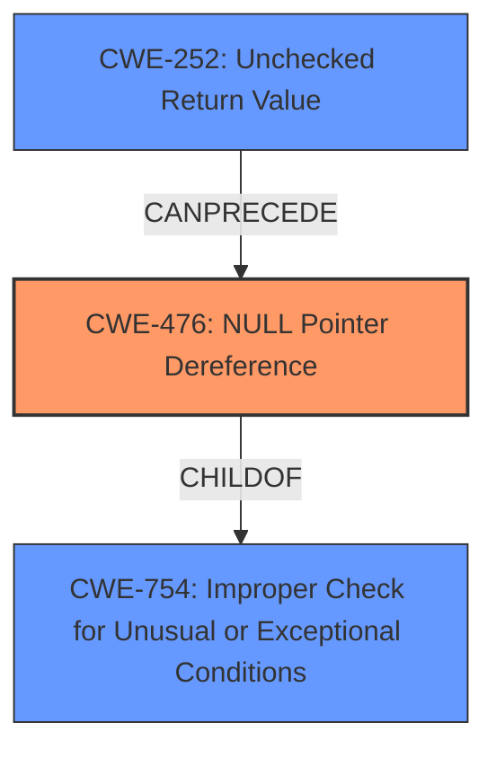

# Analysis Report for CVE-2025-37829

# Vulnerability Analysis Report: CVE-2025-37829

## Description

In the Linux kernel, the following vulnerability has been resolved cpufreq scpi Fix **null-ptr-deref** in scpi_cpufreq_get_rate() cpufreq_cpu_get_raw() can return NULL when the target CPU is not present in the policy->cpus mask. scpi_cpufreq_get_rate() does not check for this case, which results in a NULL pointer dereference.

## Vulnerability Description Key Phrases

- **Rootcause:** null pointer dereference
- **Weakness:** null-ptr-deref
- **Product:** Linux kernel
- **Component:** cpufreq scpi

## Analysis (with Relationship Data)

# Summary
| CWE ID | CWE Name | Confidence | CWE Abstraction Level | CWE Vulnerability Mapping Label | CWE-Vulnerability Mapping Notes |
|---|---|---|---|---|---|
| CWE-476 | NULL Pointer Dereference | 1.0 | Base | Primary CWE | Allowed |
| CWE-252 | Unchecked Return Value | 0.7 | Base | Secondary Candidate | Allowed |

## Evidence and Confidence

*   **Confidence Score:** 0.9
*   **Evidence Strength:** HIGH

## Relationship Analysis
The primary relationship influencing the CWE selection is the ChildOf relationship where CWE-476 (NULL Pointer Dereference) is a child of CWE-754 (Improper Check for Unusual or Exceptional Conditions). The vulnerability description indicates a **missing check** for a potential NULL value, directly leading to a dereference. This aligns with the explicit description of CWE-476. CWE-252 (Unchecked Return Value) is also considered because the return value of `cpufreq_cpu_get_raw()` is not checked, which can result in a NULL value. This contributes to the NULL pointer dereference.



## Vulnerability Chain
The vulnerability chain starts with a **missing check** after a function call that can return NULL (`cpufreq_cpu_get_raw()`), then results in a **NULL pointer dereference** in `scpi_cpufreq_get_rate()`.
  - **Root Cause:** Missing Check (Implied by CWE-252 and directly leading to CWE-476)
  - **Weakness:** CWE-476 (NULL Pointer Dereference)
  - **Impact:** System crash or unexpected behavior due to the dereference of the NULL pointer.

## Summary of Analysis
The analysis is strongly based on the provided evidence, specifically the vulnerability description highlighting the **null pointer dereference** due to a **missing check**.

The vulnerability description clearly states: "scpi_cpufreq_get_rate() does not check for this case, which results in a NULL pointer dereference." This statement directly supports the selection of CWE-476.

CWE-476 is chosen as the primary CWE because it directly reflects the vulnerability's outcome. CWE-252 represents the **missing check** which is a contributing factor.

The selected CWEs are at the optimal level of specificity, with CWE-476 being a Base level CWE and directly describing the **null pointer dereference**.

Relevant CWE Information:

# Enhanced Context (25 CWEs)
The following CWEs were identified as potentially relevant to this vulnerability:

## CWE-476: NULL Pointer Dereference
**Abstraction Level**: Base
**Similarity Score**: 0.75
**Source**: dense

**Description**:
The product dereferences a pointer that it expects to be valid but is NULL.

**Mapping Guidance**:
- Usage: Allowed
- Rationale: This CWE entry is at the Base level of abstraction, which is a preferred level of abstraction for mapping to the root causes of vulnerabilities.

## CWE-252: Unchecked Return Value
**Abstraction Level**: Base
**Similarity Score**: 0.73
**Source**: dense

**Description**:
The product does not check the return value from a method or function, which can prevent it from detecting unexpected states and conditions.

**Mapping Guidance**:
- Usage: Allowed
- Rationale: This CWE entry is at the Base level of abstraction, which is a preferred level of abstraction for mapping to the root causes of vulnerabilities.

## CWE-690: Unchecked Return Value to NULL Pointer Dereference
**Abstraction Level**: Compound
**Similarity Score**: 418.06
**Source**: sparse

**Description**:
The product does not check for an error after calling a function that can return with a NULL pointer if the function fails, which leads to a resultant NULL pointer dereference.

**Mapping Guidance**:
- Usage: Discouraged
- Rationale: This CWE entry is a named chain, which combines multiple weaknesses.

CWE-690 was considered but not used because it's a compound CWE and the guidance discourages its use. It can be better represented by CWE-252 and CWE-476.

CWE-754 was considered as the parent of CWE-476, but it is too general.

**CWE-476: NULL Pointer Dereference**
*   **Technical Explanation:** The vulnerability occurs because the code directly dereferences a pointer without validating that it is not NULL. Specifically, `scpi_cpufreq_get_rate()` fails to check if `cpufreq_cpu_get_raw()` returns NULL before using the returned pointer.
*   **Security Implications:** A NULL pointer dereference can lead to a crash, denial of service, or potentially exploitable conditions depending on the context.
*   **Relationship Analysis:** CWE-476 is a child of CWE-754 (Improper Check for Unusual or Exceptional Conditions), indicating that the root cause is a **failure to validate** the pointer before dereferencing it.
*   **Primary/Secondary:** Primary CWE, as it directly describes the vulnerability.
*   **MITRE Mapping Guidance:** The usage is ALLOWED, and the abstraction level is Base, which is preferred.

**CWE-252: Unchecked Return Value**
*   **Technical Explanation:** The function `cpufreq_cpu_get_raw()` can return a NULL pointer under certain conditions (when the target CPU is not present in the `policy->cpus` mask). The calling function, `scpi_cpufreq_get_rate()`, does not check the return value of `cpufreq_cpu_get_raw()` before proceeding to dereference it.
*   **Security Implications:** The **lack of checking** the return value can lead to unexpected program states, in this case, a NULL pointer.
*   **Relationship Analysis:** CWE-252 can precede CWE-476, as not checking the return value of a function can lead to a NULL pointer dereference if the function returns NULL.
*   **Primary/Secondary:** Secondary CWE, as it contributes to the vulnerability but is not the direct cause.
*   **MITRE Mapping Guidance:** The usage is ALLOWED, and the abstraction level is Base, which is preferred.


## CWE Relationship Analysis

Current CWEs represent these abstraction levels: .


### Vulnerability Chain Analysis

**Chain starting from CWE-252:**
- 252 (Unchecked Return Value) - ROOT


**Chain starting from CWE-690:**
- 690 (Unchecked Return Value to NULL Pointer Dereference) - ROOT


### CWE Relationship Diagram

```mermaid
graph TD
    classDef primary fill:#f96,stroke:#333,stroke-width:2px
    classDef secondary fill:#69f,stroke:#333
    classDef tertiary fill:#9e9,stroke:#333
```


*Report generated on 2025-07-14 21:32:28*
