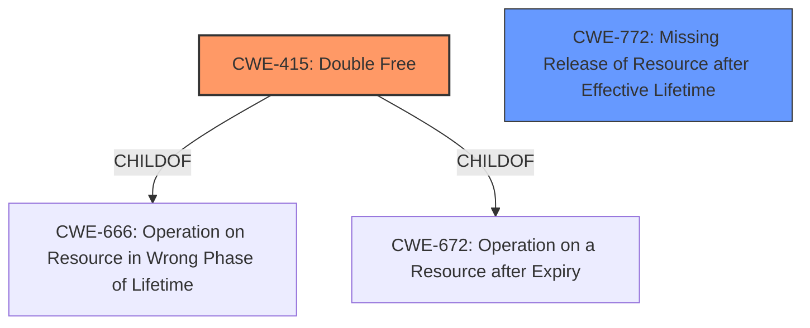

# Raw Analyzer Response for CVE-2025-37836

# Summary
| CWE ID | CWE Name | Confidence | CWE Abstraction Level | CWE Vulnerability Mapping Label | CWE-Vulnerability Mapping Notes |
|---|---|---|---|---|---|
| CWE-415 | Double Free | 1.0 | Variant | Allowed | Primary CWE. The vulnerability description explicitly mentions a **double free** condition. |
| CWE-772 | Missing Release of Resource after Effective Lifetime | 0.5 | Base | Allowed | Secondary Candidate. A memory leak can be caused by missing release of resource |

## Evidence and Confidence

*   **Confidence Score:** 0.9
*   **Evidence Strength:** HIGH

## Relationship Analysis
The primary relationship influencing the decision is the direct match between the vulnerability description and the definition of CWE-415. CWE-415 (Double Free) is a variant of CWE-666 (Operation on Resource in Wrong Phase of Lifetime) and CWE-672 (Operation on a Resource after Expiry). This hierarchical relationship supports the selection of CWE-415 as it is a specific type of resource management issue. The Retriever Results also strongly suggest CWE-415.

## Vulnerability Chain
The vulnerability chain starts with the **double free** condition in `pci_register_host_bridge()`. The failure to properly manage the reference count during error handling (device_register() failing) leads to the **double free**. The impact is a memory leak and potential system instability.

## Summary of Analysis
The analysis is primarily based on the explicit mention of the **double free** condition in the vulnerability description: "Dan Carpenters **double free** fix from https//lore.kernel.org/r/db806a6c-a91b-4e5a-a84b-6b7e01bdac85@stanley.mountain]". The Retriever Results also strongly suggest CWE-415. Given this direct evidence, CWE-415 is selected as the primary CWE. CWE-772 is a possible secondary CWE because the initial error leads to a missing release of a resource. The selected CWEs are at the optimal level of specificity, with CWE-415 being a Variant and CWE-772 being a Base.

**CWEs Considered But Not Used:**

*   **CWE-911 Improper Update of Reference Count:** While reference counting is mentioned, the core issue is the double free itself, making CWE-415 a more direct representation of the vulnerability.
*   **CWE-401 Missing Release of Memory after Effective Lifetime:** Though a memory leak is mentioned, the explicit **double free** takes precedence.
*   **CWE-362 Concurrent Execution using Shared Resource with Improper Synchronization ('Race Condition'):** There is no mention of concurrency or synchronization issues in the vulnerability description.
*   **CWE-667 Improper Locking:** There is no mention of locking issues in the vulnerability description.
*   **CWE-909 Missing Initialization of Resource:** The issue is not about missing initialization, but rather incorrect freeing.
*   **CWE-824 Access of Uninitialized Pointer:** The issue is not about accessing an uninitialized pointer.
*   **CWE-364 Signal Handler Race Condition:** The vulnerability description does not mention signal handlers or race conditions related to them.
*   **CWE-1262 Improper Access Control for Register Interface:** This CWE is related to access control issues which are not present in the vulnerability description.
*   **CWE-123 Write-what-where Condition:** This CWE is not directly related to the double free condition described in the vulnerability.