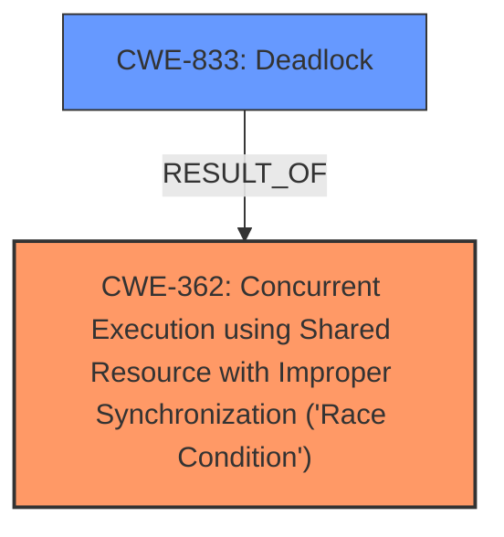

# Analysis Report for CVE-2025-37843

# Vulnerability Analysis Report: CVE-2025-37843

## Description

In the Linux kernel, the following vulnerability has been resolved PCI pciehp Avoid unnecessary device replacement check Hot-removal of nested PCI hotplug ports suffers from a long-standing **race condition** which can lead to a deadlock A parent hotplug port acquires pci_lock_rescan_remove(), then waits for pciehp to unbind from a child hotplug port. Meanwhile that child hotplug port tries to acquire pci_lock_rescan_remove() as well in order to remove its own children. The deadlock only occurs if the parent acquires pci_lock_rescan_remove() first, not if the child happens to acquire it first. Several workarounds to avoid the issue have been proposed and discarded over the years, e.g. https//lore.kernel.org/r/4c882e25194ba8282b78fe963fec8faae7cf23eb.1529173804.git.lukas@wunner.de/ A proper fix is being worked on, but needs more time as it is nontrivial and necessarily intrusive. Recent commit 9d573d19547b (PCI pciehp Detect device replacement during system sleep) provokes more frequent occurrence of the deadlock when removing more than one Thunderbolt device during system sleep. The commit sought to detect device replacement, but also triggered on device removal. Differentiating reliably between replacement and removal is impossible because pci_get_dsn() returns 0 both if the device was removed, as well as if it was replaced with one lacking a Device Serial Number. Avoid the more frequent occurrence of the deadlock by checking whether the hotplug port itself was hot-removed. If so, theres no sense in checking whether its child device was replaced. This works because the ->resume_noirq() callback is invoked in top-down order for the entire hierarchy A parent hotplug port detecting device replacement (or removal) marks all children as removed using pci_dev_set_disconnected() and a child hotplug port can then reliably detect being removed.

## Vulnerability Description Key Phrases

- **Rootcause:** race condition
- **Impact:** deadlock
- **Product:** Linux kernel
- **Component:** PCI pciehp

## Analysis (with Relationship Data)

# Summary
| CWE ID | CWE Name | Confidence | CWE Abstraction Level | CWE Vulnerability Mapping Label | CWE-Vulnerability Mapping Notes |
|---|---|---|---|---|---|
| CWE-362 | Concurrent Execution using Shared Resource with Improper Synchronization ('Race Condition') | 0.9 | Class | Allowed-with-Review | Primary CWE |
| CWE-833 | Deadlock | 0.7 | Base | Allowed | Secondary Candidate |

## Evidence and Confidence

*   **Confidence Score:** 0.8
*   **Evidence Strength:** MEDIUM

## Relationship Analysis
The primary relationship influencing the decision is that **CWE-362** is a Class-level CWE, while **CWE-833** is a Base-level CWE and a potential outcome of a race condition. Although **CWE-833** (Deadlock) is a symptom of the problem, the root cause is the **race condition** described in **CWE-362**. While the description directly mentions a deadlock, the vulnerability description explicitly states "**race condition** which can lead to a deadlock".



## Vulnerability Chain
The vulnerability chain begins with a **race condition** (**CWE-362**) where multiple threads attempt to access a shared resource without proper synchronization. This leads to a deadlock (**CWE-833**) where threads are blocked indefinitely, waiting for each other to release resources. The root cause is the improper synchronization, while the deadlock is a consequence of the **race condition**.

## Summary of Analysis
The initial analysis focused on identifying the root cause and the resulting impact. The description explicitly mentions a **race condition** leading to a deadlock, which strongly suggests **CWE-362** as the primary weakness. The retriever results also support this, with **CWE-362** having the highest score.

The relationship analysis confirmed that **CWE-362** is a more appropriate classification because it represents the underlying **root cause**, while **CWE-833** is a consequence. Although **CWE-833** is a base level CWE, **CWE-362** is a better fit because it identifies the missing synchronization that led to the deadlock.

The evidence from the vulnerability description is "long-standing **race condition** which can lead to a deadlock".

The selected CWEs are at the optimal level of specificity because **CWE-362** identifies the specific synchronization problem, while **CWE-833** represents the resulting deadlock scenario.

Relevant CWE Information:

# Enhanced Context (25 CWEs)
The following CWEs were identified as potentially relevant to this vulnerability:

## CWE-667: Improper Locking
**Abstraction Level**: Class
**Similarity Score**: 0.78
**Source**: dense

**Description**:
The product does not properly acquire or release a lock on a resource, leading to unexpected resource state changes and behaviors.

**Mapping Guidance**:
- Usage: Allowed-with-Review
- Rationale: This CWE entry is a Class and might have Base-level children that would be more appropriate

## CWE-833: Deadlock
**Abstraction Level**: Base
**Similarity Score**: 0.78
**Source**: dense

**Description**:
The product contains multiple threads or executable segments that are waiting for each other to release a necessary lock, resulting in deadlock.

**Mapping Guidance**:
- Usage: Allowed
- Rationale: This CWE entry is at the Base level of abstraction, which is a preferred level of abstraction for mapping to the root causes of vulnerabilities.

## CWE-362: Concurrent Execution using Shared Resource with Improper Synchronization ('Race Condition')
**Abstraction Level**: Class
**Similarity Score**: 0.76
**Source**: dense

**Description**:
The product contains a concurrent code sequence that requires temporary, exclusive access to a shared resource, but a timing window exists in which the shared resource can be modified by another code sequence operating concurrently.

**Mapping Guidance**:
- Usage: Allowed-with-Review
- Rationale: This CWE entry is a Class and might have Base-level children that would be more appropriate

## CWE-367: Time-of-check Time-of-use (TOCTOU) Race Condition
**Abstraction Level**: Base
**Similarity Score**: 0.75
**Source**: dense

**Description**:
The product checks the state of a resource before using that resource, but the resource's state can change between the check and the use in a way that invalidates the results of the check. This can cause the product to perform invalid actions when the resource is in an unexpected state.

**Mapping Guidance**:
- Usage: Allowed
- Rationale: This CWE entry is at the Base level of abstraction, which is a preferred level of abstraction for mapping to the root causes of vulnerabilities.

## CWE-755: Improper Handling of Exceptional Conditions
**Abstraction Level**: Class
**Similarity Score**: 0.74
**Source**: dense

**Description**:
The product does not handle or incorrectly handles an exceptional condition.

**Mapping Guidance**:
- Usage: Discouraged
- Rationale: This CWE entry is a level-1 Class (i.e., a child of a Pillar). It might have lower-level children that would be more appropriate

## CWE-366: Race Condition within a Thread
**Abstraction Level**: Base
**Similarity Score**: 0.73
**Source**: dense

**Description**:
If two threads of execution use a resource simultaneously, there exists the possibility that resources may be used while invalid, in turn making the state of execution undefined.

**Mapping Guidance**:
- Usage: Allowed
- Rationale: This CWE entry is at the Base level of abstraction, which is a preferred level of abstraction for mapping to the root causes of vulnerabilities.

## CWE-404: Improper Resource Shutdown or Release
**Abstraction Level**: Class
**Similarity Score**: 0.73
**Source**: dense

**Description**:
The product does not release or incorrectly releases a resource before it is made available for re-use.

**Mapping Guidance**:
- Usage: Allowed-with-Review
- Rationale: This CWE entry is a Class and might have Base-level children that would be more appropriate

## CWE-754: Improper Check for Unusual or Exceptional Conditions
**Abstraction Level**: Class
**Similarity Score**: 0.72
**Source**: dense

**Description**:
The product does not check or incorrectly checks for unusual or exceptional conditions that are not expected to occur frequently during day to day operation of the product.

**Mapping Guidance**:
- Usage: Allowed-with-Review
- Rationale: This CWE entry is a Class and might have Base-level children that would be more appropriate

## CWE-1285: Improper Validation of Specified Index, Position, or Offset in Input
**Abstraction Level**: Base
**Similarity Score**: 0.72
**Source**: dense

**Description**:
The product receives input that is expected to specify an index, position, or offset into an indexable resource such as a buffer or file, but it does not validate or incorrectly validates that the specified index/position/offset has the required properties.

**Mapping Guidance**:
- Usage: Allowed
- Rationale: This CWE entry is at the Base level of abstraction, which is a preferred level of abstraction for mapping to the root causes of vulnerabilities.

## CWE-703: Improper Check or Handling of Exceptional Conditions
**Abstraction Level**: Pillar
**Similarity Score**: 0.72
**Source**: dense

**Description**:
The product does not properly anticipate or handle exceptional conditions that rarely occur during normal operation of the product.

**Mapping Guidance**:
- Usage: Discouraged
- Rationale: This CWE entry is extremely high-level, a Pillar.

## CWE-667: Improper Locking
**Abstraction Level**: Class
**Similarity Score**: 740.68
**Source**: sparse

**Description**:
The product does not properly acquire or release a lock on a resource, leading to unexpected resource state changes and behaviors.

**Mapping Guidance**:
- Usage: Allowed-with-Review
- Rationale: This CWE entry is a Class and might have Base-level children that would be more appropriate

## CWE-362: Concurrent Execution using Shared Resource with Improper Synchronization ('Race Condition')
**Abstraction Level**: Class
**Similarity Score**: 712.91
**Source**: sparse

**Description**:
The product contains a concurrent code sequence that requires temporary, exclusive access to a shared resource, but a timing window exists in which the shared resource can be modified by another code sequence operating concurrently.

**Mapping Guidance**:
- Usage: Allowed-with-Review
- Rationale: This CWE entry is a Class and might have Base-level children that would be more appropriate

## CWE-367: Time-of-check Time-of-use


## CWE Relationship Analysis

Current CWEs represent these abstraction levels: .


### Vulnerability Chain Analysis

**Chain starting from CWE-404:**
- 404 (Improper Resource Shutdown or Release) - ROOT


**Chain starting from CWE-667:**
- 667 (Improper Locking) - ROOT


### CWE Relationship Diagram

```mermaid
graph TD
    classDef primary fill:#f96,stroke:#333,stroke-width:2px
    classDef secondary fill:#69f,stroke:#333
    classDef tertiary fill:#9e9,stroke:#333
```


*Report generated on 2025-07-14 21:35:13*
