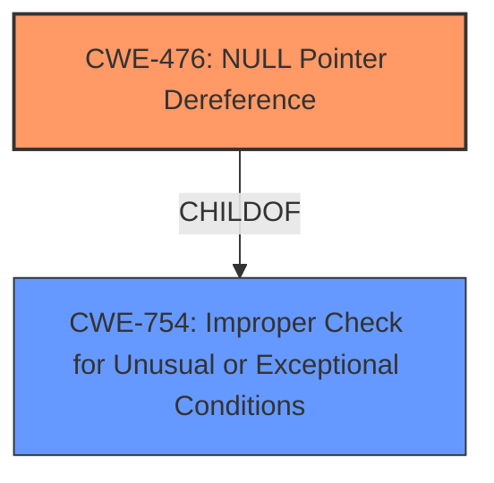

# Enhanced Analysis for CVE-2025-37844

# Summary
| CWE ID | CWE Name | Confidence | CWE Abstraction Level | CWE Vulnerability Mapping Label | CWE-Vulnerability Mapping Notes |
|---|---|---|---|---|---|
| CWE-476 | NULL Pointer Dereference | 1.0 | Base | Allowed | Primary CWE. The vulnerability description explicitly states a **NULL pointer dereference**. |

## Evidence and Confidence

*   **Confidence Score:** 1.0
*   **Evidence Strength:** HIGH

## Relationship Analysis
The primary relationship to consider here is the parent-child relationship. CWE-476 is a child of CWE-754 (Improper Check for Unusual or Exceptional Conditions), meaning it's a more specific case of failing to handle exceptional conditions. Given that the description pinpoints the **NULL pointer dereference** itself, the more specific CWE-476 is the better choice.



## Vulnerability Chain
The vulnerability chain is straightforward: a condition leading to a **NULL pointer dereference**.
  - Root Cause: **NULL pointer dereference** due to missing or incorrect validation.
  - Impact: System crash or unexpected behavior.

## Summary of Analysis
The vulnerability description clearly indicates a **NULL pointer dereference**. The phrase "**NULL pointer dereference** in dbg call" from the vulnerability description is the primary reason for choosing CWE-476. The fix involves moving the call under a condition, which prevents the dereference.

The retriever results also list CWE-476 with a high score, further supporting this choice.

Other CWEs considered but rejected:

*   CWE-252 (Unchecked Return Value): While unchecked return values can lead to **NULL pointer dereferences**, the description directly mentions the dereference itself.
*   CWE-665 (Improper Initialization) and CWE-456 (Missing Initialization of a Variable): These relate to initialization issues, but the core problem here is the dereference of a potentially NULL pointer, not necessarily the initialization itself.
*   CWE-690 (Unchecked Return Value to NULL Pointer Dereference): While relevant, CWE-476 is more direct and specific since the description explicitly describes the dereference.
*   CWE-822 (Untrusted Pointer Dereference): This CWE is applicable only if the pointer comes from an untrusted source, but there is no evidence about the source of the pointer from the description.


## CWE Relationship Analysis

Current CWEs represent these abstraction levels: .


### Vulnerability Chain Analysis

**Chain starting from CWE-690:**
- 690 (Unchecked Return Value to NULL Pointer Dereference) - ROOT


**Chain starting from CWE-476:**
- 476 (NULL Pointer Dereference) - ROOT


### CWE Relationship Diagram

```mermaid
graph TD
    classDef primary fill:#f96,stroke:#333,stroke-width:2px
    classDef secondary fill:#69f,stroke:#333
    classDef tertiary fill:#9e9,stroke:#333
```