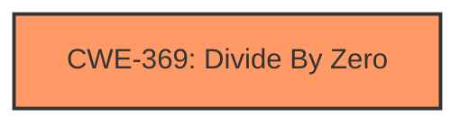

# Analysis for CVE-2025-37850

# Summary
| CWE ID | CWE Name | Confidence | CWE Abstraction Level | CWE Vulnerability Mapping Label | CWE-Vulnerability Mapping Notes |
|---|---|---|---|---|---|
| CWE-369 | Divide By Zero | 1.0 | Base | Primary | Allowed |

## Evidence and Confidence

*   **Confidence Score:** 1.0
*   **Evidence Strength:** HIGH

## Relationship Analysis
The primary CWE is CWE-369 Divide By Zero. This is a base level CWE. No other CWEs were selected.

## Vulnerability Chain
The vulnerability chain consists of the divide by zero error. The **rootcause** is the **Divide-by-zero in pwm_mediatek_config()** due to the fact that the `!CONFIG_HAVE_CLK` version of `clk_get_rate()` returns zero.

## Summary of Analysis
The vulnerability description clearly indicates a **divide-by-zero** error. The line `do_div(resolution, clk_get_rate(pc->clk_pwms[pwm->hwpwm]))` causes a divide by zero because `clk_get_rate()` returns zero.

CWE-369 Divide By Zero is the most appropriate CWE because it directly addresses the **rootcause** of the vulnerability. The description for CWE-369 matches the vulnerability description.

Other CWEs Considered:

*   CWE-1335: Incorrect Bitwise Shift of Integer - While this CWE was listed first in the Retriever Results, this is not a bitwise shift error.
*   CWE-129: Improper Validation of Array Index - This is not an array index issue.
*   CWE-781: Improper Address Validation in IOCTL with METHOD_NEITHER I/O Control Code - This vulnerability does not involve IOCTL.
*   CWE-825: Expired Pointer Dereference - There is no pointer dereference.
*   CWE-823: Use of Out-of-range Pointer Offset - There is no pointer offset issue.
*   CWE-822: Untrusted Pointer Dereference - There is no untrusted pointer dereference.
*   CWE-606: Unchecked Input for Loop Condition - No loop condition issues.
*   CWE-1389: Incorrect Parsing of Numbers with Different Radices - Not related to number parsing
*   CWE-1256: Improper Restriction of Software Interfaces to Hardware Features - Not related to restriction of software interfaces.
*   CWE-703: Improper Check or Handling of Exceptional Conditions - The **rootcause** is not handling an exceptional condition, but a divide by zero.

Relevant CWE Information: