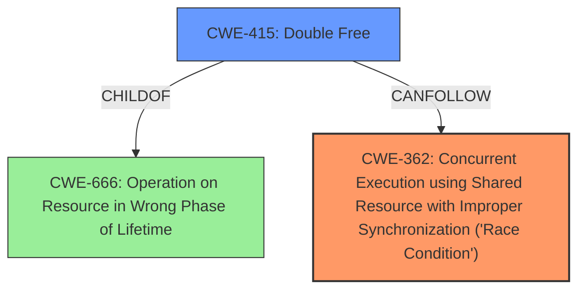

# Enhanced Analysis for CVE-2025-37856

# Summary
| CWE ID | CWE Name | Confidence | CWE Abstraction Level | CWE Vulnerability Mapping Label | CWE-Vulnerability Mapping Notes |
|---|---|---|---|---|---|
| CWE-362 | Concurrent Execution using Shared Resource with Improper Synchronization ('Race Condition') | 0.9 | Class | Allowed-with-Review | Primary CWE |
| CWE-415 | Double Free | 0.7 | Variant | Allowed | Secondary Candidate |

## Evidence and Confidence

*   **Confidence Score:** 0.8
*   **Evidence Strength:** MEDIUM

## Relationship Analysis
The primary relationship is that CWE-362 is a Class-level CWE, and while it is a good starting point, the specific manifestation of the race condition could lead to other issues. The vulnerability description hints at a potential double free (CWE-415), which can be a consequence of a race condition. The hierarchical relationship between CWE-666 (Operation on Resource in Wrong Phase of Lifetime) and CWE-415 is relevant, as a double free means the resource is being operated on at the wrong time.



## Vulnerability Chain
The vulnerability chain starts with a **race condition** (CWE-362) in the btrfs code related to managing block group lists. This **race condition** can lead to a broken reference count, and ultimately a **double free** (CWE-415) when the reference count underflows.
  - **Root Cause:** CWE-362 Concurrent Execution using Shared Resource with Improper Synchronization ('Race Condition')
  - **Weakness:** CWE-415 Double Free
  - **Impact:** A broken ref count leads to memory corruption and application instability.

## Summary of Analysis
The initial assessment points to a **race condition** (CWE-362) as the root cause. The description mentions a scenario where `list_del_init()` calls on `bg_list` race with `btrfs_mark_bg_unused()` or `btrfs_mark_bg_to_reclaim()`. This can lead to a broken ref count, which then results in a **double free** (CWE-415), as explicitly stated in the **Vulnerability Description Key Phrases**.

The evidence from the vulnerability description includes: "these calls of list_del_init() on bg_list cannot run concurrently with btrfs_mark_bg_unused() or btrfs_mark_bg_to_reclaim()." And "Ultimately, this results in a broken ref count that hits zero one deref early and the real final deref underflows the refcount, resulting in a WARNING."

The Retriever results suggest CWE-415 Double Free, and CWE-362 Concurrent Execution using Shared Resource with Improper Synchronization ('Race Condition').

CWE-362 is at the Class level, but it accurately describes the concurrent access problem. CWE-415 is more specific and represents a potential consequence of the race condition.

Therefore, the assessment is based on both the direct evidence of a race condition and the resulting double free condition.

Relevant CWE Information:

# Enhanced Context (25 CWEs)
The following CWEs were identified as potentially relevant to this vulnerability:

## CWE-362: Concurrent Execution using Shared Resource with Improper Synchronization ('Race Condition')
**Abstraction Level**: Class
**Similarity Score**: 0.77
**Source**: dense

**Description**:
The product contains a concurrent code sequence that requires temporary, exclusive access to a shared resource, but a timing window exists in which the shared resource can be modified by another code sequence operating concurrently.

**Mapping Guidance**:
- Usage: Allowed-with-Review
- Rationale: This CWE entry is a Class and might have Base-level children that would be more appropriate

## CWE-415: Double Free
**Abstraction Level**: Variant
**Similarity Score**: 450.54
**Source**: sparse

**Description**:
The product calls free() twice on the same memory address, potentially leading to modification of unexpected memory locations.

**Mapping Guidance**:
- Usage: Allowed
- Rationale: This CWE entry is at the Variant level of abstraction, which is a preferred level of abstraction for mapping to the root causes of vulnerabilities.

## CWE-364: Signal Handler Race Condition
**Abstraction Level**: Base
**Similarity Score**: 4.33
**Source**: graph

**Description**:
CWE-364: Signal Handler Race Condition

**Mapping Guidance**:
- Usage: Allowed
- Rationale: This CWE entry is at the Base level of abstraction, which is a preferred level of abstraction for mapping to the root causes of vulnerabilities.

## CWE-415: Double Free
**Abstraction Level**: variant
**Similarity Score**: 3.24
**Source**: graph

**Description**:
CWE-415: Double Free

**Mapping Guidance**:
- Usage: Allowed
- Rationale: This CWE entry is at the Variant level of abstraction, which is a preferred level of abstraction for mapping to the root causes of vulnerabilities.

### Other CWEs Considered and Rejected:
*   CWE-617 Reachable Assertion: This CWE does not fit the vulnerability description. There is no mention of assertions being triggered.
*   CWE-328 Use of Weak Hash: This is not related to the vulnerability.
*   CWE-59 Improper Link Resolution Before File Access ('Link Following'): This is not relevant to memory management issues.
*   CWE-476 NULL Pointer Dereference: While possible, the description focuses on the race condition and broken reference count leading to a double free, not a NULL pointer dereference directly.
*   CWE-923 Improper Restriction of Communication Channel to Intended Endpoints: Not relevant.
*   CWE-918 Server-Side Request Forgery (SSRF): Not relevant.
*   CWE-909 Missing Initialization of Resource: Not relevant.
*   CWE-364 Signal Handler Race Condition: It's a race condition but not specifically in a signal handler.


## CWE Relationship Analysis

Current CWEs represent these abstraction levels: .


### Vulnerability Chain Analysis

**Chain starting from CWE-476:**
- 476 (NULL Pointer Dereference) - ROOT


**Chain starting from CWE-666:**
- 666 (Operation on Resource in Wrong Phase of Lifetime) - ROOT


### CWE Relationship Diagram

```mermaid
graph TD
    classDef primary fill:#f96,stroke:#333,stroke-width:2px
    classDef secondary fill:#69f,stroke:#333
    classDef tertiary fill:#9e9,stroke:#333
```