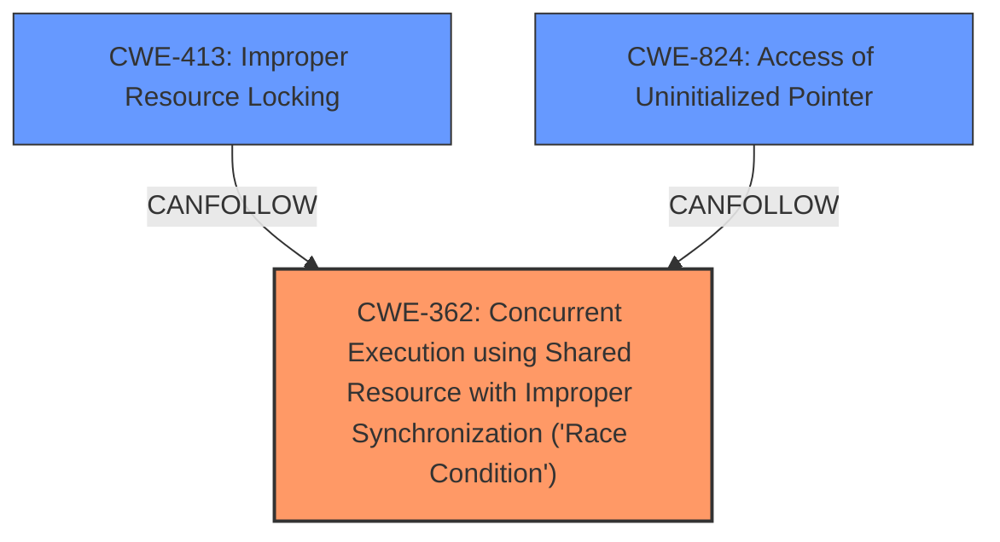

# Enhanced Analysis for CVE-2025-37861

# Summary
| CWE ID | CWE Name | Confidence | CWE Abstraction Level | CWE Vulnerability Mapping Label | CWE-Vulnerability Mapping Notes |
|---|---|---|---|---|---|
| CWE-362 | Concurrent Execution using Shared Resource with Improper Synchronization ('Race Condition') | 0.8 | Class | Allowed-with-Review | Primary CWE |
| CWE-413 | Improper Resource Locking | 0.7 | Base | Allowed | Secondary Candidate |
| CWE-824 | Access of Uninitialized Pointer | 0.6 | Base | Allowed | Secondary Candidate |

## Evidence and Confidence

*   **Confidence Score:** 0.7
*   **Evidence Strength:** MEDIUM

## Relationship Analysis
The primary weakness is identified as CWE-362, "Concurrent Execution using Shared Resource with Improper Synchronization ('Race Condition')" because the core issue is a lack of synchronization between the reset and task management threads when accessing the reply queue. CWE-413, "Improper Resource Locking" and CWE-824, "Access of Uninitialized Pointer" are considered as secondary because the **improper synchronization** leads to these issues. CWE-362 is a Class, so it is possible that a more specific Base CWE exists. CWE-413 is a good candidate for a Base CWE, describing a lack of locking. However, the description focuses on the **synchronous access** so CWE-362 is preferred.



## Vulnerability Chain
The vulnerability chain starts with **synchronous access** between the reset and task management threads, leading to **accessing an invalid queue ID (0xFFFF)**. This then leads to accessing unallocated memory, which causes a crash.
1.  **Root Cause:** CWE-362 Concurrent Execution using Shared Resource with Improper Synchronization ('Race Condition')
2.  **Weakness:** Accessing invalid queue ID (0xFFFF) which could be represented by CWE-824 Access of Uninitialized Pointer
3.  **Impact:** Crash

## Summary of Analysis
The analysis is based on the provided vulnerability description, focusing on the root cause. The description clearly indicates a **synchronous access** issue between different threads, which aligns with the characteristics of CWE-362. The retriever results also list CWE-362 as a potential candidate. The graph relationships and retriever results help in identifying potential related CWEs, but the primary focus remains on the root cause described in the vulnerability description. The selection of CWE-362 is at an appropriate level of specificity, and it accurately represents the weakness described in the vulnerability description. I'm selecting CWE-362 as the primary CWE. I considered CWE-413 (Improper Resource Locking) because the description mentions synchronization problems, but the core issue is the concurrent access without proper synchronization, making CWE-362 a better fit.
The vulnerability description mentions "Synchronous access b/w reset and tm thread for reply queue" which strongly suggests a race condition. The "accesses an invalid queue ID (0xFFFF)" is a symptom of the race condition. This symptom could be represented by CWE-824 Access of Uninitialized Pointer.

Relevant CWE Information:
- Vulnerability Description Key Phrases
  - **rootcause:** **Synchronous access b/w reset and tm thread for reply queue**
  - **weakness:** **accesses an invalid queue ID (0xFFFF)**
- "When the task management thread processes reply queues while the reset thread resets them, the task management thread **accesses an invalid queue ID (0xFFFF)**, set by the reset thread, which points to unallocated memory, causing a crash."


## CWE Relationship Analysis

Current CWEs represent these abstraction levels: .


### Vulnerability Chain Analysis

**Chain starting from CWE-824:**
- 824 (Access of Uninitialized Pointer) - ROOT


**Chain starting from CWE-362:**
- 362 (Concurrent Execution using Shared Resource with Improper Synchronization ('Race Condition')) - ROOT


### CWE Relationship Diagram

```mermaid
graph TD
    classDef primary fill:#f96,stroke:#333,stroke-width:2px
    classDef secondary fill:#69f,stroke:#333
    classDef tertiary fill:#9e9,stroke:#333
```