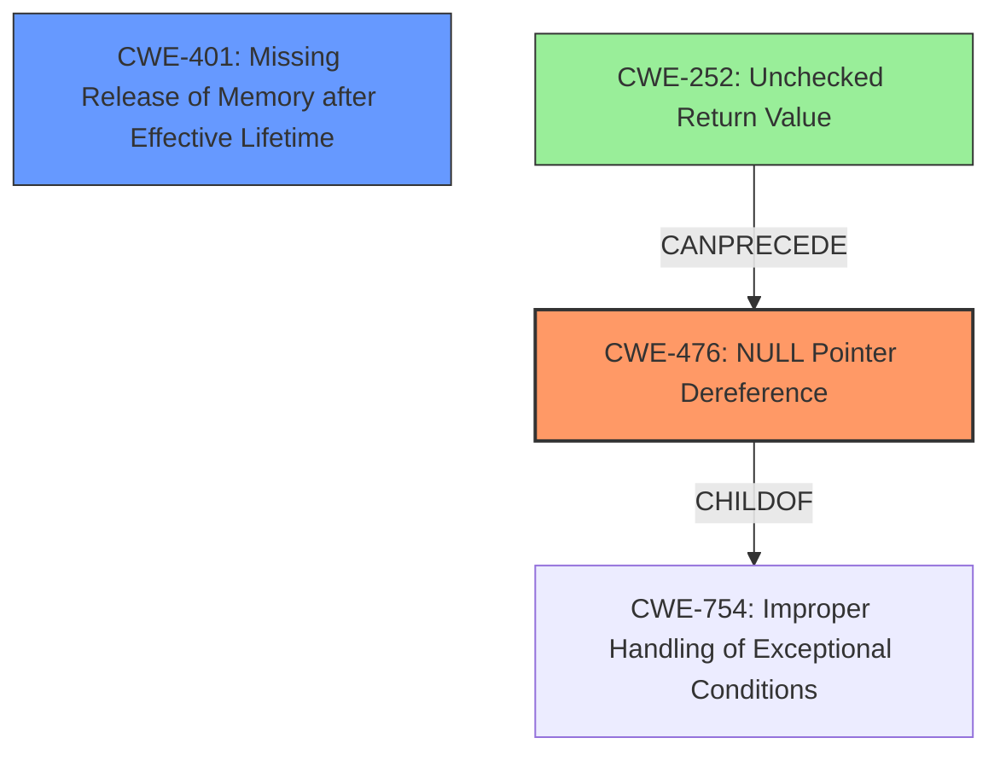

# Analysis Report for CVE-2025-37883

# Vulnerability Analysis Report: CVE-2025-37883

## Description

In the Linux kernel, the following vulnerability has been resolved s390/sclp Add check for get_zeroed_page() Add check for the return value of get_zeroed_page() in sclp_console_init() to prevent null pointer dereference. Furthermore, to solve the memory leak caused by the loop allocation, add a free helper to do the free job.

## Vulnerability Description Key Phrases

- **Component:** s390/sclp sclp_console_init()
- **Weakness:** memory leak, null pointer dereference
- **Product:** Linux kernel

## Analysis (with Relationship Data)

# Summary
| CWE ID | CWE Name | Confidence | CWE Abstraction Level | CWE Vulnerability Mapping Label | CWE-Vulnerability Mapping Notes |
|---|---|---|---|---|---|
| CWE-476 | NULL Pointer Dereference | 0.9 | Base | Primary | Allowed |
| CWE-401 | Missing Release of Memory after Effective Lifetime | 0.8 | Variant | Secondary | Allowed |

## Evidence and Confidence

*   **Confidence Score:** 0.85
*   **Evidence Strength:** MEDIUM

## Relationship Analysis
The primary relationship impacting the decision is that CWE-476 [CWE-476: NULL Pointer Dereference] can be caused by an unchecked return value, which is potentially relevant here as the description mentions adding a check for the return value of `get_zeroed_page()`. However, the description focuses on the result (NULL pointer dereference) rather than the missing check, making CWE-476 the more appropriate primary classification. CWE-401 [CWE-401: Missing Release of Memory after Effective Lifetime] is identified as a secondary weakness due to the mention of a memory leak.



## Vulnerability Chain
The vulnerability chain involves a **missing** check on the return value of `get_zeroed_page()`, potentially leading to a **NULL Pointer Dereference** when the returned pointer is used. Additionally, there's a **memory leak** due to improper resource management within a loop.

1.  `get_zeroed_page()` fails and returns NULL
2.  **Missing** check for NULL return value.
3.  **NULL Pointer Dereference** (CWE-476)
4.  Loop allocation leads to **memory leak** (CWE-401)

## Summary of Analysis
The primary focus of this vulnerability is the **NULL Pointer Dereference** which is addressed by adding a check for the return value of `get_zeroed_page()`. The secondary issue is the **memory leak**, which is resolved by adding a free helper.

The analysis is based directly on the vulnerability description, which explicitly mentions the **NULL Pointer Dereference** and the **memory leak**.

*   "Add check for the return value of get_zeroed_page() in sclp_console_init() to prevent null pointer dereference."
*   "Furthermore, to solve the memory leak caused by the loop allocation, add a free helper to do the free job."

The Retriever Results also support these findings, with CWE-476 [CWE-476: NULL Pointer Dereference] and CWE-401 [CWE-401: Missing Release of Memory after Effective Lifetime] being highly ranked.

The selected CWEs are at the optimal level of specificity. CWE-476 [CWE-476: NULL Pointer Dereference] is a Base level CWE and accurately describes the **NULL Pointer Dereference**. CWE-401 [CWE-401: Missing Release of Memory after Effective Lifetime] is a Variant level CWE and accurately describes the **memory leak**.

CWEs considered but not used:

*   CWE-252 [CWE-252: Unchecked Return Value]: While related to the root cause, the description focuses on the dereference itself, making CWE-476 [CWE-476: NULL Pointer Dereference] more accurate.
*   CWE-665 [CWE-665: Improper Initialization] and CWE-908 [CWE-908: Use of Uninitialized Resource]: While related to the general concept of resource handling, they are less specific than CWE-476 [CWE-476: NULL Pointer Dereference] in describing the **NULL Pointer Dereference**.
*   CWE-909 [CWE-909: Missing Initialization of Resource]: Similar to CWE-665 [CWE-665: Improper Initialization], but less specific than CWE-401 [CWE-401: Missing Release of Memory after Effective Lifetime] in describing the **memory leak**.
*   CWE-824 [CWE-824: Access of Uninitialized Pointer]: Similar to CWE-476 [CWE-476: NULL Pointer Dereference], but less specific to the situation of a dereference after a function call.


## CWE Relationship Analysis

Current CWEs represent these abstraction levels: .


### Vulnerability Chain Analysis

**Chain starting from CWE-476:**
- 476 (NULL Pointer Dereference) - ROOT


**Chain starting from CWE-401:**
- 401 (Missing Release of Memory after Effective Lifetime) - ROOT


### CWE Relationship Diagram

```mermaid
graph TD
    classDef primary fill:#f96,stroke:#333,stroke-width:2px
    classDef secondary fill:#69f,stroke:#333
    classDef tertiary fill:#9e9,stroke:#333
```


*Report generated on 2025-07-14 21:46:36*
