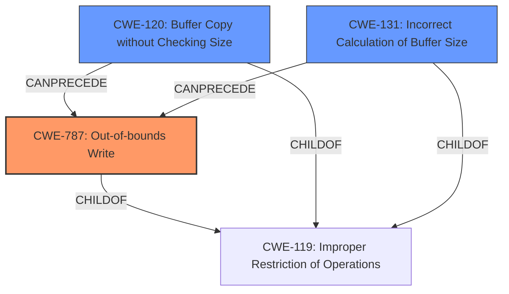

# Analysis Report for CVE-2025-37891

# Vulnerability Analysis Report: CVE-2025-37891

## Description

In the Linux kernel, the following vulnerability has been resolved ALSA ump Fix **buffer overflow** at UMP SysEx message conversion The conversion function from MIDI 1.0 to UMP packet contains an internal buffer to keep the incoming MIDI bytes, and its size is 4, as it was supposed to be the max size for a MIDI1 UMP packet data. However, the **implementation overlooked that SysEx is handled in a different format**, and it can be up to 6 bytes, as found in do_convert_to_ump(). It leads eventually to a **buffer overflow**, and may corrupt the memory when a longer SysEx message is received. The fix is simply to extend the buffer size to 6 to fit with the SysEx UMP message.

## Vulnerability Description Key Phrases

- **Component:** ALSA ump SysEx message conversion
- **Rootcause:** implementation overlooked that SysEx is handled in a different format
- **Vector:** longer SysEx message
- **Weakness:** buffer overflow
- **Product:** Linux kernel
- **Impact:** corrupt the memory, memory corruption

## Analysis (with Relationship Data)

# Summary
| CWE ID | CWE Name | Confidence | CWE Abstraction Level | CWE Vulnerability Mapping Label | CWE-Vulnerability Mapping Notes |
|---|---|---|---|---|---|
| CWE-787 | Out-of-bounds Write | 0.9 | Base | Allowed | Primary CWE: The **buffer overflow** leads to memory corruption by writing past the buffer's boundary. |
| CWE-120 | Buffer Copy without Checking Size of Input ('Classic Buffer Overflow') | 0.7 | Base | Allowed-with-Review | The vulnerability involves copying data into a buffer without properly checking the size of the input, leading to a buffer overflow. |
| CWE-131 | Incorrect Calculation of Buffer Size | 0.6 | Base | Allowed | The **implementation overlooked that SysEx is handled in a different format**, leading to an incorrect buffer size calculation. |

## Evidence and Confidence

*   **Confidence Score:** 0.8
*   **Evidence Strength:** MEDIUM

## Relationship Analysis
The primary weakness is CWE-787 Out-of-bounds Write, which is caused by writing past the end of a buffer due to an incorrect calculation or oversight in handling SysEx messages. CWE-120 Buffer Copy without Checking Size is a related weakness because the code copies data into the buffer without proper size checks, exacerbating the risk of overflow. CWE-131 Incorrect Calculation of Buffer Size is also relevant, as the root cause involves an oversight that led to the buffer being too small for certain SysEx messages.



## Vulnerability Chain
The vulnerability chain starts with an **implementation overlooking that SysEx is handled in a different format** (potentially leading to CWE-131), which causes an incorrect buffer size. Then, during the conversion from MIDI 1.0 to UMP packet, a longer SysEx message is received and written into the undersized buffer without proper size checking (CWE-120), resulting in a **buffer overflow** (CWE-787) that corrupts memory.

## Summary of Analysis
The initial analysis focused on the **buffer overflow** and its root cause. The evidence clearly indicates that the implementation **overlooked that SysEx is handled in a different format**, leading to the buffer being too small. The vulnerability description mentions "buffer overflow" and "corrupt the memory", supporting the selection of CWE-787 as the primary weakness.

The relationship analysis highlights the connections between the different weaknesses involved. CWE-120 and CWE-131 contribute to the overflow condition.

The final selection prioritizes CWE-787 as the most specific representation of the vulnerability's impact (out-of-bounds write). CWE-120 and CWE-131 are included as contributing factors that led to this overflow. The abstraction levels are chosen to be as specific as possible, with all selected CWEs being at the Base level.

Relevant CWE Information:

# Enhanced Context (25 CWEs)
The following CWEs were identified as potentially relevant to this vulnerability:

## CWE-131: Incorrect Calculation of Buffer Size
**Abstraction Level**: Base
**Similarity Score**: 0.77
**Source**: dense

**Description**:
The product does not correctly calculate the size to be used when allocating a buffer, which could lead to a buffer overflow.

**Mapping Guidance**:
- Usage: Allowed
- Rationale: This CWE entry is at the Base level of abstraction, which is a preferred level of abstraction for mapping to the root causes of vulnerabilities.

## CWE-191: Integer Underflow (Wrap or Wraparound)
**Abstraction Level**: Base
**Similarity Score**: 0.75
**Source**: dense

**Description**:
The product subtracts one value from another, such that the result is less than the minimum allowable integer value, which produces a value that is not equal to the correct result.

**Mapping Guidance**:
- Usage: Allowed
- Rationale: This CWE entry is at the Base level of abstraction, which is a preferred level of abstraction for mapping to the root causes of vulnerabilities.

## CWE-193: Off-by-one Error
**Abstraction Level**: Base
**Similarity Score**: 0.75
**Source**: dense

**Description**:
A product calculates or uses an incorrect maximum or minimum value that is 1 more, or 1 less, than the correct value.

**Mapping Guidance**:
- Usage: Allowed
- Rationale: This CWE entry is at the Base level of abstraction, which is a preferred level of abstraction for mapping to the root causes of vulnerabilities.

## CWE-805: Buffer Access with Incorrect Length Value
**Abstraction Level**: Base
**Similarity Score**: 0.75
**Source**: dense

**Description**:
The product uses a sequential operation to read or write a buffer, but it uses an incorrect length value that causes it to access memory that is outside of the bounds of the buffer.

**Mapping Guidance**:
- Usage: Allowed
- Rationale: This CWE entry is at the Base level of abstraction, which is a preferred level of abstraction for mapping to the root causes of vulnerabilities.

## CWE-119: Improper Restriction of Operations within the Bounds of a Memory Buffer
**Abstraction Level**: Class
**Similarity Score**: 0.74
**Source**: dense

**Description**:
The product performs operations on a memory buffer, but it reads from or writes to a memory location outside the buffer's intended boundary. This may result in read or write operations on unexpected memory locations that could be linked to other variables, data structures, or internal program data.

**Mapping Guidance**:
- Usage: Discouraged
- Rationale: CWE-119 is commonly misused in low-information vulnerability reports when lower-level CWEs could be used instead, or when more details about the vulnerability are available.

## CWE-124: Buffer Underwrite ('Buffer Underflow')
**Abstraction Level**: Base
**Similarity Score**: 0.74
**Source**: dense

**Description**:
The product writes to a buffer using an index or pointer that references a memory location prior to the beginning of the buffer.

**Mapping Guidance**:
- Usage: Allowed
- Rationale: This CWE entry is at the Base level of abstraction, which is a preferred level of abstraction for mapping to the root causes of vulnerabilities.

## CWE-789: Memory Allocation with Excessive Size Value
**Abstraction Level**: Variant
**Similarity Score**: 0.73
**Source**: dense

**Description**:
The product allocates memory based on an untrusted, large size value, but it does not ensure that the size is within expected limits, allowing arbitrary amounts of memory to be allocated.

**Mapping Guidance**:
- Usage: Allowed
- Rationale: This CWE entry is at the Variant level of abstraction, which is a preferred level of abstraction for mapping to the root causes of vulnerabilities.

## CWE-126: Buffer Over-read
**Abstraction Level**: Variant
**Similarity Score**: 0.73
**Source**: dense

**Description**:
The product reads from a buffer using buffer access mechanisms such as indexes or pointers that reference memory locations after the targeted buffer.

**Mapping Guidance**:
- Usage: Allowed
- Rationale: This CWE entry is at the Variant level of abstraction, which is a preferred level of abstraction for mapping to the root causes of vulnerabilities.

## CWE-125: Out-of-bounds Read
**Abstraction Level**: Base
**Similarity Score**: 0.73
**Source**: dense

**Description**:
The product reads data past the end, or before the beginning, of the intended buffer.

**Mapping Guidance**:
- Usage: Allowed
- Rationale: This CWE entry is at the Base level of abstraction, which is a preferred level of abstraction for mapping to the root causes of vulnerabilities.

## CWE-681: Incorrect Conversion between Numeric Types
**Abstraction Level**: Base
**Similarity Score**: 0.73
**Source**: dense

**Description**:
When converting from one data type to another, such as long to integer, data can be omitted or translated in a way that produces unexpected values. If the resulting values are used in a sensitive context, then dangerous behaviors may occur.

**Mapping Guidance**:
- Usage: Allowed
- Rationale: This CWE entry is at the Base


## CWE Relationship Analysis

Current CWEs represent these abstraction levels: .


### Vulnerability Chain Analysis

**Chain starting from CWE-805:**
- 805 (Buffer Access with Incorrect Length Value) - ROOT


**Chain starting from CWE-681:**
- 681 (Incorrect Conversion between Numeric Types) - ROOT


### CWE Relationship Diagram

```mermaid
graph TD
    classDef primary fill:#f96,stroke:#333,stroke-width:2px
    classDef secondary fill:#69f,stroke:#333
    classDef tertiary fill:#9e9,stroke:#333
```


*Report generated on 2025-07-14 21:48:09*
