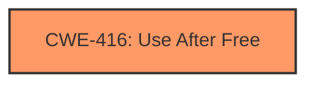

# Analysis for CVE-2025-37903

# Summary
| CWE ID | CWE Name | Confidence | CWE Abstraction Level | CWE Vulnerability Mapping Label | CWE-Vulnerability Mapping Notes |
|---|---|---|---|---|---|
| CWE-416 | Use After Free | 1.0 | Variant | Allowed | Primary CWE |

## Evidence and Confidence

*   **Confidence Score:** 1.0
*   **Evidence Strength:** HIGH

## Relationship Analysis
The primary relationship is that CWE-416 is a Variant, providing a specific type of memory corruption issue. There is no clear evidence to suggest any other related CWEs in terms of direct parent-child or chain relationships based on the provided text.

## Vulnerability Chain
The vulnerability chain is straightforward:

1.  **Root Cause:** **slab-use-after-free** due to copying pointers without incrementing reference counts.
2.  **Weakness:** Dangling pointers created after objects are freed.
3.  **Impact:** Dereferencing dangling pointers leading to memory corruption and system crash.

## Summary of Analysis
The analysis is primarily based on the provided vulnerability description, which explicitly states "**slab-use-after-free**." The description provides sufficient evidence for a direct mapping to CWE-416.

The vulnerability description states: "The HDCP code in amdgpu_dm_hdcp.c copies pointers to amdgpu_dm_connector objects without incrementing the kref reference counts. When using a USB-C dock, and the dock is unplugged, the corresponding amdgpu_dm_connector objects are freed, creating dangling pointers in the HDCP code. When the dock is plugged back, the dangling pointers are dereferenced, resulting in a **slab-use-after-free**".

This clearly indicates a **use-after-free** condition where memory is accessed after it has been freed, directly aligning with the characteristics of CWE-416.

The Retriever Results also identified CWE-416 as the top candidate with a score of 0.800. The other CWEs listed in the Retriever Results are not as directly relevant as CWE-416. For instance, CWE-69, CWE-66, and CWE-72 relate to file name handling issues, which are not present in this vulnerability description.

CWE-362, CWE-364 relate to Race Conditions, but that is not what the description says.

Therefore, based on the provided evidence, CWE-416 is the most appropriate and specific CWE to classify this vulnerability.

Relevant CWE Information:

# Enhanced Context (25 CWEs)
The following CWEs were identified as potentially relevant to this vulnerability:

## CWE-667: Improper Locking
**Abstraction Level**: Class
**Similarity Score**: 0.77
**Source**: dense

**Description**:
The product does not properly acquire or release a lock on a resource, leading to unexpected resource state changes and behaviors.

**Mapping Guidance**:
- Usage: Allowed-with-Review
- Rationale: This CWE entry is a Class and might have Base-level children that would be more appropriate

*Not Selected:* This is related to locking, and there's no evidence in the description related to locking issues.

## CWE-362: Concurrent Execution using Shared Resource with Improper Synchronization ('Race Condition')
**Abstraction Level**: Class
**Similarity Score**: 0.76
**Source**: dense

**Description**:
The product contains a concurrent code sequence that requires temporary, exclusive access to a shared resource, but a timing window exists in which the shared resource can be modified by another code sequence operating concurrently.

**Mapping Guidance**:
- Usage: Allowed-with-Review
- Rationale: This CWE entry is a Class and might have Base-level children that would be more appropriate

*Not Selected:* While the vulnerability involves USB-C dock connection/disconnection, there is no explicit mention of concurrent execution or timing windows that would indicate a race condition.

## CWE-366: Race Condition within a Thread
**Abstraction Level**: Base
**Similarity Score**: 0.75
**Source**: dense

**Description**:
If two threads of execution use a resource simultaneously, there exists the possibility that resources may be used while invalid, in turn making the state of execution undefined.

**Mapping Guidance**:
- Usage: Allowed
- Rationale: This CWE entry is at the Base level of abstraction, which is a preferred level of abstraction for mapping to the root causes of vulnerabilities.

*Not Selected:* Similar to CWE-362, there's no evidence of multiple threads and race conditions.

## CWE-367: Time-of-check Time-of-use (TOCTOU) Race Condition
**Abstraction Level**: Base
**Similarity Score**: 0.74
**Source**: dense

**Description**:
The product checks the state of a resource before using that resource, but the resource's state can change between the check and the use in a way that invalidates the results of the check. This can cause the product to perform invalid actions when the resource is in an unexpected state.

**Mapping Guidance**:
- Usage: Allowed
- Rationale: This CWE entry is at the Base level of abstraction, which is a preferred level of abstraction for mapping to the root causes of vulnerabilities.

*Not Selected:* This is a specific type of race condition, and not present here.

## CWE-416: Use After Free
**Abstraction Level**: Variant
**Similarity Score**: 0.74
**Source**: dense

**Description**:
The product reuses or references memory after it has been freed. At some point afterward, the memory may be allocated again and saved in another pointer, while the original pointer references a location somewhere within the new allocation. Any operations using the original pointer are no longer valid because the memory "belongs" to the code that operates on the new pointer.

**Mapping Guidance**:
- Usage: Allowed
- Rationale: This CWE entry is at the Variant level of abstraction, which is a preferred level of abstraction for mapping to the root causes of vulnerabilities.

*Selected:* This perfectly describes the **slab-use-after-free**.

## CWE-125: Out-of-bounds Read
**Abstraction Level**: Base
**Similarity Score**: 0.74
**Source**: dense

**Description**:
The product reads data past the end, or before the beginning, of the intended buffer.

**Mapping Guidance**:
- Usage: Allowed
- Rationale: This CWE entry is at the Base level of abstraction, which is a preferred level of abstraction for mapping to the root causes of vulnerabilities.

*Not Selected:* The vulnerability is a **use-after-free**, not an out-of-bounds read.

## CWE-755: Improper Handling of Exceptional Conditions
**Abstraction Level**: Class
**Similarity Score**: 0.74
**Source**: dense

**Description**:
The product does not handle or incorrectly handles an exceptional condition.

**Mapping Guidance**:
- Usage: Discouraged
- Rationale: This CWE entry is a level-1 Class (i.e., a child of a Pillar). It might have lower-level children that would be more appropriate

*Not Selected:* Too generic.

## CWE-754: Improper Check for Unusual or Exceptional Conditions
**Abstraction Level**: Class
**Similarity Score**: 0.74
**Source**: dense

**Description**:
The product does not check or incorrectly checks for unusual or exceptional conditions that are not expected to occur frequently during day to day operation of the product.

**Mapping Guidance**:
- Usage: Allowed-with-Review
- Rationale: This CWE entry is a Class and might have Base-level children that would be more appropriate

*Not Selected:* Too generic.

## CWE-131: Incorrect Calculation of Buffer Size
**Abstraction Level**: Base
**Similarity Score**: 0.74
**Source**: dense

**Description**:
The product does not correctly calculate the size to be used when allocating a buffer, which could lead to a buffer overflow.

**Mapping Guidance**:
- Usage: Allowed
- Rationale: This CWE entry is at the Base level of abstraction, which is a preferred level of abstraction for mapping to the root causes of vulnerabilities.

*Not Selected:* This is related to buffer sizes, which is not present here.

## CWE-908: Use of Uninitialized Resource
**Abstraction Level**: Base
**Similarity Score**: 0.74
**Source**: dense

**Description**:
The product uses or accesses a resource that has not been initialized.

**Mapping Guidance**:
- Usage: Allowed
- Rationale: This CWE entry is at the Base level of abstraction, which is a preferred level of abstraction for mapping to the root causes of vulnerabilities.

*Not Selected:* The issue is a **use-after-free**, not use of an uninitialized resource.

## CWE-72: Improper Handling of Apple HFS+ Alternate Data Stream Path
**Abstraction Level**: Variant
**Similarity Score**: 835.32
**Source**: sparse

**Description**:
The product does not properly handle special paths that may identify the data or resource fork of a file on the HFS+ file system.

**Mapping Guidance**:
- Usage: Allowed