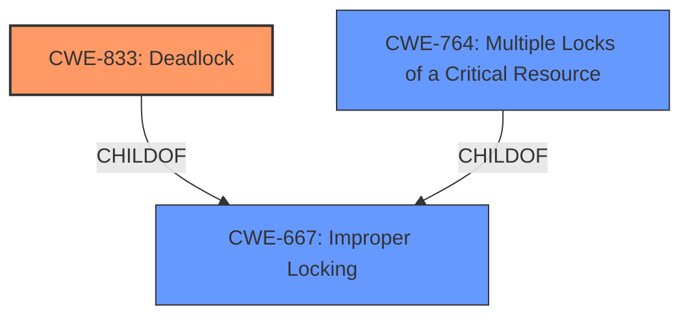

# Analysis Report for CVE-2025-37907

# Vulnerability Analysis Report: CVE-2025-37907

## Description

In the Linux kernel, the following vulnerability has been resolved accel/ivpu Fix locking order in ivpu_job_submit Fix **deadlock** in job submission and abort handling. When a thread aborts currently executing jobs due to a fault, it first locks the global lock protecting submitted_jobs (#1). After the last job is destroyed, it proceeds to release the related context and locks file_priv (#2). Meanwhile, in the job submission thread, the file_priv lock (#2) is taken first, and then the submitted_jobs lock (#1) is obtained when a job is added to the submitted jobs list. CPU0 CPU1 ---- ---- (for example due to a fault) (jobs submissions keep coming) lock(&vdev->submitted_jobs_lock) #1 ivpu_jobs_abort_all() job_destroy() lock(&file_priv->lock) #2 lock(&vdev->submitted_jobs_lock) #1 file_priv_release() lock(&vdev->context_list_lock) lock(&file_priv->lock) #2 This order of locking causes a **deadlock**. To resolve this issue, change the order of locking in ivpu_job_submit().

## Vulnerability Description Key Phrases

- **Rootcause:** deadlock
- **Product:** Linux kernel
- **Component:** accel/ivpu

## Analysis (with Relationship Data)

# Summary
| CWE ID | CWE Name | Confidence | CWE Abstraction Level | CWE Vulnerability Mapping Label | CWE-Vulnerability Mapping Notes |
|---|---|---|---|---|---|
| CWE-833 | Deadlock | 1.0 | Base | Primary CWE | Allowed |
| CWE-667 | Improper Locking | 0.7 | Class | Secondary Candidate | Allowed-with-Review |
| CWE-764 | Multiple Locks of a Critical Resource | 0.6 | Base | Secondary Candidate | Allowed |

## Evidence and Confidence

*   **Confidence Score:** 0.9
*   **Evidence Strength:** MEDIUM

## Relationship Analysis
The primary CWE is CWE-833 (Deadlock), which is a Base level CWE. CWE-667 (Improper Locking) is a parent Class of CWE-833, indicating that the deadlock results from some form of improper locking. CWE-764 (Multiple Locks of a Critical Resource) is another related Base CWE that can contribute to deadlocks. The relationship analysis helped confirm that while improper locking is present, the specific outcome is a deadlock, making CWE-833 the more accurate primary classification.



## Vulnerability Chain
The vulnerability chain starts with **improper locking** practices, specifically a locking order inversion. This leads directly to a **deadlock** when two threads attempt to acquire the same locks in opposite orders.
  - The root cause is the **improper locking** order.
  - The resulting impact is a **deadlock**.

## Summary of Analysis
The initial analysis strongly points to CWE-833 (Deadlock) as the primary weakness, supported by the vulnerability description explicitly mentioning the term "**deadlock**". The description details the scenario where two threads acquire locks in reverse order, leading to a deadlock situation. The retriever results also list CWE-833 as a highly relevant candidate.

CWE-667 (Improper Locking) is a valid secondary consideration as the deadlock arises due to **improper locking**, specifically a locking order inversion. However, CWE-833 is more specific and accurately reflects the final outcome of the vulnerability.

CWE-764 (Multiple Locks of a Critical Resource) is also considered as a secondary candidate since multiple locks are involved.

The evidence for the root cause is: "Fix **deadlock** in job submission and abort handling... This order of locking causes a **deadlock**. To resolve this issue, change the order of locking in ivpu_job_submit()."

The graph relationships confirm that CWE-833 is a child of CWE-667, indicating a specific type of improper locking. This justifies choosing CWE-833 as the primary, more specific CWE.

Relevant CWE Information:

# Enhanced Context (25 CWEs)
The following CWEs were identified as potentially relevant to this vulnerability:

## CWE-667: Improper Locking
**Abstraction Level**: Class
**Similarity Score**: 0.75
**Source**: dense

**Description**:
The product does not properly acquire or release a lock on a resource, leading to unexpected resource state changes and behaviors.

**Mapping Guidance**:
- Usage: Allowed-with-Review
- Rationale: This CWE entry is a Class and might have Base-level children that would be more appropriate

## CWE-833: Deadlock
**Abstraction Level**: Base
**Similarity Score**: 0.74
**Source**: dense

**Description**:
The product contains multiple threads or executable segments that are waiting for each other to release a necessary lock, resulting in deadlock.

**Mapping Guidance**:
- Usage: Allowed
- Rationale: This CWE entry is at the Base level of abstraction, which is a preferred level of abstraction for mapping to the root causes of vulnerabilities.

## CWE-413: Improper Resource Locking
**Abstraction Level**: Base
**Similarity Score**: 0.71
**Source**: dense

**Description**:
The product does not lock or does not correctly lock a resource when the product must have exclusive access to the resource.

**Mapping Guidance**:
- Usage: Allowed
- Rationale: This CWE entry is at the Base level of abstraction, which is a preferred level of abstraction for mapping to the root causes of vulnerabilities.

## CWE-362: Concurrent Execution using Shared Resource with Improper Synchronization ('Race Condition')
**Abstraction Level**: Class
**Similarity Score**: 0.70
**Source**: dense

**Description**:
The product contains a concurrent code sequence that requires temporary, exclusive access to a shared resource, but a timing window exists in which the shared resource can be modified by another code sequence operating concurrently.

**Mapping Guidance**:
- Usage: Allowed-with-Review
- Rationale: This CWE entry is a Class and might have Base-level children that would be more appropriate

## CWE-755: Improper Handling of Exceptional Conditions
**Abstraction Level**: Class
**Similarity Score**: 0.69
**Source**: dense

**Description**:
The product does not handle or incorrectly handles an exceptional condition.

**Mapping Guidance**:
- Usage: Discouraged
- Rationale: This CWE entry is a level-1 Class (i.e., a child of a Pillar). It might have lower-level children that would be more appropriate

## CWE-1285: Improper Validation of Specified Index, Position, or Offset in Input
**Abstraction Level**: Base
**Similarity Score**: 0.68
**Source**: dense

**Description**:
The product receives input that is expected to specify an index, position, or offset into an indexable resource such as a buffer or file, but it does not validate or incorrectly validates that the specified index/position/offset has the required properties.

**Mapping Guidance**:
- Usage: Allowed
- Rationale: This CWE entry is at the Base level of abstraction, which is a preferred level of abstraction for mapping to the root causes of vulnerabilities.

## CWE-665: Improper Initialization
**Abstraction Level**: Class
**Similarity Score**: 0.68
**Source**: dense

**Description**:
The product does not initialize or incorrectly initializes a resource, which might leave the resource in an unexpected state when it is accessed or used.

**Mapping Guidance**:
- Usage: Discouraged
- Rationale: This CWE entry is a level-1 Class (i.e., a child of a Pillar). It might have lower-level children that would be more appropriate

## CWE-252: Unchecked Return Value
**Abstraction Level**: Base
**Similarity Score**: 0.68
**Source**: dense

**Description**:
The product does not check the return value from a method or function, which can prevent it from detecting unexpected states and conditions.

**Mapping Guidance**:
- Usage: Allowed
- Rationale: This CWE entry is at the Base level of abstraction, which is a preferred level of abstraction for mapping to the root causes of vulnerabilities.

## CWE-754: Improper Check for Unusual or Exceptional Conditions
**Abstraction Level**: Class
**Similarity Score**: 0.68
**Source**: dense

**Description**:
The product does not check or incorrectly checks for unusual or exceptional conditions that are not expected to occur frequently during day to day operation of the product.

**Mapping Guidance**:
- Usage: Allowed-with-Review
- Rationale: This CWE entry is a Class and might have Base-level children that would be more appropriate

## CWE-824: Access of Uninitialized Pointer
**Abstraction Level**: Base
**Similarity Score**: 0.68
**Source**: dense

**Description**:
The product accesses or uses a pointer that has not been initialized.

**Mapping Guidance**:
- Usage: Allowed
- Rationale: This CWE entry is at the Base level of abstraction, which is a preferred level of abstraction for mapping to the root causes of vulnerabilities.

## CWE-667: Improper Locking
**Abstraction Level**: Class
**Similarity Score**: 690.44
**Source**: sparse

**Description**:
The product does not properly acquire or release a lock on a resource, leading to unexpected resource state changes and behaviors.

**Mapping Guidance**:
- Usage: Allowed-with-Review
- Rationale: This CWE entry is a Class and might have Base-level children that would be more appropriate

## CWE-764: Multiple Locks of a Critical Resource
**Abstraction Level**: Base
**Similarity Score**: 611.72
**Source**: sparse

**Description**:
The product locks a critical resource more times than intended, leading to an unexpected state in the system.

**Mapping Guidance**:
- Usage: Allowed
- Rationale: This CWE entry is at the Base level of abstraction, which is a preferred level of abstraction for mapping


## CWE Relationship Analysis

Current CWEs represent these abstraction levels: .


### Vulnerability Chain Analysis

**Chain starting from CWE-667:**
- 667 (Improper Locking) - ROOT


**Chain starting from CWE-833:**
- 833 (Deadlock) - ROOT


### CWE Relationship Diagram

```mermaid
graph TD
    classDef primary fill:#f96,stroke:#333,stroke-width:2px
    classDef secondary fill:#69f,stroke:#333
    classDef tertiary fill:#9e9,stroke:#333
```


*Report generated on 2025-07-14 21:50:01*
