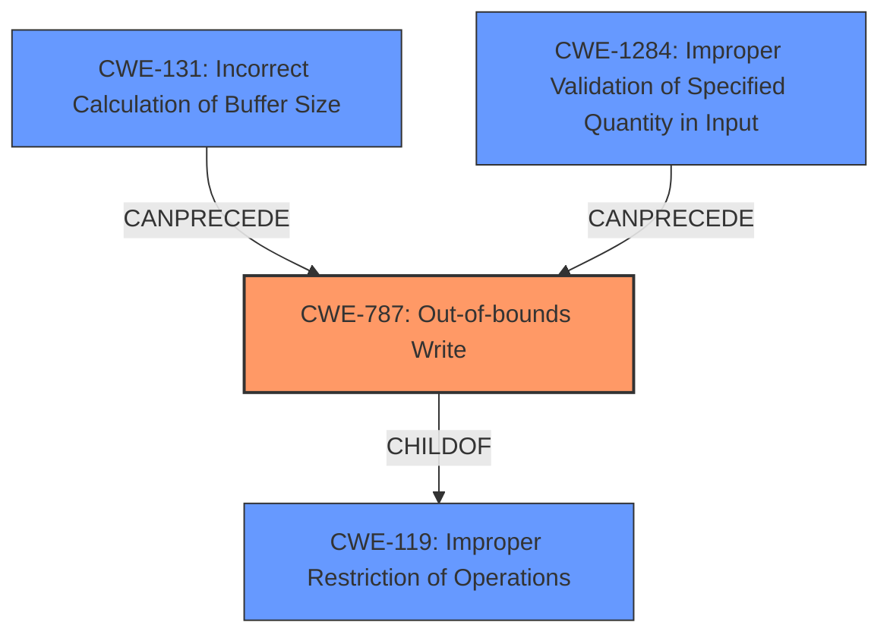

# Analysis Report for CVE-2025-37911

# Vulnerability Analysis Report: CVE-2025-37911

## Description

In the Linux kernel, the following vulnerability has been resolved bnxt_en Fix out-of-bound memcpy() during ethtool -w When retrieving the FW coredump using ethtool, it can sometimes cause **memory corruption** BUG KFENCE **memory corruption** in __bnxt_get_coredump+0x3ef/0x670 [bnxt_en] Corrupted memory at 0x000000008f0f30e8 [ ! ! ! ! ! ! ! ! ! ! ! ! ! ! ! ! ] (in kfence-#45) __bnxt_get_coredump+0x3ef/0x670 [bnxt_en] ethtool_get_dump_data+0xdc/0x1a0 __dev_ethtool+0xa1e/0x1af0 dev_ethtool+0xa8/0x170 dev_ioctl+0x1b5/0x580 sock_do_ioctl+0xab/0xf0 sock_ioctl+0x1ce/0x2e0 __x64_sys_ioctl+0x87/0xc0 do_syscall_64+0x5c/0xf0 entry_SYSCALL_64_after_hwframe+0x78/0x80 ... This happens when copying the coredump segment list in bnxt_hwrm_dbg_dma_data() with the HWRM_DBG_COREDUMP_LIST FW command. The info->dest_buf buffer is allocated based on the number of coredump segments returned by the FW. The segment list is then DMAed by the FW and the length of the DMA is returned by FW. The driver then copies this DMAed segment list to info->dest_buf. In some cases, this DMA length may exceed the info->dest_buf length and cause the above BUG condition. Fix it by capping the copy length to not exceed the length of info->dest_buf. The extra DMA data contains no useful information. This code path is shared for the HWRM_DBG_COREDUMP_LIST and the HWRM_DBG_COREDUMP_RETRIEVE FW commands. The buffering is different for these 2 FW commands. To simplify the logic, we need to move the line to adjust the buffer length for HWRM_DBG_COREDUMP_RETRIEVE up, so that the new check to cap the copy length will work for both commands.

## Vulnerability Description Key Phrases

- **Weakness:** memory corruption
- **Product:** Linux kernel
- **Component:** bnxt_en

## Analysis (with Relationship Data)

# Summary
| CWE ID | CWE Name | Confidence | CWE Abstraction Level | CWE Vulnerability Mapping Label | CWE-Vulnerability Mapping Notes |
|---|---|---|---|---|---|
| CWE-787 | Out-of-bounds Write | 0.9 | Base | Allowed | Primary CWE. The driver copies data to a buffer without proper bounds checking, leading to memory corruption. |
| CWE-131 | Incorrect Calculation of Buffer Size | 0.7 | Base | Allowed | Secondary CWE. The allocated buffer size is dependent on the number of coredump segments, which may not be sufficient to hold the DMAed data. |
| CWE-1284 | Improper Validation of Specified Quantity in Input | 0.6 | Base | Allowed | Secondary CWE. The length of the DMA data is not validated against the allocated buffer size, which causes the out-of-bounds write. |

## Evidence and Confidence

*   **Confidence Score:** 0.8
*   **Evidence Strength:** MEDIUM

## Relationship Analysis
The primary weakness is CWE-787, which results from a **incorrect calculation of buffer size** (CWE-131) and **improper validation of specified quantity in input** (CWE-1284). CWE-787 is a child of CWE-119 (Improper Restriction of Operations within the Bounds of a Memory Buffer), indicating a general class of buffer-related errors. CWE-131 and CWE-1284 can precede CWE-787, as they set the stage for an out-of-bounds write.



## Vulnerability Chain
1.  The driver calculates the buffer size based on the number of coredump segments (CWE-131).
2.  The FW DMAs data, and the length is returned to the driver.
3.  The driver copies the DMAed segment list to the buffer without validating that the DMA length does not exceed the buffer length (CWE-1284).
4.  The DMA length exceeds the buffer length (CWE-131, CWE-1284).
5.  An out-of-bounds write occurs, leading to **memory corruption** (CWE-787).

## Summary of Analysis
The primary vulnerability is an out-of-bounds write (CWE-787) that leads to **memory corruption**. The root cause is a combination of **incorrect calculation of buffer size** (CWE-131) and **improper validation of specified quantity in input** (CWE-1284). The driver allocates a buffer and then copies data into it without properly checking the size of the data being copied, which results in writing past the end of the buffer.

The evidence from the vulnerability description is: "In some cases, this DMA length may exceed the info->dest_buf length and cause the above BUG condition. Fix it by capping the copy length to not exceed the length of info->dest_buf." This clearly indicates that the DMA length sometimes exceeds the buffer length, and the fix involves limiting the copy length to the buffer length, supporting the assessment of CWE-787 and CWE-1284. The mention of `info->dest_buf buffer is allocated based on the number of coredump segments` supports the assessment of CWE-131, since the number of segments doesn't mean the resulting buffer size will be correct.

The graph relationships influenced the selection by highlighting the chain of events leading to the out-of-bounds write. The selected CWEs are at the optimal level of specificity because they accurately represent the technical details of the vulnerability and are base level CWEs.

CWEs Considered but Not Used:

*   CWE-125 (Out-of-bounds Read): While out-of-bounds read is related to buffer access issues, the vulnerability description specifically mentions an out-of-bounds *write*, making CWE-787 a more accurate fit.
*   CWE-190 (Integer Overflow or Wraparound) and CWE-191 (Integer Underflow): These CWEs relate to integer calculation errors, but the core issue here is the lack of proper bounds checking during the data copy, not integer manipulation.
*   CWE-362 (Race Condition): This CWE relates to concurrency issues, which are not mentioned in the vulnerability description.
*   CWE-755 (Improper Handling of Exceptional Conditions): This is a general class and is less specific than the identified CWEs.
*   CWE-805 (Buffer Access with Incorrect Length Value): Similar to CWE-787, but CWE-787 more directly captures the out-of-bounds write.


## CWE Relationship Analysis

Current CWEs represent these abstraction levels: .


### Vulnerability Chain Analysis

**Chain starting from CWE-1284:**
- 1284 (Improper Validation of Specified Quantity in Input) - ROOT


**Chain starting from CWE-805:**
- 805 (Buffer Access with Incorrect Length Value) - ROOT


### CWE Relationship Diagram

```mermaid
graph TD
    classDef primary fill:#f96,stroke:#333,stroke-width:2px
    classDef secondary fill:#69f,stroke:#333
    classDef tertiary fill:#9e9,stroke:#333
```


*Report generated on 2025-07-14 21:51:21*
