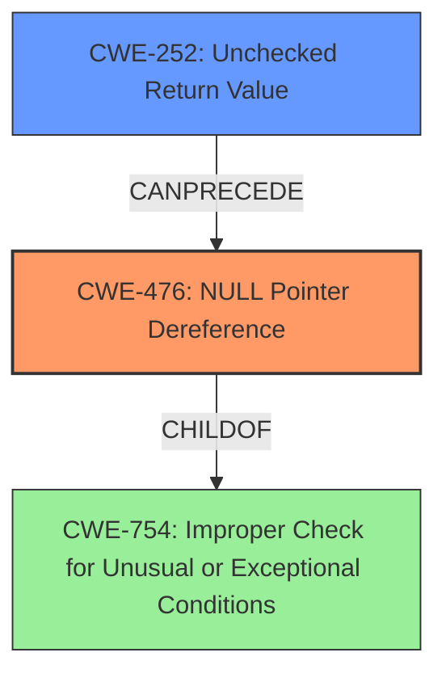

# Analysis Report for CVE-2025-37912

# Vulnerability Analysis Report: CVE-2025-37912

## Description

In the Linux kernel, the following vulnerability has been resolved ice Check VF VSI Pointer Value in ice_vc_add_fdir_fltr() As mentioned in the commit baeb705fd6a7 (ice always check VF VSI pointer values), we need to perform a null pointer check on the return value of ice_get_vf_vsi() before using it.

## Vulnerability Description Key Phrases

- **Rootcause:** null pointer dereference
- **Product:** Linux kernel
- **Component:** ice_vc_add_fdir_fltr()

## Analysis (with Relationship Data)

# Summary

| CWE ID | CWE Name | Confidence | CWE Abstraction Level | CWE Vulnerability Mapping Label | CWE-Vulnerability Mapping Notes |
|---|---|---|---|---|---|
| CWE-476 | NULL Pointer Dereference | 1.0 | Base | Allowed | Primary CWE: The code dereferences a pointer that it expects to be valid but is NULL. |
| CWE-252 | Unchecked Return Value | 0.7 | Base | Allowed | Secondary CWE: The product does not check the return value from a method or function, which can prevent it from detecting unexpected states and conditions. |

## Evidence and Confidence

*   **Confidence Score:** 0.9
*   **Evidence Strength:** HIGH

## Relationship Analysis
The primary relationship that impacted my decision was the CANPRECEDE relationship between CWE-252 **Unchecked Return Value** and CWE-476 **NULL Pointer Dereference**. The vulnerability arises because the return value of `ice_get_vf_vsi()` is not checked, and if it returns NULL, a subsequent dereference leads to a **null pointer dereference**. CWE-476 is a child of CWE-754 **Improper Check for Unusual or Exceptional Conditions**. Both CWE-252 and CWE-476 are base level.



## Vulnerability Chain
The vulnerability chain begins with an **unchecked return value** (CWE-252) from `ice_get_vf_vsi()`. This leads to a potential **NULL pointer dereference** (CWE-476) when the code attempts to use the returned pointer without validating it. Thus the first weakness is the unchecked return value, which leads to the NULL pointer dereference.

## Summary of Analysis
The analysis is heavily based on the provided vulnerability description and the phrase "**null pointer dereference**". The description clearly states the need to perform a null pointer check on the return value of `ice_get_vf_vsi()` before using it. This directly points to CWE-476 **NULL Pointer Dereference** as the primary weakness. The retriever results also listed CWE-476 with a high score. Since the return value is not checked before dereferencing, the code could be improved by checking the return value.

The selection of CWE-476 is at the optimal level of specificity, as it accurately describes the vulnerability's root cause. While CWE-754 **Improper Check for Unusual or Exceptional Conditions** is a parent, CWE-476 provides a more precise characterization of the flaw.

CWE-252 **Unchecked Return Value** was also considered, as the root cause is the missing check of the return value of `ice_get_vf_vsi()`. This is a prerequisite for the **NULL Pointer Dereference** (CWE-476).

Other CWEs were considered but not chosen because they did not accurately reflect the specific vulnerability. For example, CWE-824 **Access of Uninitialized Pointer** was not chosen because the pointer is not uninitialized, but rather potentially NULL due to the unchecked return value. CWE-823 **Use of Out-of-range Pointer Offset** was not chosen because there's no indication of pointer arithmetic or out-of-range offsets being involved.


## CWE Relationship Analysis

Current CWEs represent these abstraction levels: .


### Vulnerability Chain Analysis

**Chain starting from CWE-476:**
- 476 (NULL Pointer Dereference) - ROOT


**Chain starting from CWE-823:**
- 823 (Use of Out-of-range Pointer Offset) - ROOT


### CWE Relationship Diagram

```mermaid
graph TD
    classDef primary fill:#f96,stroke:#333,stroke-width:2px
    classDef secondary fill:#69f,stroke:#333
    classDef tertiary fill:#9e9,stroke:#333
```


*Report generated on 2025-07-14 21:51:36*
