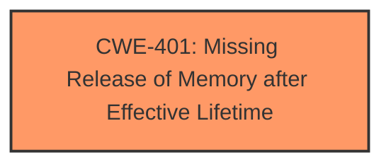

# Analysis for CVE-2025-37941

# Summary
| CWE ID | CWE Name | Confidence | CWE Abstraction Level | CWE Vulnerability Mapping Label | CWE-Vulnerability Mapping Notes |
|---|---|---|---|---|---|
| CWE-401 | Missing Release of Memory after Effective Lifetime | 1.0 | Variant | Allowed | Primary CWE. The **rootcause** is that the allocated `wcd937x->clsh_info` is **not freed** when `snd_soc_dapm_new_controls()` or `snd_soc_dapm_add_routes()` fails. |

## Evidence and Confidence

*   **Confidence Score:** 1.0
*   **Evidence Strength:** HIGH

## Relationship Analysis
The primary CWE is CWE-401, which is a variant. There are no specific parent or child relationships that influence the selection in this case, as the description directly matches the CWE.

## Vulnerability Chain
The vulnerability chain is straightforward:
1.  **Root Cause:** Memory is allocated (`wcd_clsh_ctrl_alloc`).
2.  **Weakness:** The allocated memory is not released (`wcd937x->clsh_info is not freed`) under specific failure conditions.
3.  **Impact:** Memory leak.

## Summary of Analysis
The analysis is based on the provided vulnerability description, which clearly states that memory allocated by `wcd_clsh_ctrl_alloc` is **not freed** in the `wcd937x_soc_codec_probe()` function when `snd_soc_dapm_new_controls()` or `snd_soc_dapm_add_routes()` fails. This directly corresponds to **CWE-401: Missing Release of Memory after Effective Lifetime**, which describes a situation where allocated memory is not released after its effective lifetime.

The retriever results also list CWE-401 as the top candidate. The description explicitly states the **rootcause** as `wcd937x->clsh_info is not freed` and the impact as a memory leak.

Other CWEs were considered but not selected because they didn't directly address the **rootcause** which is the **missing release of memory**. For example:

*   CWE-362, CWE-667, CWE-364, CWE-662: These relate to concurrency and synchronization issues, which are not relevant to this specific vulnerability.
*   CWE-415: Double Free is not applicable since the memory is not being freed at all under certain conditions, rather than being freed twice.
*   CWE-909: Missing Initialization of Resource is not applicable because the memory is allocated, so it is initialized. The issue is its release.
* CWE-125: Out-of-bounds Read is not applicable because the vulnerability is not related to reading past the end of an allocated buffer.
* CWE-1189: Improper Isolation of Shared Resources on System-on-a-Chip (SoC) is not applicable because the vulnerability is not related to shared resources on a System-on-a-Chip.
Relevant CWE Information: