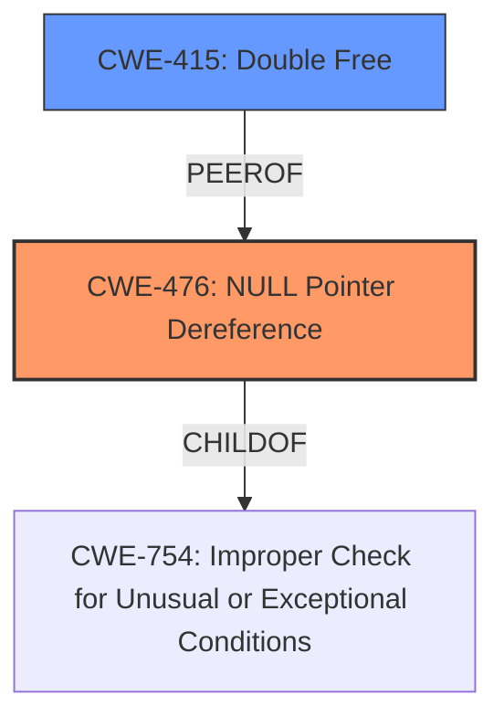

# Analysis Report for CVE-2025-37953

# Vulnerability Analysis Report: CVE-2025-37953

## Description

In the Linux kernel, the following vulnerability has been resolved sch_htb make htb_deactivate() idempotent Alan reported a **NULL pointer dereference** in htb_next_rb_node() after we made htb_qlen_notify() idempotent. It turns out in the following case it introduced some regression htb_dequeue_tree() |-> fq_codel_dequeue() |-> qdisc_tree_reduce_backlog() |-> htb_qlen_notify() |-> htb_deactivate() |-> htb_next_rb_node() |-> htb_deactivate() For htb_next_rb_node(), after calling the 1st htb_deactivate(), the clprio[prio]->ptr could be already set to NULL, which means htb_next_rb_node() is vulnerable here. For htb_deactivate(), although we checked qlen before calling it, in case of qlen==0 after qdisc_tree_reduce_backlog(), we may call it again which triggers the warning inside. To fix the issues here, we need to 1) Make htb_deactivate() idempotent, that is, simply return if we already call it before. 2) Make htb_next_rb_node() safe against ptr==NULL. Many thanks to Alan for testing and for the reproducer.

## Vulnerability Description Key Phrases

- **Rootcause:** NULL pointer dereference
- **Product:** Linux kernel

## Analysis (with Relationship Data)

# Summary
| CWE ID | CWE Name | Confidence | CWE Abstraction Level | CWE Vulnerability Mapping Label | CWE-Vulnerability Mapping Notes |
|---|---|---|---|---|---|
| CWE-476 | NULL Pointer Dereference | 1.0 | Base | Primary | Allowed |
| CWE-415 | Double Free | 0.4 | Variant | Secondary | Allowed |

## Evidence and Confidence

*   **Confidence Score:** 0.9
*   **Evidence Strength:** HIGH

## Relationship Analysis
The primary identified weakness is CWE-476 (**NULL Pointer Dereference**). Several other CWEs were considered, especially those related to resource management and concurrency, such as CWE-415 (**Double Free**), CWE-824 (**Access of Uninitialized Pointer**), and CWE-362 (**Concurrent Execution using Shared Resource with Improper Synchronization ('Race Condition')**).

The hierarchical relationships were considered, especially the child-parent relationship with CWE-754 (**Improper Check for Unusual or Exceptional Conditions**) as a parent of CWE-476, but CWE-476 was ultimately selected for its specificity. The chain relationships also highlighted potential prerequisite conditions or subsequent impacts related to memory safety.



## Vulnerability Chain
The vulnerability chain starts with a complex sequence of operations within the Linux kernel's sch_htb module leading to a **NULL pointer dereference**.

1.  `htb_dequeue_tree()` -\> `fq_codel_dequeue()` -\> `qdisc_tree_reduce_backlog()` -\> `htb_qlen_notify()` -\> `htb_deactivate()` -\> `htb_next_rb_node()` -\> `htb_deactivate()`

The initial call to `htb_deactivate()` can set `clprio[prio]->ptr` to NULL. A subsequent call to `htb_next_rb_node()` then attempts to dereference this **NULL** pointer, triggering CWE-476.

## Summary of Analysis
The analysis heavily relies on the provided vulnerability description, which explicitly mentions a **NULL pointer dereference** in `htb_next_rb_node()`. This aligns directly with the definition of CWE-476.

The relationships between CWEs influenced the analysis by suggesting potential related weaknesses, such as those involving resource management and concurrency. However, the explicit mention of the **NULL pointer dereference** made CWE-476 the most appropriate primary classification.

The selected CWE is at the optimal level of specificity because it directly addresses the root cause described in the vulnerability report. While more general CWEs like CWE-754 could be considered, they lack the precision needed to capture the specific nature of the vulnerability.

Relevant CWE Information:

# Enhanced Context (25 CWEs)
The following CWEs were identified as potentially relevant to this vulnerability:

## CWE-476: NULL Pointer Dereference
**Abstraction Level**: Base
**Similarity Score**: 0.74
**Source**: dense

**Description**:
The product dereferences a pointer that it expects to be valid but is NULL.

**Mapping Guidance**:
- Usage: Allowed
- Rationale: This CWE entry is at the Base level of abstraction, which is a preferred level of abstraction for mapping to the root causes of vulnerabilities.

## CWE-824: Access of Uninitialized Pointer
**Abstraction Level**: Base
**Similarity Score**: 0.72
**Source**: dense

**Description**:
The product accesses or uses a pointer that has not been initialized.

**Mapping Guidance**:
- Usage: Allowed
- Rationale: This CWE entry is at the Base level of abstraction, which is a preferred level of abstraction for mapping to the root causes of vulnerabilities.

## CWE-252: Unchecked Return Value
**Abstraction Level**: Base
**Similarity Score**: 0.72
**Source**: dense

**Description**:
The product does not check the return value from a method or function, which can prevent it from detecting unexpected states and conditions.

**Mapping Guidance**:
- Usage: Allowed
- Rationale: This CWE entry is at the Base level of abstraction, which is a preferred level of abstraction for mapping to the root causes of vulnerabilities.

## CWE-909: Missing Initialization of Resource
**Abstraction Level**: Class
**Similarity Score**: 0.71
**Source**: dense

**Description**:
The product does not initialize a critical resource.

**Mapping Guidance**:
- Usage: Allowed-with-Review
- Rationale: This CWE entry is a Class and might have Base-level children that would be more appropriate

## CWE-362: Concurrent Execution using Shared Resource with Improper Synchronization ('Race Condition')
**Abstraction Level**: Class
**Similarity Score**: 0.71
**Source**: dense

**Description**:
The product contains a concurrent code sequence that requires temporary, exclusive access to a shared resource, but a timing window exists in which the shared resource can be modified by another code sequence operating concurrently.

**Mapping Guidance**:
- Usage: Allowed-with-Review
- Rationale: This CWE entry is a Class and might have Base-level children that would be more appropriate

## CWE-908: Use of Uninitialized Resource
**Abstraction Level**: Base
**Similarity Score**: 0.70
**Source**: dense

**Description**:
The product uses or accesses a resource that has not been initialized.

**Mapping Guidance**:
- Usage: Allowed
- Rationale: This CWE entry is at the Base level of abstraction, which is a preferred level of abstraction for mapping to the root causes of vulnerabilities.

## CWE-667: Improper Locking
**Abstraction Level**: Class
**Similarity Score**: 0.70
**Source**: dense

**Description**:
The product does not properly acquire or release a lock on a resource, leading to unexpected resource state changes and behaviors.

**Mapping Guidance**:
- Usage: Allowed-with-Review
- Rationale: This CWE entry is a Class and might have Base-level children that would be more appropriate

## CWE-131: Incorrect Calculation of Buffer Size
**Abstraction Level**: Base
**Similarity Score**: 0.70
**Source**: dense

**Description**:
The product does not correctly calculate the size to be used when allocating a buffer, which could lead to a buffer overflow.

**Mapping Guidance**:
- Usage: Allowed
- Rationale: This CWE entry is at the Base level of abstraction, which is a preferred level of abstraction for mapping to the root causes of vulnerabilities.

## CWE-822: Untrusted Pointer Dereference
**Abstraction Level**: Base
**Similarity Score**: 0.70
**Source**: dense

**Description**:
The product obtains a value from an untrusted source, converts this value to a pointer, and dereferences the resulting pointer.

**Mapping Guidance**:
- Usage: Allowed
- Rationale: This CWE entry is at the Base level of abstraction, which is a preferred level of abstraction for mapping to the root causes of vulnerabilities.

## CWE-754: Improper Check for Unusual or Exceptional Conditions
**Abstraction Level**: Class
**Similarity Score**: 0.70
**Source**: dense

**Description**:
The product does not check or incorrectly checks for unusual or exceptional conditions that are not expected to occur frequently during day to day operation of the product.

**Mapping Guidance**:
- Usage: Allowed-with-Review
- Rationale: This CWE entry is a Class and might have Base-level children that would be more appropriate

## CWE-476: NULL Pointer Dereference
**Abstraction Level**: Base
**Similarity Score**: 504.29
**Source**: sparse

**Description**:
The product dereferences a pointer that it expects to be valid but is NULL.

**Mapping Guidance**:
- Usage: Allowed
- Rationale: This CWE entry is at the Base level of abstraction, which is a preferred level of abstraction for mapping to the root causes of vulnerabilities.

## CWE-252: Unchecked Return Value
**Abstraction Level**: Base
**Similarity Score**: 476.76
**Source**: sparse

**Description**:
The product does not check the return value from a method or function, which can prevent it from detecting unexpected states and conditions.

**Mapping Guidance**:
- Usage: Allowed
- Rationale: This CWE entry is at the Base level of abstraction, which is a preferred level of abstraction for mapping to the root causes of vulnerabilities.

## CWE-362: Concurrent Execution using Shared Resource with Improper Synchronization ('Race Condition')
**Abstraction Level**: Class
**Similarity Score**: 472.14
**Source**: sparse

**Description**:
The product contains


## CWE Relationship Analysis

Current CWEs represent these abstraction levels: .


### Vulnerability Chain Analysis

**Chain starting from CWE-476:**
- 476 (NULL Pointer Dereference) - ROOT


**Chain starting from CWE-131:**
- 131 (Incorrect Calculation of Buffer Size) - ROOT


### CWE Relationship Diagram

```mermaid
graph TD
    classDef primary fill:#f96,stroke:#333,stroke-width:2px
    classDef secondary fill:#69f,stroke:#333
    classDef tertiary fill:#9e9,stroke:#333
```


*Report generated on 2025-07-14 21:59:47*
