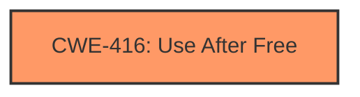

# Analysis Report for CVE-2025-37957

# Vulnerability Analysis Report: CVE-2025-37957

## Description

In the Linux kernel, the following vulnerability has been resolved KVM SVM Forcibly leave SMM mode on SHUTDOWN interception Previously, commit ed129ec9057f (KVM x86 forcibly leave nested mode on vCPU reset) addressed an issue where a triple fault occurring in nested mode could lead to **use-after-free** scenarios. However, the commit did not handle the analogous situation for System Management Mode (SMM). This omission results in triggering a WARN when KVM forces a vCPU INIT after SHUTDOWN interception while the vCPU is in SMM. This situation was reprodused using Syzkaller by 1) Creating a KVM VM and vCPU 2) Sending a KVM_SMI ioctl to explicitly enter SMM 3) Executing invalid instructions causing consecutive exceptions and eventually a triple fault The issue manifests as follows WARNING CPU 0 PID 25506 at arch/x86/kvm/x86.c12112 kvm_vcpu_reset+0x1d2/0x1530 arch/x86/kvm/x86.c12112 Modules linked in CPU 0 PID 25506 Comm syz-executor.0 Not tainted 6.1.130-syzkaller-00157-g164fe5dde9b6 #0 Hardware name QEMU Standard PC (i440FX + PIIX, 1996), BIOS 1.12.0-1 04/01/2014 RIP 0010kvm_vcpu_reset+0x1d2/0x1530 arch/x86/kvm/x86.c12112 Call Trace shutdown_interception+0x66/0xb0 arch/x86/kvm/svm/svm.c2136 svm_invoke_exit_handler+0x110/0x530 arch/x86/kvm/svm/svm.c3395 svm_handle_exit+0x424/0x920 arch/x86/kvm/svm/svm.c3457 vcpu_enter_guest arch/x86/kvm/x86.c10959 [inline] vcpu_run+0x2c43/0x5a90 arch/x86/kvm/x86.c11062 kvm_arch_vcpu_ioctl_run+0x50f/0x1cf0 arch/x86/kvm/x86.c11283 kvm_vcpu_ioctl+0x570/0xf00 arch/x86/kvm/../../../virt/kvm/kvm_main.c4122 vfs_ioctl fs/ioctl.c51 [inline] __do_sys_ioctl fs/ioctl.c870 [inline] __se_sys_ioctl fs/ioctl.c856 [inline] __x64_sys_ioctl+0x19a/0x210 fs/ioctl.c856 do_syscall_x64 arch/x86/entry/common.c51 [inline] do_syscall_64+0x35/0x80 arch/x86/entry/common.c81 entry_SYSCALL_64_after_hwframe+0x6e/0xd8 Architecturally, INIT is blocked when the CPU is in SMM, hence KVMs WARN() in kvm_vcpu_reset() to guard against KVM bugs, e.g. to detect improper emulation of INIT. SHUTDOWN on SVM is a weird edge case where KVM needs to do _something_ sane with the VMCB, since its technically undefined, and INIT is the least awful choice given KVMs ABI. So, double down on stuffing INIT on SHUTDOWN, and force the vCPU out of SMM to avoid any weirdness (and the WARN). Found by Linux Verification Center (linuxtesting.org) with Syzkaller. [sean massage changelog, make it clear this isnt architectural behavior]

## Vulnerability Description Key Phrases

- **Weakness:** use-after-free
- **Product:** Linux kernel

## Analysis (with Relationship Data)

# Summary

| CWE ID | CWE Name | Confidence | CWE Abstraction Level | CWE Vulnerability Mapping Label | CWE-Vulnerability Mapping Notes |
|---|---|---|---|---|---|
| CWE-416 | Use After Free | 1.0 | Variant |  | Allowed |

## Evidence and Confidence

*   **Confidence Score:** 1.0
*   **Evidence Strength:** HIGH

## Relationship Analysis

The primary identified CWE is CWE-416. This is a variant level CWE, providing a specific description of the vulnerability. No other parent or child relationships influenced this decision, as the description directly refers to a use-after-free condition.



## Vulnerability Chain

The vulnerability chain is straightforward: a triple fault in nested mode within KVM, specifically during SHUTDOWN interception while the vCPU is in SMM, leads to a **use-after-free** condition.

## Summary of Analysis

The analysis is based on the provided vulnerability description, which explicitly mentions the **weakness** as a **use-after-free**.

The description clearly states: "Previously, commit ed129ec9057f (KVM x86 forcibly leave nested mode on vCPU reset) addressed an issue where a triple fault occurring in nested mode could lead to **use-after-free** scenarios. However, the commit did not handle the analogous situation for System Management Mode (SMM). This omission results in triggering a WARN when KVM forces a vCPU INIT after SHUTDOWN interception while the vCPU is in SMM."

The retriever results also list CWE-416 as the top candidate with a score of 1.0.

Therefore, CWE-416 is the most appropriate and specific CWE for this vulnerability.

Relevant CWE Information:

# Enhanced Context (25 CWEs)
The following CWEs were identified as potentially relevant to this vulnerability:

## CWE-667: Improper Locking
**Abstraction Level**: Class
**Similarity Score**: 0.77
**Source**: dense

**Description**:
The product does not properly acquire or release a lock on a resource, leading to unexpected resource state changes and behaviors.

**Mapping Guidance**:
- Usage: Allowed-with-Review
- Rationale: This CWE entry is a Class and might have Base-level children that would be more appropriate

## CWE-404: Improper Resource Shutdown or Release
**Abstraction Level**: Class
**Similarity Score**: 0.75
**Source**: dense

**Description**:
The product does not release or incorrectly releases a resource before it is made available for re-use.

**Mapping Guidance**:
- Usage: Allowed-with-Review
- Rationale: This CWE entry is a Class and might have Base-level children that would be more appropriate

## CWE-703: Improper Check or Handling of Exceptional Conditions
**Abstraction Level**: Pillar
**Similarity Score**: 0.75
**Source**: dense

**Description**:
The product does not properly anticipate or handle exceptional conditions that rarely occur during normal operation of the product.

**Mapping Guidance**:
- Usage: Discouraged
- Rationale: This CWE entry is extremely high-level, a Pillar.

## CWE-909: Missing Initialization of Resource
**Abstraction Level**: Class
**Similarity Score**: 0.75
**Source**: dense

**Description**:
The product does not initialize a critical resource.

**Mapping Guidance**:
- Usage: Allowed-with-Review
- Rationale: This CWE entry is a Class and might have Base-level children that would be more appropriate

## CWE-754: Improper Check for Unusual or Exceptional Conditions
**Abstraction Level**: Class
**Similarity Score**: 0.75
**Source**: dense

**Description**:
The product does not check or incorrectly checks for unusual or exceptional conditions that are not expected to occur frequently during day to day operation of the product.

**Mapping Guidance**:
- Usage: Allowed-with-Review
- Rationale: This CWE entry is a Class and might have Base-level children that would be more appropriate

## CWE-252: Unchecked Return Value
**Abstraction Level**: Base
**Similarity Score**: 0.75
**Source**: dense

**Description**:
The product does not check the return value from a method or function, which can prevent it from detecting unexpected states and conditions.

**Mapping Guidance**:
- Usage: Allowed
- Rationale: This CWE entry is at the Base level of abstraction, which is a preferred level of abstraction for mapping to the root causes of vulnerabilities.

## CWE-362: Concurrent Execution using Shared Resource with Improper Synchronization ('Race Condition')
**Abstraction Level**: Class
**Similarity Score**: 0.74
**Source**: dense

**Description**:
The product contains a concurrent code sequence that requires temporary, exclusive access to a shared resource, but a timing window exists in which the shared resource can be modified by another code sequence operating concurrently.

**Mapping Guidance**:
- Usage: Allowed-with-Review
- Rationale: This CWE entry is a Class and might have Base-level children that would be more appropriate

## CWE-665: Improper Initialization
**Abstraction Level**: Class
**Similarity Score**: 0.74
**Source**: dense

**Description**:
The product does not initialize or incorrectly initializes a resource, which might leave the resource in an unexpected state when it is accessed or used.

**Mapping Guidance**:
- Usage: Discouraged
- Rationale: This CWE entry is a level-1 Class (i.e., a child of a Pillar). It might have lower-level children that would be more appropriate

## CWE-755: Improper Handling of Exceptional Conditions
**Abstraction Level**: Class
**Similarity Score**: 0.74
**Source**: dense

**Description**:
The product does not handle or incorrectly handles an exceptional condition.

**Mapping Guidance**:
- Usage: Discouraged
- Rationale: This CWE entry is a level-1 Class (i.e., a child of a Pillar). It might have lower-level children that would be more appropriate

## CWE-824: Access of Uninitialized Pointer
**Abstraction Level**: Base
**Similarity Score**: 0.74
**Source**: dense

**Description**:
The product accesses or uses a pointer that has not been initialized.

**Mapping Guidance**:
- Usage: Allowed
- Rationale: This CWE entry is at the Base level of abstraction, which is a preferred level of abstraction for mapping to the root causes of vulnerabilities.

## CWE-367: Time-of-check Time-of-use (TOCTOU) Race Condition
**Abstraction Level**: Base
**Similarity Score**: 766.37
**Source**: sparse

**Description**:
The product checks the state of a resource before using that resource, but the resource's state can change between the check and the use in a way that invalidates the results of the check. This can cause the product to perform invalid actions when the resource is in an unexpected state.

**Mapping Guidance**:
- Usage: Allowed
- Rationale: This CWE entry is at the Base level of abstraction, which is a preferred level of abstraction for mapping to the root causes of vulnerabilities.

## CWE-1342: Information Exposure through Microarchitectural State after Transient Execution
**Abstraction Level**: Base
**Similarity Score**: 695.48
**Source**: sparse

**Description**:
The processor does not properly clear microarchitectural state after incorrect microcode assists or speculative execution, resulting in transient execution.

**Mapping Guidance**:
- Usage: Allowed
- Rationale: This CWE entry is at the Base level of abstraction, which is a preferred level of abstraction for mapping to the root causes of vulnerabilities.

## CWE-125: Out-of-bounds Read
**Abstraction Level**: Base
**Similarity Score**: 683.15
**Source**: sparse

**Description**:
The product reads data past the end, or before the beginning, of the intended buffer.

**Mapping Guidance**:
- Usage: Allowed
- Rationale: This CWE entry is at the Base level of abstraction, which is a preferred level of abstraction for mapping to the root causes of vulnerabilities.

## CWE-755: Improper Handling of Exceptional Conditions
**Abstraction Level**: Class
**Similarity Score**: 675.09
**Source**: sparse

**Description**:
The product does not handle or incorrectly handles an exceptional condition.

**Mapping Guidance**:
- Usage: Discouraged
- Rationale: This CWE entry is a level-1 Class (i.e., a child of a Pillar). It might have lower-level children that would be more appropriate

## CWE-362: Concurrent Execution using Shared Resource with Improper Synchronization ('Race Condition')
**Abstraction Level**: Class
**Similarity Score**: 665.81
**Source**: sparse

**Description**:
The product contains a concurrent code sequence that requires temporary, exclusive access to a shared resource, but a timing window exists in which the shared resource can be modified by another code sequence operating concurrently.

**Mapping Guidance**:
- Usage: Allowed-with-Review
- Rationale: This CWE entry is a Class and might


## CWE Relationship Analysis

Current CWEs represent these abstraction levels: .


### Vulnerability Chain Analysis

**Chain starting from CWE-665:**
- 665 (Improper Initialization) - ROOT


**Chain starting from CWE-416:**
- 416 (Use After Free) - ROOT


### CWE Relationship Diagram

```mermaid
graph TD
    classDef primary fill:#f96,stroke:#333,stroke-width:2px
    classDef secondary fill:#69f,stroke:#333
    classDef tertiary fill:#9e9,stroke:#333
```


*Report generated on 2025-07-14 22:00:11*
