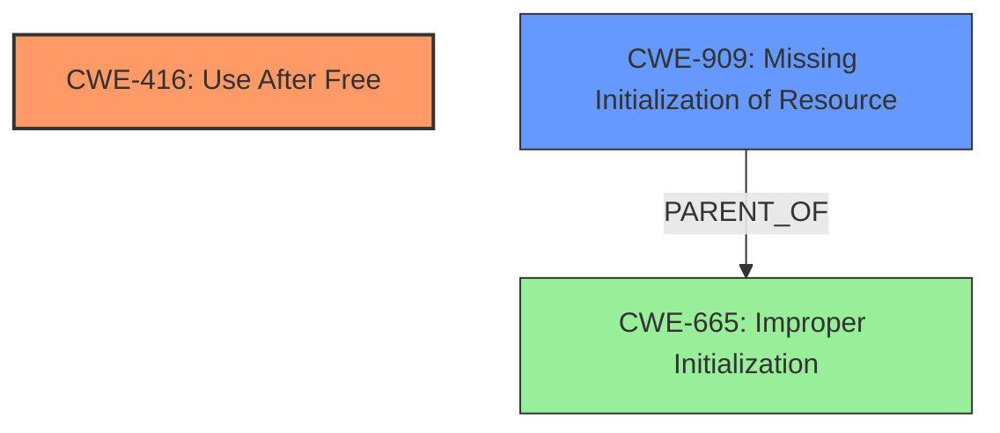

# Analysis Report for CVE-2025-37961

# Vulnerability Analysis Report: CVE-2025-37961

## Description

In the Linux kernel, the following vulnerability has been resolved ipvs fix uninit-value for saddr in do_output_route4 syzbot reports for uninit-value for the saddr argument [1]. commit 4754957f04f5 (ipvs do not use random local source address for tunnels) already implies that the input value of saddr should be ignored but the code is still reading it which can prevent to connect the route. Fix it by changing the argument to ret_saddr. [1] BUG KMSAN uninit-value in do_output_route4+0x42c/0x4d0 net/netfilter/ipvs/ip_vs_xmit.c147 do_output_route4+0x42c/0x4d0 net/netfilter/ipvs/ip_vs_xmit.c147 __ip_vs_get_out_rt+0x403/0x21d0 net/netfilter/ipvs/ip_vs_xmit.c330 ip_vs_tunnel_xmit+0x205/0x2380 net/netfilter/ipvs/ip_vs_xmit.c1136 ip_vs_in_hook+0x1aa5/0x35b0 net/netfilter/ipvs/ip_vs_core.c2063 nf_hook_entry_hookfn include/linux/netfilter.h154 [inline] nf_hook_slow+0xf7/0x400 net/netfilter/core.c626 nf_hook include/linux/netfilter.h269 [inline] __ip_local_out+0x758/0x7e0 net/ipv4/ip_output.c118 ip_local_out net/ipv4/ip_output.c127 [inline] ip_send_skb+0x6a/0x3c0 net/ipv4/ip_output.c1501 udp_send_skb+0xfda/0x1b70 net/ipv4/udp.c1195 udp_sendmsg+0x2fe3/0x33c0 net/ipv4/udp.c1483 inet_sendmsg+0x1fc/0x280 net/ipv4/af_inet.c851 sock_sendmsg_nosec net/socket.c712 [inline] __sock_sendmsg+0x267/0x380 net/socket.c727 ____sys_sendmsg+0x91b/0xda0 net/socket.c2566 ___sys_sendmsg+0x28d/0x3c0 net/socket.c2620 __sys_sendmmsg+0x41d/0x880 net/socket.c2702 __compat_sys_sendmmsg net/compat.c360 [inline] __do_compat_sys_sendmmsg net/compat.c367 [inline] __se_compat_sys_sendmmsg net/compat.c364 [inline] __ia32_compat_sys_sendmmsg+0xc8/0x140 net/compat.c364 ia32_sys_call+0x3ffa/0x41f0 arch/x86/include/generated/asm/syscalls_32.h346 do_syscall_32_irqs_on arch/x86/entry/syscall_32.c83 [inline] __do_fast_syscall_32+0xb0/0x110 arch/x86/entry/syscall_32.c306 do_fast_syscall_32+0x38/0x80 arch/x86/entry/syscall_32.c331 do_SYSENTER_32+0x1f/0x30 arch/x86/entry/syscall_32.c369 entry_SYSENTER_compat_after_hwframe+0x84/0x8e Uninit was created at slab_post_alloc_hook mm/slub.c4167 [inline] slab_alloc_node mm/slub.c4210 [inline] __kmalloc_cache_noprof+0x8fa/0xe00 mm/slub.c4367 kmalloc_noprof include/linux/slab.h905 [inline] ip_vs_dest_dst_alloc net/netfilter/ipvs/ip_vs_xmit.c61 [inline] __ip_vs_get_out_rt+0x35d/0x21d0 net/netfilter/ipvs/ip_vs_xmit.c323 ip_vs_tunnel_xmit+0x205/0x2380 net/netfilter/ipvs/ip_vs_xmit.c1136 ip_vs_in_hook+0x1aa5/0x35b0 net/netfilter/ipvs/ip_vs_core.c2063 nf_hook_entry_hookfn include/linux/netfilter.h154 [inline] nf_hook_slow+0xf7/0x400 net/netfilter/core.c626 nf_hook include/linux/netfilter.h269 [inline] __ip_local_out+0x758/0x7e0 net/ipv4/ip_output.c118 ip_local_out net/ipv4/ip_output.c127 [inline] ip_send_skb+0x6a/0x3c0 net/ipv4/ip_output.c1501 udp_send_skb+0xfda/0x1b70 net/ipv4/udp.c1195 udp_sendmsg+0x2fe3/0x33c0 net/ipv4/udp.c1483 inet_sendmsg+0x1fc/0x280 net/ipv4/af_inet.c851 sock_sendmsg_nosec net/socket.c712 [inline] __sock_sendmsg+0x267/0x380 net/socket.c727 ____sys_sendmsg+0x91b/0xda0 net/socket.c2566 ___sys_sendmsg+0x28d/0x3c0 net/socket.c2620 __sys_sendmmsg+0x41d/0x880 net/socket.c2702 __compat_sys_sendmmsg net/compat.c360 [inline] __do_compat_sys_sendmmsg net/compat.c367 [inline] __se_compat_sys_sendmmsg net/compat.c364 [inline] __ia32_compat_sys_sendmmsg+0xc8/0x140 net/compat.c364 ia32_sys_call+0x3ffa/0x41f0 arch/x86/include/generated/asm/syscalls_32.h346 do_syscall_32_irqs_on arch/x86/entry/syscall_32.c83 [inline] __do_fast_syscall_32+0xb0/0x110 arch/x86/entry/syscall_32.c306 do_fast_syscall_32+0x38/0x80 arch/x86/entry/syscall_32.c331 do_SYSENTER_32+0x1f/0x30 arch/x86/entry/syscall_32.c369 entry_SYSENTER_compat_after_hwframe+0x84/0x8e CPU 0 UID 0 PID 22408 Comm syz.4.5165 Not tainted 6.15.0-rc3-syzkaller-00019-gbc3372351d0c #0 PREEMPT(undef) Hardware name Google Google Compute Engi ---truncated---

## Vulnerability Description Key Phrases

- **Component:** ipvs
- **Rootcause:** use-after-free
- **Weakness:** use-after-free, uninit-value
- **Product:** Linux kernel
- **Version:** 6.15.0-rc3-syzkaller-00019-gbc3372351d0c

## Analysis (with Relationship Data)

# Summary
| CWE ID | CWE Name | Confidence | CWE Abstraction Level | CWE Vulnerability Mapping Label | CWE-Vulnerability Mapping Notes |
|---|---|---|---|---|---|
| CWE-416 | Use After Free | 0.9 | Variant | Primary | Allowed |
| CWE-909 | Missing Initialization of Resource | 0.5 | Class | Secondary | Allowed-with-Review |

## Evidence and Confidence

*   **Confidence Score:** 0.7
*   **Evidence Strength:** MEDIUM

## Relationship Analysis
The primary relationship influencing the selection is the direct match of the vulnerability description to CWE-416 **Use After Free**. While CWE-909 **Missing Initialization of Resource** is considered as a potential contributing factor, the evidence primarily focuses on the **use-after-free** condition.



## Vulnerability Chain
The vulnerability chain starts with a potential **missing initialization**, which then leads to a **use-after-free** condition.
  - Root Cause: Possible **missing initialization of a resource**.
  - Weakness: **Use-after-free** when the resource is accessed after it has been freed.

## Summary of Analysis
The primary focus of the vulnerability description is on the **use-after-free** condition, making CWE-416 the most appropriate primary CWE. The description mentions an "**uninit-value**" but the report describes how the code reads the value which can prevent to connect the route. This could be from a **missing initialization**, which makes CWE-909 a secondary consideration.

Relevant CWE Information:

# Enhanced Context (25 CWEs)
The following CWEs were identified as potentially relevant to this vulnerability:

## CWE-909: Missing Initialization of Resource
**Abstraction Level**: Class
**Similarity Score**: 0.78
**Source**: dense

**Description**:
The product does not initialize a critical resource.

**Mapping Guidance**:
- Usage: Allowed-with-Review
- Rationale: This CWE entry is a Class and might have Base-level children that would be more appropriate

## CWE-416: Use After Free
**Abstraction Level**: variant
**Similarity Score**: 3.24
**Source**: graph

**Description**:
CWE-416: Use After Free

**Mapping Guidance**:
- Usage: Allowed
- Rationale: This CWE entry is at the Variant level of abstraction, which is a preferred level of abstraction for mapping to the root causes of vulnerabilities.

**Relationships**:
- CANFOLLOW -> CWE-754
- CANFOLLOW -> CWE-364
- CANFOLLOW -> CWE-362
- CANFOLLOW -> CWE-1265
- CANPRECEDE -> CWE-123

### Detailed Analysis of Selected CWEs:

*   **CWE-416: Use After Free**
    *   **Technical Explanation:** The vulnerability description explicitly mentions a **use-after-free** condition. The code attempts to use a resource (saddr) after it has been freed, leading to unpredictable behavior.
    *   **Security Implications:** **Use-after-free** vulnerabilities can lead to arbitrary code execution, denial of service, or information disclosure.
    *   **Relationship Analysis:** CWE-416 is a variant-level CWE, providing a specific description of the **use-after-free** weakness.
    *   **Mapping Guidance:** The mapping guidance allows the use of CWE-416.
    *   **Evidence:** "BUG KMSAN **uninit-value** in do_output_route4+0x42c/0x4d0 net/netfilter/ipvs/ip_vs_xmit.c147"
*   **CWE-909: Missing Initialization of Resource**
    *   **Technical Explanation:** The "**uninit-value**" suggests that a resource might not have been properly initialized before being used. This could lead to the **use-after-free** condition if the uninitialized resource is later freed and then accessed.
    *   **Security Implications:** **Missing initialization** can cause unpredictable program behavior and, in some cases, security vulnerabilities.
    *   **Relationship Analysis:** CWE-909 is a class-level CWE. While relevant, it is less specific than CWE-416 in this context.
    *   **Mapping Guidance:** The mapping guidance suggests reviewing for more appropriate base-level children. However, given the direct evidence of **use-after-free**, CWE-416 is more suitable as the primary mapping.
    *   **Evidence:** "ipvs fix **uninit-value** for saddr in do_output_route4 syzbot reports for **uninit-value** for the saddr argument"

### CWEs Considered But Not Used:

*   **CWE-665: Improper Initialization:** This is a class-level CWE and is too general. CWE-909 is a better fit for describing a **missing initialization** scenario.
*   **CWE-824: Access of Uninitialized Pointer:** While related to the "**uninit-value**" aspect, the primary issue is the **use-after-free**, making CWE-416 more relevant.
*   **CWE-476: NULL Pointer Dereference:** This is not the primary issue, as the problem is using memory after it has been freed, not necessarily dereferencing a NULL pointer.
*   **CWE-362: Concurrent Execution using Shared Resource with Improper Synchronization ('Race Condition'):** There is no indication of concurrency issues in the vulnerability description.
*   **CWE-120: Buffer Copy without Checking Size of Input ('Classic Buffer Overflow'):** This CWE is not relevant as the issue is not related to buffer overflows.


## CWE Relationship Analysis

Current CWEs represent these abstraction levels: .


### Vulnerability Chain Analysis

**Chain starting from CWE-665:**
- 665 (Improper Initialization) - ROOT


**Chain starting from CWE-123:**
- 123 (Write-what-where Condition) - ROOT


### CWE Relationship Diagram

```mermaid
graph TD
    classDef primary fill:#f96,stroke:#333,stroke-width:2px
    classDef secondary fill:#69f,stroke:#333
    classDef tertiary fill:#9e9,stroke:#333
```


*Report generated on 2025-07-14 22:01:21*
