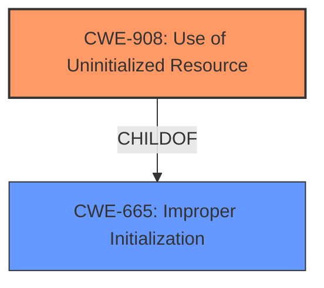

# Raw Analyzer Response for CVE-2025-37977

# Summary

| CWE ID | CWE Name | Confidence | CWE Abstraction Level | CWE Vulnerability Mapping Label | CWE-Vulnerability Mapping Notes |
|---|---|---|---|---|---|
| **CWE-908** | Use of Uninitialized Resource | 0.8 | Base | Allowed | Primary CWE |
| CWE-665 | Improper Initialization | 0.6 | Class | Discouraged | Secondary Candidate |

## Evidence and Confidence

*   **Confidence Score:** 0.7
*   **Evidence Strength:** MEDIUM

## Relationship Analysis
The primary relationship is between CWE-908 (Use of Uninitialized Resource) and its parent CWE-665 (Improper Initialization). CWE-908 is a more specific case of CWE-665, where the uninitialized resource is accessed. The selection of CWE-908 is preferred because it provides a more precise description of the vulnerability.

## Vulnerability Chain
The vulnerability chain involves the following:
1.  **Root Cause**: The **dma-coherent** property is not set, leading to descriptors being non-cacheable. This can be seen as an **improper initialization or lack of initialization** of shareability bits.
2.  **Weakness**: Because descriptors are non-cacheable, the iocc shareability bits are not disabled.
3.  **Impact**: The UFS ends up in an incompatible configuration, resulting in random cache-related stability issues.

## Summary of Analysis
The vulnerability involves a configuration issue in the Linux kernel related to the UFS (Universal Flash Storage) subsystem. Specifically, if the `dma-coherent` property is not set, descriptors become non-cacheable. In such cases, the IO Coherency Controller (IOCC) shareability bits should be disabled. The analysis focuses on identifying the most accurate CWE to represent the root cause of this issue.

Initial analysis considered several CWEs from the Retriever Results, including CWE-770, CWE-1190, and CWE-295. However, these did not accurately reflect the specific nature of the vulnerability which is related to an **uninitialized or improperly initialized** configuration setting that leads to cache-related stability issues.

The final decision to select CWE-908 and CWE-665 is based on the evidence that the core issue is the **lack of proper initialization** (or handling) of the IOCC shareability bits when the `dma-coherent` property is not set. The description explicitly states that the IOCC shareability bits "should be disabled" in this condition, implying that they are either not being initialized correctly or not being modified to the correct state.

The CWEs are chosen at the optimal level of specificity. CWE-908 is chosen as the primary because it is a base level CWE and shows that the resource was uninitialized and then used.

Relevant CWE Information:

# Enhanced Context (25 CWEs)
The following CWEs were identified as potentially relevant to this vulnerability:

## CWE-703: Improper Check or Handling of Exceptional Conditions
**Abstraction Level**: Pillar
**Similarity Score**: 0.76
**Source**: dense

**Description**:
The product does not properly anticipate or handle exceptional conditions that rarely occur during normal operation of the product.

**Mapping Guidance**:
- Usage: Discouraged
- Rationale: This CWE entry is extremely high-level, a Pillar.

*Rationale for not selecting*: This is a very high-level CWE and doesn't describe the root cause.

## CWE-696: Incorrect Behavior Order
**Abstraction Level**: Class
**Similarity Score**: 0.76
**Source**: dense

**Description**:
The product performs multiple related behaviors, but the behaviors are performed in the wrong order in ways which may produce resultant weaknesses.

**Mapping Guidance**:
- Usage: Allowed-with-Review
- Rationale: This CWE entry is a Class and might have Base-level children that would be more appropriate

*Rationale for not selecting*: This CWE does not fit the vulnerability description. There is no indication that the order of operations is the cause.

## CWE-667: Improper Locking
**Abstraction Level**: Class
**Similarity Score**: 0.76
**Source**: dense

**Description**:
The product does not properly acquire or release a lock on a resource, leading to unexpected resource state changes and behaviors.

**Mapping Guidance**:
- Usage: Allowed-with-Review
- Rationale: This CWE entry is a Class and might have Base-level children that would be more appropriate

*Rationale for not selecting*: Improper locking is not mentioned in the description.

## CWE-755: Improper Handling of Exceptional Conditions
**Abstraction Level**: Class
**Similarity Score**: 0.75
**Source**: dense

**Description**:
The product does not handle or incorrectly handles an exceptional condition.

**Mapping Guidance**:
- Usage: Discouraged
- Rationale: This CWE entry is a level-1 Class (i.e., a child of a Pillar). It might have lower-level children that would be more appropriate

*Rationale for not selecting*: This is a general class and doesn't pinpoint the root cause.

## CWE-754: Improper Check for Unusual or Exceptional Conditions
**Abstraction Level**: Class
**Similarity Score**: 0.75
**Source**: dense

**Description**:
The product does not check or incorrectly checks for unusual or exceptional conditions that are not expected to occur frequently during day to day operation of the product.

**Mapping Guidance**:
- Usage: Allowed-with-Review
- Rationale: This CWE entry is a Class and might have Base-level children that would be more appropriate

*Rationale for not selecting*: While related, the core issue is not primarily about a missing check, but rather the consequences of a specific configuration setting.

## CWE-908: Use of Uninitialized Resource
**Abstraction Level**: Base
**Similarity Score**: 0.75
**Source**: dense

**Description**:
The product uses or accesses a resource that has not been initialized.

**Mapping Guidance**:
- Usage: Allowed
- Rationale: This CWE entry is at the Base level of abstraction, which is a preferred level of abstraction for mapping to the root causes of vulnerabilities.

*Rationale for selecting*: This accurately describes the vulnerability. If `dma-coherent` is not set, the IOCC shareability bits should be disabled. The vulnerability occurs because these bits are not properly initialized or handled, and then used in an inconsistent state.

## CWE-404: Improper Resource Shutdown or Release
**Abstraction Level**: Class
**Similarity Score**: 0.75
**Source**: dense

**Description**:
The product does not release or incorrectly releases a resource before it is made available for re-use.

**Mapping Guidance**:
- Usage: Allowed-with-Review
- Rationale: This CWE entry is a Class and might have Base-level children that would be more appropriate

*Rationale for not selecting*: Resource release isn't the issue here.

## CWE-252: Unchecked Return Value
**Abstraction Level**: Base
**Similarity Score**: 0.75
**Source**: dense

**Description**:
The product does not check the return value from a method or function, which can prevent it from detecting unexpected states and conditions.

**Mapping Guidance**:
- Usage: Allowed
- Rationale: This CWE entry is at the Base level of abstraction, which is a preferred level of abstraction for mapping to the root causes of vulnerabilities.

*Rationale for not selecting*: There is no evidence of missing return value checks.

## CWE-665: Improper Initialization
**Abstraction Level**: Class
**Similarity Score**: 0.75
**Source**: dense

**Description**:
The product does not initialize or incorrectly initializes a resource, which might leave the resource in an unexpected state when it is accessed or used.

**Mapping Guidance**:
- Usage: Discouraged
- Rationale: This CWE entry is a level-1 Class (i.e., a child of a Pillar). It might have lower-level children that would be more appropriate

*Rationale for selecting as secondary*: The **root cause** is that if the `dma-coherent` property isn't set then the iocc shareability bits should be disabled. Since they are not the product does not initialize correctly. CWE-665 is parent to the CWE-908, which is a more specific case of an uninitialized resource being accessed.

## CWE-824: Access of Uninitialized Pointer
**Abstraction Level**: Base
**Similarity Score**: 0.75
**Source**: dense

**Description**:
The product accesses or uses a pointer that has not been initialized.

**Mapping Guidance**:
- Usage: Allowed
- Rationale: This CWE entry is at the Base level of abstraction, which is a preferred level of abstraction for mapping to the root causes of vulnerabilities.

*Rationale for not selecting*: