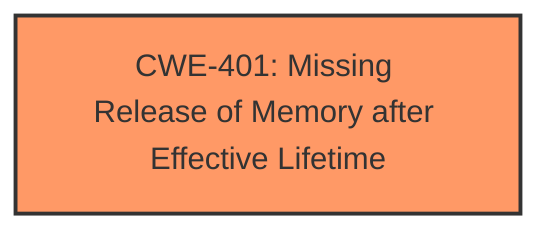

# Analysis for CVE-2025-37982

# Summary
| CWE ID | CWE Name | Confidence | CWE Abstraction Level | CWE Vulnerability Mapping Label | CWE-Vulnerability Mapping Notes |
|---|---|---|---|---|---|
| CWE-401 | Missing Release of Memory after Effective Lifetime | 0.9 | Variant | Allowed | Primary CWE. The skb dequeued from tx_queue is lost when wl1251_ps_elp_wakeup fails with a -ETIMEDOUT error. |

## Evidence and Confidence

*   **Confidence Score:** 0.9
*   **Evidence Strength:** HIGH

## Relationship Analysis
The primary relationship considered was the direct match of the vulnerability description to CWE-401. The other CWEs were less specific to the **memory leak** issue described. The abstraction level of CWE-401 as a Variant is appropriate because it directly identifies the specific type of resource management issue.

## Vulnerability Chain
The vulnerability chain is straightforward: **wl1251_ps_elp_wakeup fails with -ETIMEDOUT** leading to a **memory leak** because the skb dequeued from tx_queue is not properly handled, which is represented by CWE-401.

## Summary of Analysis
The primary decision is based on the explicit mention of a **memory leak** in the vulnerability description. The root cause is **wl1251_ps_elp_wakeup fails with -ETIMEDOUT**. This leads to the **impact:** memory leak because "The skb dequeued from tx_queue is lost when wl1251_ps_elp_wakeup fails with a -ETIMEDOUT error."

CWE-401 (Missing Release of Memory after Effective Lifetime) directly addresses this scenario, making it the most suitable choice. It is a Variant, representing a specific type of resource management error. The usage is Allowed.

Other CWEs Considered but Not Used:
*   CWE-362 (Concurrent Execution using Shared Resource with Improper Synchronization ('Race Condition')): While concurrency might be involved in the kernel, the primary issue isn't a race condition, but rather the failure to release memory.
*   CWE-833 (Deadlock): No evidence of a deadlock is present.
*   CWE-909 (Missing Initialization of Resource): The issue is not a missing initialization, but a missing release.
*   CWE-61 (UNIX Symbolic Link (Symlink) Following): Not relevant to the described vulnerability.
*   CWE-415 (Double Free): The problem is a missing free, not a double free.
*   CWE-667 (Improper Locking): No mention of locking issues.
*   CWE-125 (Out-of-bounds Read): No read out of bounds.
*   CWE-1285 (Improper Validation of Specified Index, Position, or Offset in Input): Not related to index or offset validation.
*   CWE-129 (Improper Validation of Array Index): Not relevant to the vulnerability.