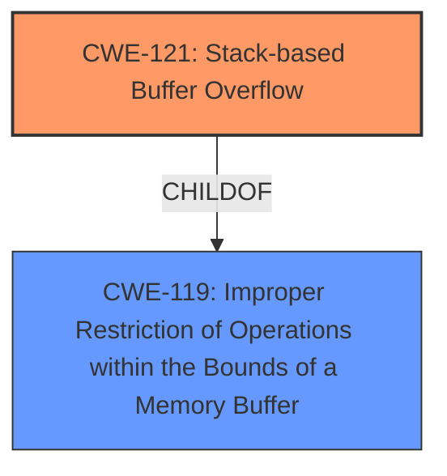

# Raw Analyzer Response for CVE-2025-3803

# Summary

| CWE ID  | CWE Name  | Confidence | CWE Abstraction Level | CWE Vulnerability Mapping Label | CWE-Vulnerability Mapping Notes |
|---|---|---|---|---|---|
| CWE-121 | Stack-based Buffer Overflow | 1.0  | Variant | Allowed | Primary CWE |
| CWE-119 | Improper Restriction of Operations within the Bounds of a Memory Buffer | 0.7 | Class  | Discouraged | Secondary Candidate |

## Evidence and Confidence

*   **Confidence Score:** 0.9
*   **Evidence Strength:** HIGH

## Relationship Analysis

The primary CWE is CWE-121, which is a variant of the class CWE-119. The vulnerability description clearly indicates a stack-based buffer overflow due to the lack of input validation on the `rebootDate` parameter, making CWE-121 the most specific and appropriate choice.

## Vulnerability Chain

The vulnerability chain starts with the **lack of input validation** on the `rebootDate` parameter, which leads to a **stack-based buffer overflow**. This overflow allows modification of the `$RA` register, potentially leading to Remote Code Execution (RCE).

## Summary of Analysis

The analysis is based on the provided vulnerability description and the CVE reference content, which both explicitly mention a **stack-based buffer overflow** due to the manipulation of the `rebootDate` argument. The root cause is the **lack of input validation** on this argument.

The vulnerability description states: "The manipulation of the argument rebootDate leads to **stack-based buffer overflow**." The CVE reference summary states "The `rebootDate` parameter in the `cgiSysScheduleRebootSet` function does not have length limitations, leading to a stack overflow."

CWE-121 is the most specific CWE that directly addresses this vulnerability. The retriever results also list CWE-121 as a potential candidate.

CWE-119, while related, is a more general class of vulnerability. CWE-121 is a variant of CWE-119, and thus a better and more specific fit.

Relevant CWE Information:

# Enhanced Context (25 CWEs)
The following CWEs were identified as potentially relevant to this vulnerability:

## CWE-121: Stack-based Buffer Overflow
**Abstraction Level**: Variant
**Similarity Score**: 0.76
**Source**: dense

**Description**:
A stack-based buffer overflow condition is a condition where the buffer being overwritten is allocated on the stack (i.e., is a local variable or, rarely, a parameter to a function).

**Mapping Guidance**:
- Usage: Allowed
- Rationale: This CWE entry is at the Variant level of abstraction, which is a preferred level of abstraction for mapping to the root causes of vulnerabilities.

## CWE-119: Improper Restriction of Operations within the Bounds of a Memory Buffer
**Abstraction Level**: Class
**Similarity Score**: 0.73
**Source**: dense

**Description**:
The product performs operations on a memory buffer, but it reads from or writes to a memory location outside the buffer's intended boundary. This may result in read or write operations on unexpected memory locations that could be linked to other variables, data structures, or internal program data.

**Mapping Guidance**:
- Usage: Discouraged
- Rationale: CWE-119 is commonly misused in low-information vulnerability reports when lower-level CWEs could be used instead, or when more details about the vulnerability are available.

## CWE-121: Stack-based Buffer Overflow
CWE-121 is chosen because the vulnerability description explicitly states a "stack-based buffer overflow". This is the most accurate and specific representation of the weakness.

CWE-119 is considered as a secondary candidate because it is a more general class that encompasses buffer overflows, but CWE-121 provides a more precise classification. The Mapping Guidance for CWE-119 says it is "Discouraged" when more details are available.

CWE-78, CWE-89, and CWE-79 are related to injection vulnerabilities, which is not the case here. The vulnerability is due to a buffer overflow, not improper neutralization of special elements.

CWE-190 and CWE-128 are related to integer overflows, but the vulnerability description does not indicate any integer overflow issues.

CWE-125, CWE-822, CWE-823, CWE-824, and CWE-825 are all about issues with pointers. The vulnerability description does not indicate any issues with pointers.