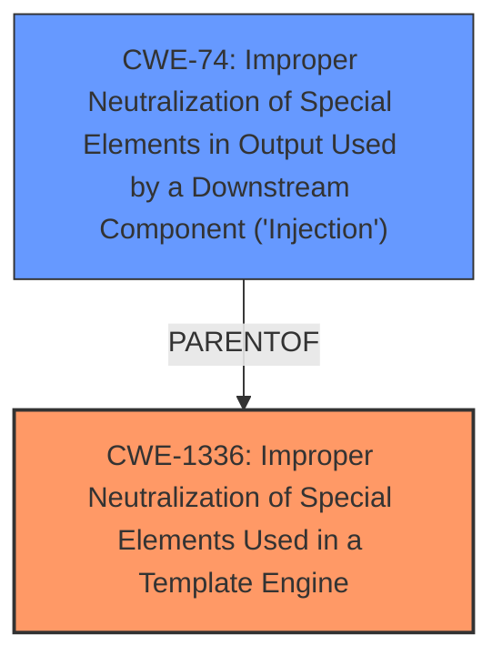

# Analysis for CVE-2025-3804

# Summary
| CWE ID  | CWE Name                                                                                               | Confidence | CWE Abstraction Level | CWE Vulnerability Mapping Label | CWE-Vulnerability Mapping Notes |
| :-------- | :------------------------------------------------------------------------------------------------------- | :--------- | :---------------------- | :------------------------------ | :-------------------------------- |
| CWE-1336  | Improper Neutralization of Special Elements Used in a Template Engine                                  | 1          | Base                    | Primary                         | Allowed                           |
| CWE-74  | Improper Neutralization of Special Elements in Output Used by a Downstream Component ('Injection')                                  | 0.6          | Class                    | Secondary                         | Discouraged - high-level and often misused when lower-level weaknesses are more appropriate |

## Evidence and Confidence

*   **Confidence Score:** 0.8
*   **Evidence Strength:** HIGH

## Relationship Analysis
The primary relationship influencing the decision is the hierarchical structure, specifically the parent-child relationship. CWE-1336 is a more specific type of injection related to template engines, making it a better fit than the more general CWE-74. CWE-74 is a Class-level CWE and the guidance discourages its use. The other relationships, like CanPrecede and CanFollow, didn't directly influence the initial CWE selection.

## Vulnerability Chain
The vulnerability chain starts with the **improper neutralization** of special elements within a template engine (CWE-1336). This leads to the ability to inject code or commands into the template, which could further lead to command execution. The chain is:
1.  **CWE-1336**: Improper Neutralization of Special Elements Used in a Template Engine (Root Cause)
2.  **CWE-74**: Improper Neutralization of Special Elements in Output Used by a Downstream Component ('Injection') (Potential Impact - broad injection)

## Summary of Analysis
The initial assessment identified **injection** as the primary **weakness**, which was further refined by the CVE Reference Links Content Summary to Server-Side Template Injection. The Retriever Results highlighted CWE-1336 as a strong candidate with high similarity scores. The Complete CWE Specifications confirmed that CWE-1336 accurately represents the vulnerability, as it directly addresses the **improper neutralization** of special elements used in template engines. I am overriding the general mapping guidance to select CWE-74 as a secondary factor.

Relevant CWE Information:

# Enhanced Context (25 CWEs)
The following CWEs were identified as potentially relevant to this vulnerability:

## CWE-1336: Improper Neutralization of Special Elements Used in a Template Engine
**Abstraction Level**: Base
**Similarity Score**: 0.77
**Source**: dense

**Description**:
The product uses a template engine to insert or process externally-influenced input, but it does not neutralize or incorrectly neutralizes special elements or syntax that can be interpreted as template expressions or other code directives when processed by the engine.

**Mapping Guidance**:
- Usage: Allowed
- Rationale: This CWE entry is at the Base level of abstraction, which is a preferred level of abstraction for mapping to the root causes of vulnerabilities.

## CWE-1336: Improper Neutralization of Special Elements Used in a Template Engine
**Abstraction Level**: Base
**Similarity Score**: 1312.04
**Source**: sparse

**Description**:
The product uses a template engine to insert or process externally-influenced input, but it does not neutralize or incorrectly neutralizes special elements or syntax that can be interpreted as template expressions or other code directives when processed by the engine.

**Mapping Guidance**:
- Usage: Allowed
- Rationale: This CWE entry is at the Base level of abstraction, which is a preferred level of abstraction for mapping to the root causes of vulnerabilities.

### CWE Selection

*   **CWE-1336: Improper Neutralization of Special Elements Used in a Template Engine**
    *   **Explanation:** The vulnerability description clearly states that the manipulation leads to **injection** within the Jinja2 template handler. The CVE Reference Links Content Summary confirms this as a Server-Side Template Injection (SSTI) due to the **lack of proper input validation or sanitization** when rendering `.in` files with Jinja2. This directly aligns with CWE-1336, which addresses the **improper neutralization** of special elements used in a template engine.
    *   **Security Implications:** An attacker can inject malicious Jinja2 expressions into `.in` files, leading to data leakage (reading sensitive files), remote code execution, and system disruption.
    *   **Relationship:** This is the primary root cause.
    *   **Mapping Guidance:** The usage is ALLOWED and the abstraction level is Base.
    *   **Confidence:** 1

*   **CWE-74: Improper Neutralization of Special Elements in Output Used by a Downstream Component ('Injection')**
    *   **Explanation:** CWE-74 is a more general **injection** vulnerability. While SSTI falls under the broader category of injection, CWE-1336 is a more precise classification. However, CWE-74 is considered as a secondary candidate because it represents the general class of the **injection** vulnerability.
    *   **Security Implications:** It represents that the **injection** could lead to modification of how the downstream component parses the input.
    *   **Relationship:** This is a parent of CWE-1336.
    *   **Mapping Guidance:** The usage is DISCOURAGED. But it is added as the broad impact.
    *   **Confidence:** 0.6

### CWEs Considered But Not Used:

*   **CWE-79: Improper Neutralization of Input During Web Page Generation ('Cross-site Scripting')**: While also an **injection** vulnerability, it is specific to web page generation, which is not the case here. SSTI is on the server side.
*   **CWE-89: Improper Neutralization of Special Elements used in an SQL Command ('SQL Injection')**: Specific to SQL commands, which is not relevant here.
*   **CWE-78: Improper Neutralization of Special Elements used in an OS Command ('OS Command Injection')**: Specific to OS commands, not relevant.
*   **CWE-94: Improper Control of Generation of Code ('Code Injection')**: While RCE is a potential impact of SSTI, CWE-1336 better represents the root cause (improper template handling).
*   **CWE-95: Improper Neutralization of Directives in Dynamically Evaluated Code ('Eval Injection')**: Similar to CWE-94, it focuses on dynamic evaluation of code, which is a potential impact but not the core weakness.
*   **CWE-184: Incomplete List of Disallowed Inputs**: This could be a contributing factor, but the primary issue is the **improper handling** of template elements, not necessarily an incomplete list of disallowed inputs.
*   **CWE-470: Use of Externally-Controlled Input to Select Classes or Code ('Unsafe Reflection')**: Not directly applicable, as the issue is with template engine handling, not class/code selection.
*   **CWE-502: Deserialization of Untrusted Data**: Not relevant, as the issue is not related to deserialization.
*   **CWE-1427: Improper Neutralization of Input Used for LLM Prompting**: Not relevant, this is LLM specific.
*   **CWE-1236: Improper Neutralization of Formula Elements in a CSV File**: Not relevant, CSV specific.
*   **CWE-138: Improper Neutralization of Special Elements**: Too broad and a Class, not as specific as CWE-1336.
*   **CWE-183: Permissive List of Allowed Inputs**: Close to CWE-184, but the primary issue is template handling, not a permissive list.
*   **CWE-494: Download of Code Without Integrity Check**: Not relevant, no code download is involved.