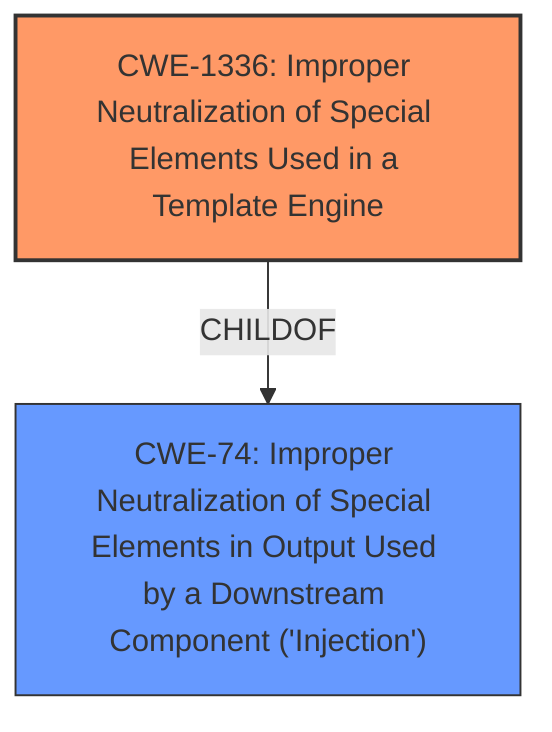

# Analysis Report for CVE-2025-3805

# Vulnerability Analysis Report: CVE-2025-3805

## Description

A vulnerability classified as critical was found in sarrionandia tournatrack up to 4c13a23f43da5317eea4614870a7a8510fc540ec. Affected by this vulnerability is an unknown functionality of the file check_id.py of the component Jinja2 Template Handler. The manipulation of the argument ID leads to **injection**. It is possible to launch the attack on the local host. The exploit has been disclosed to the public and may be used. This product does not use versioning. This is why information about affected and unaffected releases are unavailable.

## Vulnerability Description Key Phrases

- **Weakness:** injection
- **Vector:** manipulation of ID argument
- **Product:** sarrionandia tournatrack
- **Version:** up to 4c13a23f43da5317eea4614870a7a8510fc540ec
- **Component:** Jinja2 Template Handler in check_id.py

## Analysis (with Relationship Data)

# Summary
| CWE ID | CWE Name | Confidence | CWE Abstraction Level | CWE Vulnerability Mapping Label | CWE-Vulnerability Mapping Notes |
|---|---|---|---|---|---|
| CWE-1336 | Improper Neutralization of Special Elements Used in a Template Engine | 1.0 | Base | Primary | Allowed |
| CWE-74 | Improper Neutralization of Special Elements in Output Used by a Downstream Component ('Injection') | 0.6 | Class | Secondary | Discouraged |

## Evidence and Confidence

*   **Confidence Score:** 0.9
*   **Evidence Strength:** HIGH

## Relationship Analysis
The primary CWE is CWE-1336, which is a Base level CWE, indicating that it is a specific root cause. CWE-74 is a Class level CWE and a parent of CWE-1336, but is discouraged because it is too general. The vulnerability involves the manipulation of the ID argument leading to injection via the Jinja2 Template Handler. Therefore, CWE-1336 is the best fit as it specifically addresses template engine injection.



## Vulnerability Chain
The vulnerability chain starts with the **improper neutralization** of special elements in the `ID` argument, which is then used in the Jinja2 template. This leads to code injection, specifically Server-Side Template Injection (SSTI).

## Summary of Analysis
The initial assessment pointed to several injection-related CWEs, but after carefully reviewing the vulnerability description and the CVE Reference Links Content Summary, CWE-1336 emerged as the most appropriate. The vulnerability description explicitly mentions the Jinja2 Template Handler and the manipulation of the ID argument leading to injection. The CVE Reference Links Content Summary confirms that the root cause is the lack of proper input validation and sanitization of the `id` parameter. This parameter is directly used in the Jinja2 template rendering process without being checked for malicious template expressions.

The Retriever Results also list CWE-1336 as a potential match, further supporting the selection. Other CWEs like CWE-79 (Cross-site Scripting) and CWE-89 (SQL Injection) were considered but deemed less relevant as the vulnerability specifically involves template injection rather than web page generation or SQL command construction.

Relevant CWE Information:

# Enhanced Context (25 CWEs)
The following CWEs were identified as potentially relevant to this vulnerability:

## CWE-1336: Improper Neutralization of Special Elements Used in a Template Engine
**Abstraction Level**: Base
**Similarity Score**: 0.79
**Source**: dense

**Description**:
The product uses a template engine to insert or process externally-influenced input, but it does not neutralize or incorrectly neutralizes special elements or syntax that can be interpreted as template expressions or other code directives when processed by the engine.

**Mapping Guidance**:
- Usage: Allowed
- Rationale: This CWE entry is at the Base level of abstraction, which is a preferred level of abstraction for mapping to the root causes of vulnerabilities.

## CWE-74: Improper Neutralization of Special Elements in Output Used by a Downstream Component ('Injection')
**Abstraction Level**: Class
**Similarity Score**: 0.74
**Source**: dense

**Description**:
The product constructs all or part of a command, data structure, or record using externally-influenced input from an upstream component, but it does not neutralize or incorrectly neutralizes special elements that could modify how it is parsed or interpreted when it is sent to a downstream component.

**Mapping Guidance**:
- Usage: Discouraged
- Rationale: CWE-74 is high-level and often misused when lower-level weaknesses are more appropriate.

CWE-1336 is the most specific and accurate representation of the vulnerability, aligning with the root cause and technical details provided.

**CWE-1336: Improper Neutralization of Special Elements Used in a Template Engine**
The product uses a template engine to insert or process externally-influenced input, but it does not neutralize or incorrectly neutralizes special elements or syntax that can be interpreted as template expressions or other code directives when processed by the engine. This directly aligns with the description of the vulnerability, where the `ID` argument is not properly neutralized, leading to template injection. The security implication is that an attacker can inject malicious code into the template, potentially leading to remote code execution or information disclosure. This is the primary weakness. Confidence: 1.0

**CWE-74: Improper Neutralization of Special Elements in Output Used by a Downstream Component ('Injection')**
The product constructs all or part of a command, data structure, or record using externally-influenced input from an upstream component, but it does not neutralize or incorrectly neutralizes special elements that could modify how it is parsed or interpreted when it is sent to a downstream component. While this CWE broadly covers injection vulnerabilities, it is less specific than CWE-1336, which directly addresses template engine injection. CWE-74 is a parent of CWE-1336. Given the availability of a more specific CWE, CWE-74 is less preferred. Usage: Discouraged. Confidence: 0.6


## CWE Relationship Analysis

Current CWEs represent these abstraction levels: .


### Vulnerability Chain Analysis

**Chain starting from CWE-89:**
- 89 (Improper Neutralization of Special Elements used in an SQL Command ('SQL Injection')) - ROOT


**Chain starting from CWE-79:**
- 79 (Improper Neutralization of Input During Web Page Generation ('Cross-site Scripting')) - ROOT


### CWE Relationship Diagram

```mermaid
graph TD
    classDef primary fill:#f96,stroke:#333,stroke-width:2px
    classDef secondary fill:#69f,stroke:#333
    classDef tertiary fill:#9e9,stroke:#333
```


*Report generated on 2025-07-14 22:10:24*
