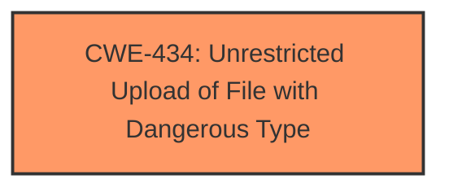

# Raw Analyzer Response for CVE-2025-3807

# Summary
| CWE ID | CWE Name | Confidence | CWE Abstraction Level | CWE Vulnerability Mapping Label | CWE-Vulnerability Mapping Notes |
|---|---|---|---|---|---|
| CWE-434 | Unrestricted Upload of File with Dangerous Type | 1.0 | Base | Allowed | Primary CWE |

## Evidence and Confidence

*   **Confidence Score:** 1.0
*   **Evidence Strength:** HIGH

## Relationship Analysis
The primary relationship that influenced the decision was the direct match of the **unrestricted upload** vulnerability description to CWE-434. While other CWEs like Path Traversal (CWE-22) and Cross-Site Scripting (CWE-79) could potentially be related depending on the application's handling of the uploaded file, the initial **root cause** is the **unrestricted upload** itself. Thus, focusing on the most direct and fundamental weakness led to selecting CWE-434.

## Vulnerability Chain
The vulnerability chain starts with the **unrestricted upload** (CWE-434). Depending on how the application processes the uploaded file, this could lead to further vulnerabilities such as code execution, path traversal, or cross-site scripting. However, based on the provided information, the chain ends with the **unrestricted upload**.

## Summary of Analysis
The analysis is based on the vulnerability description, specifically the phrase "**unrestricted upload**". The description directly states that the vulnerability involves the **unrestricted upload**, mapping directly to CWE-434.

The retriever results list CWE-434 as a highly relevant candidate. The description of CWE-434, "The product allows the upload or transfer of dangerous file types that are automatically processed within its environment," aligns perfectly with the vulnerability description.

The other CWEs were considered but not selected because they represent potential consequences of the **unrestricted upload** rather than the **root cause** itself. For example, while a path traversal vulnerability could arise from mishandling the uploaded file's name, the initial flaw is the **unrestricted upload**. Similarly, cross-site scripting could occur if the file's content is not properly sanitized, but the **root cause** remains the **unrestricted upload**.

CWE-434 is at the Base level of abstraction, which is appropriate for identifying the specific weakness.

Relevant CWE Information:

# Enhanced Context (25 CWEs)
The following CWEs were identified as potentially relevant to this vulnerability:

## CWE-434: Unrestricted Upload of File with Dangerous Type
**Abstraction Level**: Base
**Similarity Score**: 0.78
**Source**: dense

**Description**:
The product allows the upload or transfer of dangerous file types that are automatically processed within its environment.

**Mapping Guidance**:
- Usage: Allowed
- Rationale: This CWE entry is at the Base level of abstraction, which is a preferred level of abstraction for mapping to the root causes of vulnerabilities.