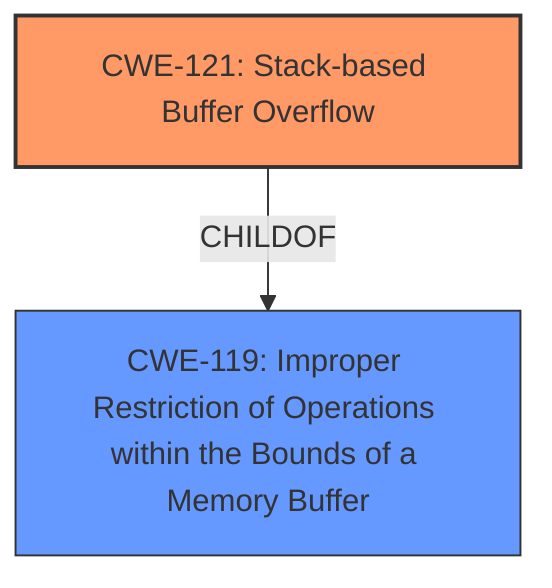

# Analysis Report for CVE-2025-3820

# Vulnerability Analysis Report: CVE-2025-3820

## Description

A vulnerability was found in Tenda W12 and i24 3.0.0.4(2887)/3.0.0.5(3644) and classified as critical. Affected by this issue is the function cgiSysUplinkCheckSet of the file /bin/httpd. The manipulation of the argument hostIp1/hostIp2 leads to **stack-based buffer overflow**. The attack may be launched remotely. The exploit has been disclosed to the public and may be used.

## Vulnerability Description Key Phrases

- **Weakness:** stack-based buffer overflow
- **Product:** Tenda W12 and i24
- **Version:** 3.0.0.4(2887)/3.0.0.5(3644)
- **Component:** /bin/httpd

## Analysis (with Relationship Data)

# Summary
| CWE ID | CWE Name | Confidence | CWE Abstraction Level | CWE Vulnerability Mapping Label | CWE-Vulnerability Mapping Notes |
|---|---|---|---|---|---|
| CWE-121 | Stack-based Buffer Overflow | 1.0 | Variant | Allowed | Primary CWE: The vulnerability is explicitly described as a "stack-based buffer overflow." |
| CWE-119 | Improper Restriction of Operations within the Bounds of a Memory Buffer | 0.7 | Class | Discouraged | Secondary Candidate: CWE-119 is a more general category that encompasses buffer overflows, but CWE-121 is more specific. |

## Evidence and Confidence

*   **Confidence Score:** 1.0
*   **Evidence Strength:** HIGH

## Relationship Analysis
The primary relationship influencing the selection is the ChildOf relationship between CWE-121 (Stack-based Buffer Overflow) and CWE-119 (Improper Restriction of Operations within the Bounds of a Memory Buffer). CWE-121 is a variant of CWE-119, making it a more specific and appropriate choice given the explicit mention of "stack-based" in the vulnerability description.



## Vulnerability Chain
The vulnerability chain starts with the **improper handling of input**, specifically the `hostIp1` and `hostIp2` arguments. This **lack of input validation** leads to a **stack-based buffer overflow** (CWE-121) when the size of the input exceeds the buffer's capacity. The overflow can then lead to **remote code execution** (RCE).

## Summary of Analysis
The analysis is based on the explicit description of the vulnerability as a "stack-based buffer overflow" and supporting information from the CVE Reference Links Content Summary that details the **lack of length limitation** on `hostIp1` and `hostIp2` parameters, leading to this condition.

The selection of CWE-121 is at the optimal level of specificity because the vulnerability description directly states "stack-based buffer overflow." The retriever results also strongly support this, with CWE-121 being among the top matches.

Relevant CWE Information:

# Enhanced Context (25 CWEs)
The following CWEs were identified as potentially relevant to this vulnerability:

## CWE-121: Stack-based Buffer Overflow
**Abstraction Level**: Variant
**Similarity Score**: 0.77
**Source**: dense

**Description**:
A stack-based buffer overflow condition is a condition where the buffer being overwritten is allocated on the stack (i.e., is a local variable or, rarely, a parameter to a function).

**Mapping Guidance**:
- Usage: Allowed
- Rationale: This CWE entry is at the Variant level of abstraction, which is a preferred level of abstraction for mapping to the root causes of vulnerabilities.

**CWE-119:** Was considered, but CWE-121 is a better fit due to its specificity.

**CWE-190:** Was considered due to the possibility of integer overflows when calculating buffer sizes, but there is no direct evidence of this in the vulnerability description.

**CWE-125:** Was considered due to out-of-bounds memory access, but the vulnerability is a buffer overflow (write), not a read.

**CWE-131:** Was considered, but the primary issue is the **lack of validation** of the input length, not an incorrect calculation of the buffer size itself.

The primary CWE is CWE-121 (Stack-based Buffer Overflow) with high confidence (1.0) due to the direct match with the vulnerability description.


## CWE Relationship Analysis

Current CWEs represent these abstraction levels: .


### Vulnerability Chain Analysis

**Chain starting from CWE-121:**
- 121 (Stack-based Buffer Overflow) - ROOT


**Chain starting from CWE-125:**
- 125 (Out-of-bounds Read) - ROOT


### CWE Relationship Diagram

```mermaid
graph TD
    classDef primary fill:#f96,stroke:#333,stroke-width:2px
    classDef secondary fill:#69f,stroke:#333
    classDef tertiary fill:#9e9,stroke:#333
```


*Report generated on 2025-07-14 22:12:49*
