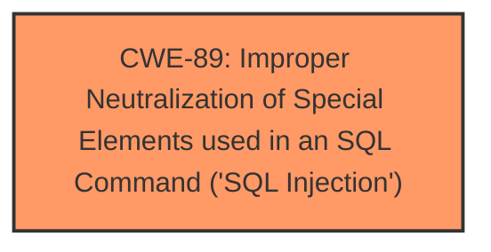

# Analysis Report for CVE-2025-3829

# Vulnerability Analysis Report: CVE-2025-3829

## Description

A vulnerability was found in PHPGurukul Men Salon Management System 1.0. It has been classified as critical. Affected is an unknown function of the file /admin/sales-reports-detail.php. The manipulation of the argument fromdate/todate leads to **sql injection**. It is possible to launch the attack remotely. The exploit has been disclosed to the public and may be used.

## Vulnerability Description Key Phrases

- **Weakness:** sql injection
- **Product:** PHPGurukul Men Salon Management System
- **Version:** 1.0
- **Component:** /admin/sales-reports-detail.php

## Analysis (with Relationship Data)

# Summary
| CWE ID | CWE Name | Confidence | CWE Abstraction Level | CWE Vulnerability Mapping Label | CWE-Vulnerability Mapping Notes |
|---|---|---|---|---|---|
| CWE-89 | Improper Neutralization of Special Elements used in an SQL Command ('SQL Injection') | 1.0 | Base | Allowed | Primary CWE. The vulnerability description clearly states that the manipulation of the argument fromdate/todate leads to **sql injection**. The CVE reference link summary also confirms this.|

## Evidence and Confidence

*   **Confidence Score:** 1.0
*   **Evidence Strength:** HIGH

## Relationship Analysis
The primary identified weakness is CWE-89. No other CWEs appear to be directly related in a parent-child or chain relationship based on the provided information. The abstraction level is Base, which is the preferred level.



## Vulnerability Chain
The vulnerability chain is straightforward:

1.  **Root Cause:** CWE-89 - Improper Neutralization of Special Elements used in an SQL Command ('SQL Injection') due to insufficient input validation of the `fromdate` and `todate` parameters.
2.  **Impact:** Unauthorized database access, sensitive data leakage, data tampering, comprehensive system control, and potential service interruption.

## Summary of Analysis
The vulnerability is a clear case of SQL injection. The vulnerability description explicitly mentions "sql injection," and the CVE reference link summary confirms that the root cause is insufficient user input validation leading to SQL injection. The suggested mitigations (prepared statements, input validation, minimizing database user permissions) also strongly support this classification.

The selection of CWE-89 is based on direct evidence from the vulnerability description and the CVE reference link summary. The retriever results also strongly suggest CWE-89 as the primary candidate. The abstraction level (Base) is appropriate.

Other CWEs Considered:

*   CWE-79 (Improper Neutralization of Input During Web Page Generation ('Cross-site Scripting')): While input is involved, the specific vulnerability is SQL injection, not XSS.
*   CWE-434 (Unrestricted Upload of File with Dangerous Type): This is not related to file uploads.
*   CWE-1336 (Improper Neutralization of Special Elements Used in a Template Engine): Not related to template engines.
*   CWE-73 (External Control of File Name or Path): The vulnerability is not related to path manipulation.


## CWE Relationship Analysis

Current CWEs represent these abstraction levels: .


### Vulnerability Chain Analysis

**Chain starting from CWE-89:**
- 89 (Improper Neutralization of Special Elements used in an SQL Command ('SQL Injection')) - ROOT


**Chain starting from CWE-73:**
- 73 (External Control of File Name or Path) - ROOT


### CWE Relationship Diagram

```mermaid
graph TD
    classDef primary fill:#f96,stroke:#333,stroke-width:2px
    classDef secondary fill:#69f,stroke:#333
    classDef tertiary fill:#9e9,stroke:#333
```


*Report generated on 2025-07-14 22:13:44*
