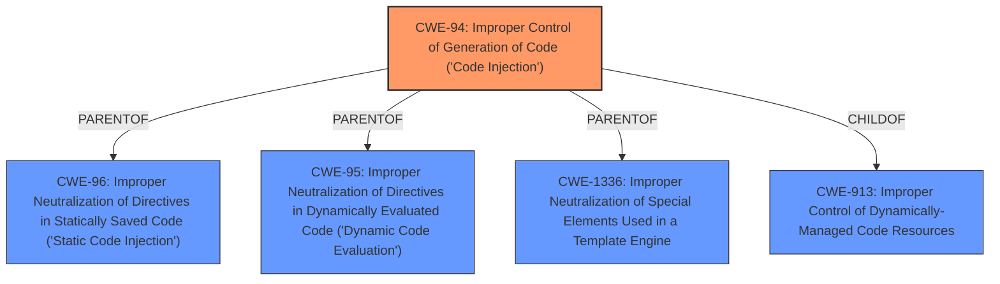

# Raw Analyzer Response for CVE-2025-3842

# Summary
| CWE ID | CWE Name | Confidence | CWE Abstraction Level | CWE Vulnerability Mapping Label | CWE-Vulnerability Mapping Notes |
|---|---|---|---|---|---|
| CWE-94 | Improper Control of Generation of Code ('Code Injection') | 0.8 | Base | Primary CWE | Allowed-with-Review |

## Evidence and Confidence

*   **Confidence Score:** 0.8
*   **Evidence Strength:** MEDIUM

## Relationship Analysis
The primary CWE is CWE-94, which is a base-level CWE. This CWE is related to other CWEs through parent-child and chain relationships. For example, CWE-94 has parents like CWE-913 (Improper Control of Dynamically-Managed Code Resources) and children like CWE-96 (Improper Neutralization of Directives in Statically Saved Code). The choice of CWE-94 is influenced by its direct relevance to **code injection**, as described in the vulnerability, and its base-level abstraction, which is preferred for root cause analysis.

## Vulnerability Chain
The vulnerability chain starts with the **improper control of code generation**, which leads to **code injection**. This is represented by CWE-94.
  - Root Cause: CWE-94 (Improper Control of Generation of Code)
  - Impact: Code Injection, potentially leading to arbitrary code execution

## Summary of Analysis
The vulnerability description clearly states that the manipulation of the argument fileUpload leads to **code injection**. The most relevant CWE is CWE-94, "Improper Control of Generation of Code ('Code Injection')." This CWE directly addresses the root cause of the vulnerability, which is the **improper control of code generation** that allows for injection of malicious code.

The retriever results show several CWEs related to injection and improper neutralization, but CWE-94 is the most specific and directly related to the vulnerability description.

The evidence from the vulnerability description supports this classification: "The manipulation of the argument fileUpload leads to **code injection**." This directly indicates that the application does not properly control the generation of code, leading to the injection vulnerability.

Other CWEs considered but not used:

*   CWE-78: Improper Neutralization of Special Elements used in an OS Command ('OS Command Injection') - While related to injection, this is specific to OS commands, which is not explicitly mentioned in the vulnerability description.
*   CWE-79: Improper Neutralization of Input During Web Page Generation ('Cross-site Scripting') - This is specific to web page generation and XSS, which is not the case here.
*   CWE-89: Improper Neutralization of Special Elements used in an SQL Command ('SQL Injection') - This is specific to SQL commands, which is not mentioned in the vulnerability description.
*   CWE-434: Unrestricted Upload of File with Dangerous Type - While the vulnerability involves file upload, the core issue is the **code injection** resulting from the **improper handling of the uploaded file**, not the unrestricted upload itself.
*   CWE-1336: Improper Neutralization of Special Elements Used in a Template Engine - This is specific to template engines, which are not explicitly mentioned in the vulnerability description.