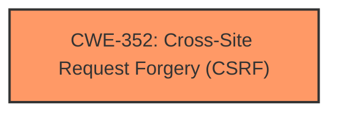

# Analysis for CVE-2025-3869

# Summary

| CWE ID | CWE Name | Confidence | CWE Abstraction Level | CWE Vulnerability Mapping Label | CWE-Vulnerability Mapping Notes |
|---|---|---|---|---|---|
| CWE-352 | Cross-Site Request Forgery (CSRF) | 1.0 | Compound | Allowed | Primary CWE |

## Evidence and Confidence

*   **Confidence Score:** 1.0
*   **Evidence Strength:** HIGH

## Relationship Analysis
The primary relationship that influenced the decision was the direct match of the vulnerability description to the definition and characteristics of CWE-352. While other CWEs were considered, none provided as direct and comprehensive a fit as CWE-352.

## Vulnerability Chain
The vulnerability chain consists of:
1.  **Root Cause:** **Missing or incorrect nonce validation**.
2.  **Weakness:** Cross-Site Request Forgery (CWE-352)
3.  **Impact:** Update settings and inject malicious web scripts.

## Summary of Analysis
The vulnerability description clearly states the presence of a **missing or incorrect nonce validation**, which directly leads to the possibility of Cross-Site Request Forgery (CSRF). The description explicitly labels "**cross-site request forgery**" as the weakness. The impact of the vulnerability is the ability to update settings and inject malicious web scripts.

The evidence supporting this assessment is derived directly from the "Vulnerability Description Key Phrases":
*   **rootcause:** **missing or incorrect nonce validation**
*   **weakness:** **cross-site request forgery**

The Retriever Results also list CWE-352 as the second highest ranked CWE with a score of 0.621. Given the explicit language used to describe the vulnerability in the description, this confirms that CWE-352 is the most appropriate mapping.

CWE-79, CWE-89, and CWE-116 were considered but rejected because they are related to injection and improper neutralization, which is a consequence of the CSRF, not the root cause. The **missing or incorrect nonce validation** is the root cause that allows the forged request to succeed, leading to the injection or settings update.

Relevant CWE Information:

# Enhanced Context (25 CWEs)
The following CWEs were identified as potentially relevant to this vulnerability:

## CWE-352: Cross-Site Request Forgery (CSRF)
**Abstraction Level**: Compound
**Similarity Score**: 0.76
**Source**: dense

**Description**:
The web application does not, or can not, sufficiently verify whether a well-formed, valid, consistent request was intentionally provided by the user who submitted the request.

**Mapping Guidance**:
- Usage: Allowed
- Rationale: This is a well-known Composite of multiple weaknesses that must all occur simultaneously, although it is attack-oriented in nature.