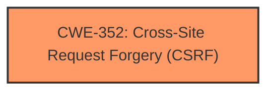

# Analysis for CVE-2025-3870

# Summary

| CWE ID  | CWE Name                                                                        | Confidence | CWE Abstraction Level | CWE Vulnerability Mapping Label | CWE-Vulnerability Mapping Notes |
| :-------- | :------------------------------------------------------------------------------ | :---------- | :--------------------- | :------------------------------ | :------------------------------ |
| CWE-352 | Cross-Site Request Forgery (CSRF)                                             | 1          | Compound               | Primary                         | Allowed                         |

## Evidence and Confidence

*   **Confidence Score:** 1
*   **Evidence Strength:** HIGH

## Relationship Analysis

The primary relationship that influenced the decision was the direct match of the vulnerability description to the characteristics of CWE-352. The description clearly states the presence of a Cross-Site Request Forgery vulnerability due to **missing or incorrect nonce validation**, which aligns directly with the definition of CWE-352.

## Vulnerability Chain

The vulnerability chain starts with the **missing or incorrect nonce validation**, which allows an unauthenticated attacker to craft a forged request. If a site administrator is tricked into performing an action (e.g., clicking a link), the attacker can then update settings and inject malicious web scripts.

Root Cause: **Missing or incorrect nonce validation** -> Impact: Forged request leads to settings update and script injection.

## Summary of Analysis

The analysis strongly supports the classification of this vulnerability as CWE-352 (Cross-Site Request Forgery). The vulnerability description explicitly mentions the **missing or incorrect nonce validation**, which is the hallmark of CSRF attacks. The attacker's ability to update settings and inject malicious scripts further confirms the impact of a successful CSRF attack.

The evidence from the vulnerability description is direct and clear: "This is due to **missing or incorrect nonce validation** on the 1-decembrie-1918/1-decembrie-1918.php page. This makes it possible for unauthenticated attackers to update settings and inject malicious web scripts via a forged request granted they can trick a site administrator into performing an action such as clicking on a link."

The retriever results also listed CWE-352 as a strong candidate.

The selected CWE is at the Compound level of abstraction, which accurately represents the combination of weaknesses required for a CSRF vulnerability to occur.

Relevant CWE Information:

# Enhanced Context (25 CWEs)
The following CWEs were identified as potentially relevant to this vulnerability:

## CWE-352: Cross-Site Request Forgery (CSRF)
**Abstraction Level**: Compound
**Similarity Score**: 0.80
**Source**: dense

**Description**:
The web application does not, or can not, sufficiently verify whether a well-formed, valid, consistent request was intentionally provided by the user who submitted the request.

**Mapping Guidance**:
- Usage: Allowed
- Rationale: This is a well-known Composite of multiple weaknesses that must all occur simultaneously, although it is attack-oriented in nature.