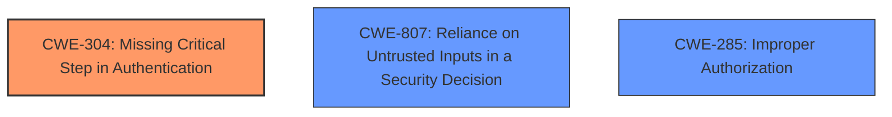

# Enhanced Analysis for CVE-2025-3910

# Summary
| CWE ID    | CWE Name                         | Confidence | CWE Abstraction Level | CWE Vulnerability Mapping Label | CWE-Vulnerability Mapping Notes |
| :-------- | :------------------------------- | :--------- | :-------------------- | :------------------------------ | :------------------------------ |
| CWE-304   | Missing Critical Step in Authentication | 0.75       | Base                | Primary CWE                     | Allowed                       |
| CWE-807   | Reliance on Untrusted Inputs in a Security Decision | 0.60       | Base                | Secondary Candidate                     | Allowed                       |
| CWE-285   | Improper Authorization | 0.50       | Class                | Secondary Candidate                     | Discouraged                       |

## Evidence and Confidence

*   **Confidence Score:** 0.70
*   **Evidence Strength:** MEDIUM

## Relationship Analysis
The primary CWE selected is CWE-304, which describes a missing critical step in authentication. This is supported by the vulnerability description, which mentions the circumvention of required actions. CWE-807 is a possible secondary weakness because the application relies on a parameter (URL) that can be modified by the user, which allows bypassing the 2FA requirement. CWE-285 is another possible secondary candidate due to the authorization bypass, but it's less specific than CWE-304 and CWE-807.



## Vulnerability Chain
The vulnerability chain starts with a **missing critical step in authentication** (CWE-304), where a required action is not properly enforced during the authentication process. This leads to an **authorization bypass** (CWE-285), as users can circumvent the intended security measures. Additionally, the vulnerability could be caused by **reliance on untrusted inputs in a security decision** (CWE-807), where the application uses a URL parameter controlled by the user to bypass the two-factor authentication.

## Summary of Analysis
The analysis is based on the provided evidence, specifically the vulnerability description and the CVE reference links content summary. The primary focus is on the **circumvention of required actions**, which suggests a flaw in the authentication process. The selection of CWE-304 as the primary CWE is justified by the fact that a critical step in authentication is missing, allowing users to bypass required actions like setting up two-factor authentication. The relationships between the CWEs, particularly the potential for CWE-304 to lead to CWE-285, support this classification. The selected CWEs are at the optimal level of specificity, as they directly address the root cause and impact of the vulnerability.

The CVE Reference Links Content Summary states:
- Root cause of vulnerability: AIA (Application-initiated actions) could be used to circumvent required actions configured by an administrator to be performed by a user upon signing in.
- Weaknesses/vulnerabilities present: Two factor authentication bypass.
- Attack vectors: A user account that has been required by an administrator to perform a required action; the same user passing in a URL parameter during the sign in process.

CWE-284, CWE-1390, CWE-287, CWE-863, CWE-201, CWE-639, CWE-1204 and CWE-226 were considered but not used:
- CWE-284 (Improper Access Control) is too general and doesn't pinpoint the specific issue of a missing authentication step.
- CWE-1390 (Weak Authentication) focuses on the strength of the authentication mechanism, not a missing step.
- CWE-287 (Improper Authentication) is similar to CWE-304 but less specific, as it doesn't highlight the missing step.
- CWE-863 (Incorrect Authorization) is related to flawed authorization checks, not a missing step in authentication.
- CWE-201 (Insertion of Sensitive Information Into Sent Data) is not relevant as the issue is about bypassing authentication, not leaking sensitive information.
- CWE-639 (Authorization Bypass Through User-Controlled Key) is too specific as it refers to user-controlled keys, which is not the primary issue here.
- CWE-1204 (Generation of Weak Initialization Vector (IV)) is irrelevant as it pertains to cryptographic weaknesses, not authentication flaws.
- CWE-226 (Sensitive Information in Resource Not Removed Before Reuse) is not relevant as the vulnerability isn't about sensitive information leakage.


## CWE Relationship Analysis

Current CWEs represent these abstraction levels: .


### Vulnerability Chain Analysis

**Chain starting from CWE-1390:**
- 1390 (Weak Authentication) - ROOT


**Chain starting from CWE-863:**
- 863 (Incorrect Authorization) - ROOT


### CWE Relationship Diagram

```mermaid
graph TD
    classDef primary fill:#f96,stroke:#333,stroke-width:2px
    classDef secondary fill:#69f,stroke:#333
    classDef tertiary fill:#9e9,stroke:#333
```