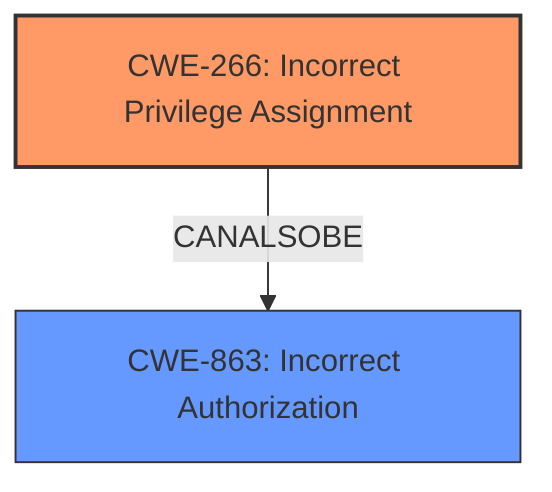

# Enhanced Analysis for CVE-2025-3918

# Summary
| CWE ID | CWE Name | Confidence | CWE Abstraction Level | CWE Vulnerability Mapping Label | CWE-Vulnerability Mapping Notes |
|---|---|---|---|---|---|
| CWE-266 | Incorrect Privilege Assignment | 0.9 | Base | Primary | Allowed |
| CWE-863 | Incorrect Authorization | 0.7 | Class | Secondary Candidate | Allowed-with-Review |

## Evidence and Confidence

*   **Confidence Score:** 0.8
*   **Evidence Strength:** HIGH

## Relationship Analysis
The primary CWE is CWE-266, Incorrect Privilege Assignment, which is a Base level CWE. CWE-863, Incorrect Authorization is a Class level CWE, is a related CWE as the authorization check is performed incorrectly, leading to the incorrect privilege assignment. CWE-266 is at the base level of abstraction making it a better fit.



## Vulnerability Chain
The vulnerability chain starts with **improper authorization** leading to privilege escalation. Specifically, the vulnerability is that the `register_action()` function reads the client-supplied `$_POST[user_role]` and passes it directly to `wp_insert_user()` without restricting it to a safe set of roles leading to privilege escalation.
  - Root Cause: **Improper Authorization** leading to **Incorrect Privilege Assignment**
  - Impact: Privilege Escalation

## Summary of Analysis
The analysis is based on the provided vulnerability description, which clearly states the **improper authorization** issue in the `register_action()` function. This leads to a direct path where an unauthenticated attacker can elevate their privileges to that of an administrator. The mapping guidance emphasizes the importance of distinguishing between authentication and authorization and selecting the appropriate CWE based on the root cause.

The selection of CWE-266, Incorrect Privilege Assignment, is based on the fact that the system incorrectly assigns privileges to a user due to a misconfigured role. While CWE-863, Incorrect Authorization, is also considered, CWE-266 is more specific to the root cause of the vulnerability.

The CWE selection is at the optimal level of specificity, with CWE-266 being a Base level CWE and directly addressing the root cause of the vulnerability.

Relevant CWE Information:

# Enhanced Context (25 CWEs)
The following CWEs were identified as potentially relevant to this vulnerability:

## CWE-266: Incorrect Privilege Assignment
**Abstraction Level**: Base
**Similarity Score**: 0.75
**Source**: dense

**Description**:
A product incorrectly assigns a privilege to a particular actor, creating an unintended sphere of control for that actor.

**Mapping Guidance**:
- Usage: Allowed
- Rationale: This CWE entry is at the Base level of abstraction, which is a preferred level of abstraction for mapping to the root causes of vulnerabilities.

## CWE-863: Incorrect Authorization
**Abstraction Level**: Class
**Similarity Score**: 2202.18
**Source**: sparse

**Description**:
The product performs an authorization check when an actor attempts to access a resource or perform an action, but it does not correctly perform the check.

**Mapping Guidance**:
- Usage: Allowed-with-Review
- Rationale: This CWE entry is a Class and might have Base-level children that would be more appropriate

## CWE-285: Improper Authorization
**Abstraction Level**: Class
**Similarity Score**: 2147.14
**Source**: sparse

**Description**:
The product does not perform or incorrectly performs an authorization check when an actor attempts to access a resource or perform an action.

**Mapping Guidance**:
- Usage: Discouraged
- Rationale: CWE-285 is high-level and lower-level CWEs can frequently be used instead. It is a level-1 Class (i.e., a child of a Pillar).

## CWE-862: Missing Authorization
**Abstraction Level**: Class
**Similarity Score**: 1998.09
**Source**: sparse

**Description**:
The product does not perform an authorization check when an actor attempts to access a resource or perform an action.

**Mapping Guidance**:
- Usage: Allowed-with-Review
- Rationale: This CWE entry is a Class and might have Base-level children that would be more appropriate

CWE-284: Improper Access Control, CWE-285: Improper Authorization, CWE-862: Missing Authorization, and CWE-863: Incorrect Authorization were considered but not used as the primary CWE. CWE-266, Incorrect Privilege Assignment, is a better fit as it clearly identifies the root cause of the vulnerability.
CWE-306: Missing Authentication for Critical Function was not considered as there was no mention of Authentication issues.
CWE-352: Cross-Site Request Forgery (CSRF) and CWE-1275: Sensitive Cookie with Improper SameSite Attribute were not considered as they are not relevant to the vulnerability.


## CWE Relationship Analysis

Current CWEs represent these abstraction levels: .


### Vulnerability Chain Analysis

**Chain starting from CWE-863:**
- 863 (Incorrect Authorization) - ROOT


**Chain starting from CWE-862:**
- 862 (Missing Authorization) - ROOT


### CWE Relationship Diagram

```mermaid
graph TD
    classDef primary fill:#f96,stroke:#333,stroke-width:2px
    classDef secondary fill:#69f,stroke:#333
    classDef tertiary fill:#9e9,stroke:#333
```