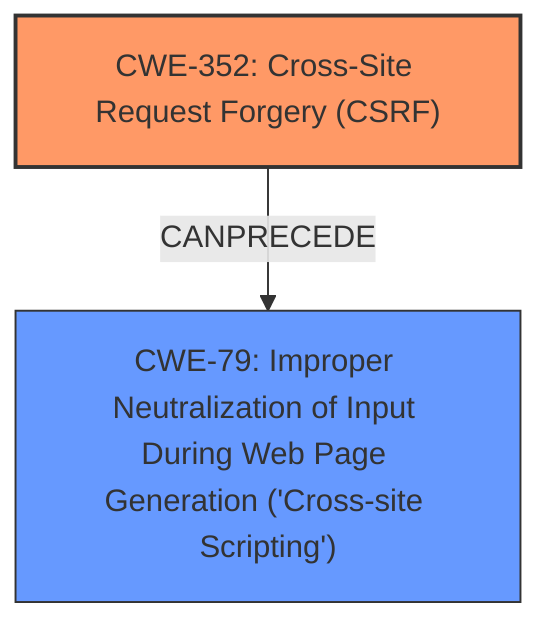

# Analysis Report for CVE-2025-39381

# Vulnerability Analysis Report: CVE-2025-39381

## Description

**Cross-Site Request Forgery** (CSRF) vulnerability in Kiotviet KiotViet Sync allows Stored XSS. This issue affects KiotViet Sync from n/a through 1.8.4.

## Vulnerability Description Key Phrases

- **Rootcause:** Cross-Site Request Forgery
- **Weakness:** Stored XSS, weakness
- **Product:** Kiotviet KiotViet Sync
- **Version:** n/a through 1.8.4

## Analysis (with Relationship Data)

# Summary
| CWE ID | CWE Name | Confidence | CWE Abstraction Level | CWE Vulnerability Mapping Label | CWE-Vulnerability Mapping Notes |
|---|---|---|---|---|---|
| CWE-352 | Cross-Site Request Forgery (CSRF) | 0.9 | Compound | Primary | Allowed |
| CWE-79 | Improper Neutralization of Input During Web Page Generation ('Cross-site Scripting') | 0.8 | Base | Secondary | Allowed |

## Evidence and Confidence

*   **Confidence Score:** 0.85
*   **Evidence Strength:** HIGH

## Relationship Analysis
The primary weakness is **CWE-352 [Cross-Site Request Forgery (CSRF)]**, a compound weakness, that allows for **Stored XSS**, which is **CWE-79 [Improper Neutralization of Input During Web Page Generation ('Cross-site Scripting')]**. **CWE-352** can lead to **CWE-79** because if an attacker can forge requests, they might be able to inject malicious scripts that are then stored and executed by other users.



## Vulnerability Chain
The vulnerability chain starts with **CWE-352 [Cross-Site Request Forgery (CSRF)]**, which then leads to **CWE-79 [Improper Neutralization of Input During Web Page Generation ('Cross-site Scripting')]** due to the ability to inject and store malicious scripts.

## Summary of Analysis
The analysis indicates that the primary vulnerability is **CWE-352 [Cross-Site Request Forgery (CSRF)]**, which enables a **Stored XSS** attack (**CWE-79 [Improper Neutralization of Input During Web Page Generation ('Cross-site Scripting')]**). The description clearly states "**Cross-Site Request Forgery** (CSRF) vulnerability in Kiotviet KiotViet Sync allows **Stored XSS**." The CVE Reference Links Content Summary also confirms the **root cause** as "**Cross Site Request Forgery (CSRF) vulnerability**" and lists "**CSRF - allows a malicious actor to force higher privileged users to execute unwanted actions under their current authentication**" as a weakness. The high retriever score for **CWE-79** supports its inclusion as a secondary weakness, as the CSRF allows for the injection of malicious scripts.

I considered other CWEs listed in the Retriever Results, such as **CWE-89 [Improper Neutralization of Special Elements used in an SQL Command ('SQL Injection')]**, **CWE-918 [Server-Side Request Forgery (SSRF)]**, and **CWE-601 [URL Redirection to Untrusted Site ('Open Redirect')]**, but these do not directly align with the provided vulnerability description, which specifically mentions CSRF leading to Stored XSS. **CWE-434 [Unrestricted Upload of File with Dangerous Type]** and others were also considered, but they are not relevant as the vulnerability is about forging requests and injecting scripts, not file uploads or redirections. The selected CWEs are at the optimal level of specificity, with **CWE-352** at the compound level representing the attack vector and **CWE-79** at the base level representing the resulting XSS.


## CWE Relationship Analysis

Current CWEs represent these abstraction levels: .


### Vulnerability Chain Analysis

**Chain starting from CWE-89:**
- 89 (Improper Neutralization of Special Elements used in an SQL Command ('SQL Injection')) - ROOT


**Chain starting from CWE-601:**
- 601 (URL Redirection to Untrusted Site ('Open Redirect')) - ROOT


### CWE Relationship Diagram

```mermaid
graph TD
    classDef primary fill:#f96,stroke:#333,stroke-width:2px
    classDef secondary fill:#69f,stroke:#333
    classDef tertiary fill:#9e9,stroke:#333
```


*Report generated on 2025-07-14 22:21:36*
