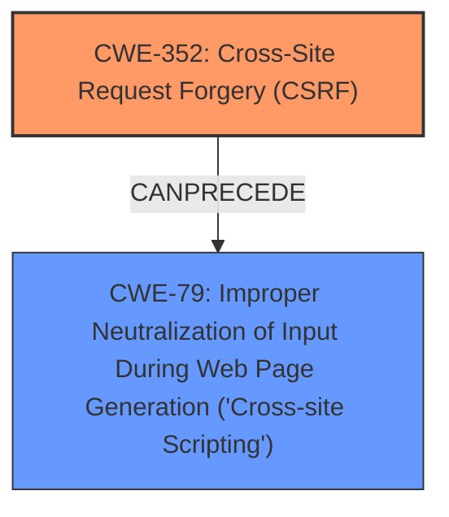

# Raw Analyzer Response for CVE-2025-39414

# Summary
| CWE ID | CWE Name | Confidence | CWE Abstraction Level | CWE Vulnerability Mapping Label | CWE-Vulnerability Mapping Notes |
|---|---|---|---|---|---|
| CWE-352 | Cross-Site Request Forgery (CSRF) | 0.9 | Compound | Allowed | Primary CWE. The root cause is the lack of CSRF protection. |
| CWE-79 | Improper Neutralization of Input During Web Page Generation ('Cross-site Scripting') | 0.8 | Base | Allowed | Secondary CWE. The CSRF allows for stored XSS. |

## Evidence and Confidence

*   **Confidence Score:** 0.85
*   **Evidence Strength:** MEDIUM

## Relationship Analysis
The vulnerability is a combination of **CWE-352 Cross-Site Request Forgery (CSRF)** and **CWE-79 Improper Neutralization of Input During Web Page Generation ('Cross-site Scripting')**. The **CWE-352 Cross-Site Request Forgery (CSRF)** enables the **CWE-79 Improper Neutralization of Input During Web Page Generation ('Cross-site Scripting')** vulnerability.

## Vulnerability Chain
The vulnerability chain starts with a **missing CSRF protection** (**CWE-352 Cross-Site Request Forgery (CSRF)**). This allows an attacker to inject malicious input without proper validation, leading to **stored XSS** (**CWE-79 Improper Neutralization of Input During Web Page Generation ('Cross-site Scripting')**).

## Summary of Analysis
The primary weakness is **CWE-352 Cross-Site Request Forgery (CSRF)**, as indicated by the "rootcause" key phrase and the CVE Reference Links summary. This allows a malicious actor to force higher privileged users to execute unwanted actions. The secondary weakness is **CWE-79 Improper Neutralization of Input During Web Page Generation ('Cross-site Scripting')**, as indicated by the "weakness" key phrase and the impact described in the CVE Reference Links summary. The **CWE-352 Cross-Site Request Forgery (CSRF)** vulnerability enables the **CWE-79 Improper Neutralization of Input During Web Page Generation ('Cross-site Scripting')** vulnerability.

The retriever results also support **CWE-79 Improper Neutralization of Input During Web Page Generation ('Cross-site Scripting')** as the top combined result and **CWE-352 Cross-Site Request Forgery (CSRF)** as the second. Both are at the appropriate Base and Compound level of abstraction.

CWEs considered but not used:
*   CWE-89: Improper Neutralization of Special Elements used in an SQL Command ('SQL Injection'): While Injection is mentioned in the OWASP Top 10, the specific vulnerability is Stored XSS, not SQL Injection.
*   CWE-918: Server-Side Request Forgery (SSRF): Not directly relevant to the vulnerability description.
*   CWE-1004: Sensitive Cookie Without 'HttpOnly' Flag: Not directly relevant to the vulnerability description.
*   CWE-601: URL Redirection to Untrusted Site ('Open Redirect'): Not directly relevant to the vulnerability description.
*   CWE-116: Improper Encoding or Escaping of Output: The vulnerability is specifically Stored XSS, so CWE-79 is more accurate.
*   CWE-1275: Sensitive Cookie with Improper SameSite Attribute: Not directly relevant to the vulnerability description.
*   CWE-80: Improper Neutralization of Script-Related HTML Tags in a Web Page (Basic XSS): CWE-79 is a better fit as it is more general.
*   CWE-494: Download of Code Without Integrity Check: Not directly relevant to the vulnerability description.