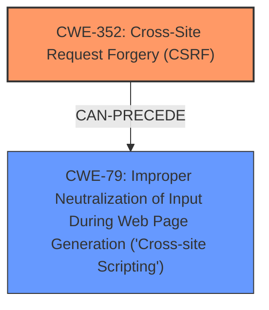

# Analysis for CVE-2025-39416

# Summary
| CWE ID | CWE Name | Confidence | CWE Abstraction Level | CWE Vulnerability Mapping Label | CWE-Vulnerability Mapping Notes |
|---|---|---|---|---|---|
| CWE-352 | Cross-Site Request Forgery (CSRF) | 1.0 | Compound | Primary | Allowed |
| CWE-79 | Improper Neutralization of Input During Web Page Generation ('Cross-site Scripting') | 0.7 | Base | Secondary | Allowed |

## Evidence and Confidence

*   **Confidence Score:** 0.9
*   **Evidence Strength:** HIGH

## Relationship Analysis
The primary weakness is **CWE-352: Cross-Site Request Forgery (CSRF)**, which allows an attacker to induce users to perform actions they did not intend to. The **CSRF** vulnerability can lead to **Stored XSS (CWE-79)** if the attacker leverages the **CSRF** to inject malicious scripts into the application's data. While **CWE-352** is a compound weakness, it appropriately captures the high-level vulnerability. **CWE-79** is a base weakness and represents the impact or a potential consequence of successful exploitation of the **CSRF** vulnerability, where injected script leads to **cross-site scripting**.

## Vulnerability Chain
The vulnerability chain starts with the **CWE-352 Cross-Site Request Forgery (CSRF)** vulnerability, which allows an attacker to force a user to perform unwanted actions. If the application is vulnerable to **CWE-79 Improper Neutralization of Input During Web Page Generation ('Cross-site Scripting')**, the attacker can use the **CSRF** vulnerability to inject malicious scripts into the application, leading to **Stored XSS**. Thus, **CWE-352** is the root cause, and **CWE-79** is the impact or a secondary vulnerability.

## Summary of Analysis
The primary vulnerability is **CWE-352 Cross-Site Request Forgery (CSRF)**. The vulnerability description states that "WordPress translit it! Plugin <= 1.6 is vulnerable to Cross Site Request Forgery (CSRF)." This allows a malicious actor to force higher privileged users to execute unwanted actions under their current authentication." The description also mentions that the vulnerability allows for "Stored XSS," which is a manifestation of **CWE-79**. However, the root cause is the **CSRF**, which then leads to the possibility of injecting malicious scripts.

The retriever results also support this analysis, with **CWE-79** and **CWE-352** being the top candidates. However, **CWE-352** is selected as the primary weakness because it is the **rootcause**. The relationship analysis shows that **CWE-352** can precede **CWE-79**, indicating that the **CSRF** vulnerability can lead to **XSS**.

Other CWEs considered but not used:
*   **CWE-89 Improper Neutralization of Special Elements used in an SQL Command ('SQL Injection')**, **CWE-918 Server-Side Request Forgery (SSRF)**, and **CWE-601 URL Redirection to Untrusted Site ('Open Redirect')**: These CWEs were considered because they appeared in the retriever results. However, they were not selected because the vulnerability description does not provide any evidence of these weaknesses.
*   **CWE-116 Improper Encoding or Escaping of Output** and **CWE-80 Improper Neutralization of Script-Related HTML Tags in a Web Page (Basic XSS)**: These CWEs relate to output encoding and neutralizing script-related tags, which are related to **CWE-79**. Since the **Stored XSS** is a consequence of the **CSRF**, **CWE-79** is deemed sufficient to represent the **XSS** aspect of the vulnerability.
*   **CWE-96 Improper Neutralization of Directives in Statically Saved Code ('Static Code Injection')**: This CWE is not applicable since the vulnerability does not involve injecting code into static files.
*   **CWE-494 Download of Code Without Integrity Check**: This CWE is not applicable since the vulnerability does not involve downloading code.