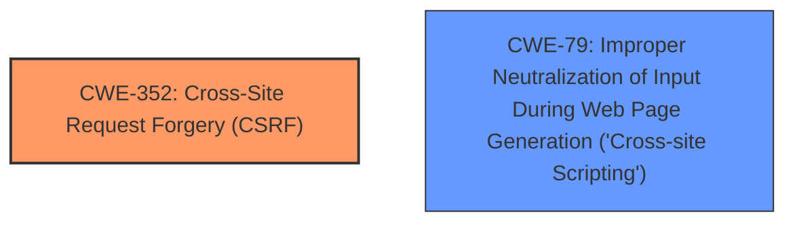

# Analysis Report for CVE-2025-39455

# Vulnerability Analysis Report: CVE-2025-39455

## Description

**Cross-Site Request Forgery** (**CSRF**) vulnerability in ip2location IP2Location Variables allows Reflected **XSS**. This issue affects IP2Location Variables from n/a through 2.9.5.

## Vulnerability Description Key Phrases

- **Rootcause:** Cross-Site Request Forgery
- **Weakness:** ['cross-site scripting', 'CSRF', 'XSS']
- **Product:** IP2Location Variables
- **Version:** through 2.9.5

## Analysis (with Relationship Data)

# Summary

| CWE ID  | CWE Name                                                                           | Confidence | CWE Abstraction Level | CWE Vulnerability Mapping Label | CWE-Vulnerability Mapping Notes |
| :-------- | :--------------------------------------------------------------------------------- | :--------- | :---------------------- | :------------------------------ | :------------------------------ |
| CWE-352   | Cross-Site Request Forgery (CSRF)                                                | 1          | Compound                | Primary                         | Allowed                         |
| CWE-79    | Improper Neutralization of Input During Web Page Generation ('Cross-site Scripting') | 0.9        | Base                    | Secondary                       | Allowed                         |

## Evidence and Confidence

*   **Confidence Score:** 0.95
*   **Evidence Strength:** HIGH

## Relationship Analysis

The primary weakness is CWE-352 [Cross-Site Request Forgery (CSRF)], a compound weakness that represents the application's failure to verify the legitimacy of user requests. The secondary weakness is CWE-79 [Improper Neutralization of Input During Web Page Generation ('Cross-site Scripting')], which arises from the application's failure to properly neutralize user-controllable input, leading to potential cross-site scripting vulnerabilities. CWE-79 can be caused by **improper** input validation, which could allow an attacker to inject malicious scripts into web pages viewed by other users. There is no direct parent-child relationship, but these weaknesses often occur together in web applications.



## Vulnerability Chain

The vulnerability chain starts with **Cross-Site Request Forgery**, which allows an attacker to inject code. The attacker then exploits **Reflected XSS** by injecting malicious code into the website. The sequence is as follows:

1.  **CWE-352** [Cross-Site Request Forgery (CSRF)]: The web application **does not sufficiently verify** the requests.
2.  **CWE-79** [Improper Neutralization of Input During Web Page Generation ('Cross-site Scripting')]: The application **fails to neutralize** user-controllable input, leading to **XSS**.

## Summary of Analysis

The initial analysis focused on identifying the root cause and related weaknesses. The vulnerability description explicitly mentions **CSRF** and **XSS**, making CWE-352 and CWE-79 the primary candidates.

*   The vulnerability description states: "**Cross-Site Request Forgery** (**CSRF**) vulnerability in ip2location IP2Location Variables allows Reflected **XSS**."
*   The keyphrases are **'Cross-Site Request Forgery'**, **'cross-site scripting'**, **'CSRF'**, and **'XSS'**.

The analysis correctly identifies CWE-352 as the primary weakness because the application **does not sufficiently verify** whether a request was intentionally provided by the user, which is the definition of **CSRF**. The secondary weakness, CWE-79, arises because the application **does not neutralize or incorrectly neutralizes** user-controllable input, leading to **XSS**. Both CWEs are at appropriate levels of specificity (Compound and Base, respectively). The confidence is high due to the explicit mention of both vulnerabilities in the description.

Relevant CWE Information:
* CWE-352 [Cross-Site Request Forgery (CSRF)]: The web application **does not, or can not, sufficiently verify** whether a well-formed, valid, consistent request was intentionally provided by the user who submitted the request.
* CWE-79 [Improper Neutralization of Input During Web Page Generation ('Cross-site Scripting')]: The product **does not neutralize or incorrectly neutralizes** user-controllable input before it is placed in output that is used as a web page that is served to other users.

CWEs Considered and Rejected:

*   CWE-918 [Server-Side Request Forgery (SSRF)]: While SSRF was considered, the description does not provide enough evidence to suggest that the server is making requests on behalf of the user.
*   CWE-89 [Improper Neutralization of Special Elements used in an SQL Command ('SQL Injection')]: SQL injection was considered but rejected as the vulnerability description doesn't provide any information related to SQL commands or databases.
*   CWE-601 [URL Redirection to Untrusted Site ('Open Redirect')]: Open redirect was considered, but the vulnerability description doesn't mention URL redirection.
*   CWE-80 [Improper Neutralization of Script-Related HTML Tags in a Web Page (Basic XSS)]: While related to XSS, CWE-79 is a more general and encompassing category.
*   CWE-1004 [Sensitive Cookie Without 'HttpOnly' Flag]: Cookie-related issues aren't explicitly mentioned in the description.
*   CWE-116 [Improper Encoding or Escaping of Output]: Although related to output handling, CWE-79 more directly addresses the XSS aspect.


## CWE Relationship Analysis

Current CWEs represent these abstraction levels: .


### Vulnerability Chain Analysis

**Chain starting from CWE-89:**
- 89 (Improper Neutralization of Special Elements used in an SQL Command ('SQL Injection')) - ROOT


**Chain starting from CWE-116:**
- 116 (Improper Encoding or Escaping of Output) - ROOT


### CWE Relationship Diagram

```mermaid
graph TD
    classDef primary fill:#f96,stroke:#333,stroke-width:2px
    classDef secondary fill:#69f,stroke:#333
    classDef tertiary fill:#9e9,stroke:#333
```


*Report generated on 2025-07-14 22:27:41*
