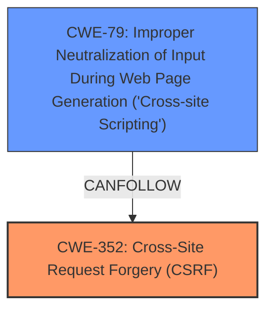

# Analysis for CVE-2025-39547

# Summary
| CWE ID | CWE Name | Confidence | CWE Abstraction Level | CWE Vulnerability Mapping Label | CWE-Vulnerability Mapping Notes |
|---|---|---|---|---|---|
| CWE-352 | Cross-Site Request Forgery (CSRF) | 0.9 | Compound | Primary | Allowed |
| CWE-79 | Improper Neutralization of Input During Web Page Generation ('Cross-site Scripting') | 0.8 | Base | Secondary | Allowed |

## Evidence and Confidence

*   **Confidence Score:** 0.85
*   **Evidence Strength:** MEDIUM

## Relationship Analysis
The primary weakness is CWE-352, Cross-Site Request Forgery (CSRF). The exploitation of this vulnerability allows for Stored XSS (CWE-79). CWE-352 can lead to other weaknesses if successfully exploited. CWE-79 is a base level weakness.

## Vulnerability Chain
The vulnerability chain starts with a **CSRF** vulnerability (CWE-352). Successfully exploiting the **CSRF** allows an attacker to inject malicious scripts, leading to Stored **XSS** (CWE-79).

## Summary of Analysis
The primary vulnerability is **CSRF** (CWE-352) which allows for stored **XSS** (CWE-79). The description states "Cross-Site Request Forgery (**CSRF**) vulnerability in Toast Plugins Internal Link Optimiser allows Stored **XSS**.". The CVE Reference Links Content Summary also states "The WordPress Internal Link Optimiser Plugin versions <= 5.1.3 are vulnerable to Cross Site Request Forgery (CSRF)." and "A malicious actor could force higher privileged users to execute unwanted actions under their current authentication. The impact varies case by case."

CWE-352 is a compound weakness and the best fit for the root cause. CWE-79 is a base level weakness which accurately describes the resulting **XSS**.

I am confident in this assessment because the vulnerability description and the CVE reference links clearly indicate **CSRF** as the root cause, leading to the **XSS** vulnerability.

Relevant CWE Information:

# Enhanced Context (25 CWEs)
The following CWEs were identified as potentially relevant to this vulnerability:

## CWE-352: Cross-Site Request Forgery (CSRF)
**Abstraction Level**: Compound
**Similarity Score**: 0.75
**Source**: dense

**Description**:
The web application does not, or can not, sufficiently verify whether a well-formed, valid, consistent request was intentionally provided by the user who submitted the request.

**Mapping Guidance**:
- Usage: Allowed
- Rationale: This is a well-known Composite of multiple weaknesses that must all occur simultaneously, although it is attack-oriented in nature.

## CWE-79: Improper Neutralization of Input During Web Page Generation ('Cross-site Scripting')
**Abstraction Level**: Base
**Similarity Score**: 0.71
**Source**: dense

**Description**:
The product does not neutralize or incorrectly neutralizes user-controllable input before it is placed in output that is used as a web page that is served to other users.

**Mapping Guidance**:
- Usage: Allowed
- Rationale: This CWE entry is at the Base level of abstraction, which is a preferred level of abstraction for mapping to the root causes of vulnerabilities.