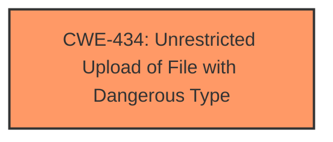

# Analysis Report for CVE-2025-3969

# Vulnerability Analysis Report: CVE-2025-3969

## Description

A vulnerability was found in codeprojects News Publishing Site Dashboard 1.0. It has been rated as critical. This issue affects some unknown processing of the file /edit-category.php of the component Edit Category Page. The manipulation of the argument category_image leads to **unrestricted upload**. The attack may be initiated remotely. The exploit has been disclosed to the public and may be used.

## Vulnerability Description Key Phrases

- **Weakness:** unrestricted upload
- **Vector:** manipulation of the argument category_image
- **Product:** codeprojects News Publishing Site Dashboard
- **Version:** 1
- **Component:** Edit Category Page

## Analysis (with Relationship Data)

# Summary
| CWE ID | CWE Name | Confidence | CWE Abstraction Level | CWE Vulnerability Mapping Label | CWE-Vulnerability Mapping Notes |
|---|---|---|---|---|---|
| CWE-434 | Unrestricted Upload of File with Dangerous Type | 1.0 | Base | Allowed | Primary CWE |

## Evidence and Confidence

*   **Confidence Score:** 1.0
*   **Evidence Strength:** HIGH

## Relationship Analysis
The primary relationship that influenced the decision was the direct match of the vulnerability description to the definition of CWE-434. There were no parent-child or peer relationships that significantly altered this initial assessment. The abstraction level of Base further solidified the choice, as it is the preferred level of specificity.



## Vulnerability Chain
The vulnerability chain starts with **unrestricted upload** of the file due to manipulation of the argument `category_image`, which leads to the ability to upload dangerous file types, potentially leading to code execution or other attacks.

## Summary of Analysis
The initial analysis focused on the **weakness** of **unrestricted upload** in the vulnerability description. The phrase "manipulation of the argument category_image leads to **unrestricted upload**" directly points to CWE-434 (Unrestricted Upload of File with Dangerous Type). The description for CWE-434 states: "The product allows the upload or transfer of dangerous file types that are automatically processed within its environment." This aligns perfectly with the provided information. The confidence is high because the vulnerability description explicitly mentions **unrestricted upload**, which is the core problem addressed by CWE-434.

Other CWEs were considered but deemed less relevant:

*   CWE-89 (Improper Neutralization of Special Elements used in an SQL Command ('SQL Injection')): Although SQL injection is a common vulnerability, there is no indication of SQL being used in the description.
*   CWE-79 (Improper Neutralization of Input During Web Page Generation ('Cross-site Scripting')): Similar to SQL injection, there's no mention of cross-site scripting in the description.
*   CWE-1336 (Improper Neutralization of Special Elements Used in a Template Engine): Not indicated in the provided information.

The selected CWE is at the optimal level of specificity because it directly addresses the **root cause** **weakness** described in the vulnerability.


## CWE Relationship Analysis

Current CWEs represent these abstraction levels: .


### Vulnerability Chain Analysis

**Chain starting from CWE-89:**
- 89 (Improper Neutralization of Special Elements used in an SQL Command ('SQL Injection')) - ROOT


**Chain starting from CWE-79:**
- 79 (Improper Neutralization of Input During Web Page Generation ('Cross-site Scripting')) - ROOT


### CWE Relationship Diagram

```mermaid
graph TD
    classDef primary fill:#f96,stroke:#333,stroke-width:2px
    classDef secondary fill:#69f,stroke:#333
    classDef tertiary fill:#9e9,stroke:#333
```


*Report generated on 2025-07-14 22:31:11*
